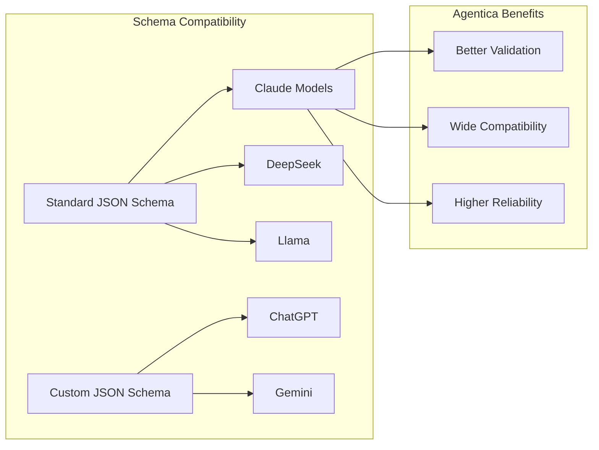

# Claude + Agentica Guide 🤖


<p align="center">
  <a href="https://www.anthropic.com/claude"></a>
  <a href="https://github.com/wrtnlabs/agentica/blob/master/LICENSE"></a>
  <a href="https://www.npmjs.com/package/@agentica/core"></a>
</p>

**The complete guide to using Anthropic Claude models with Agentica for advanced AI function calling.**

Agentica provides seamless integration with Claude models, offering a powerful alternative to Anthropic's MCP (Model Context Protocol) with enhanced TypeScript support, automatic schema conversion, and cost-effective function calling capabilities.

## 🚀 Quick Start

### Installation

```bash
# Create new project with Claude support
npx agentica start my-claude-agent

# Or add to existing project
npm install @agentica/core openai
```

### Basic Configuration

```typescript
import { Agentica } from "@agentica/core";
import OpenAI from "openai";

const agent = new Agentica({
  vendor: {
    api: new OpenAI({
      apiKey: process.env.ANTHROPIC_API_KEY,
      baseURL: "https://api.anthropic.com/v1",
    }),
    model: "claude-3-5-sonnet-20241022", // Latest Claude model
  },
  controllers: [
    // Your functions here
  ],
});

// Start conversing with Claude
await agent.conversate("Hello Claude, help me with my task!");
```

## 🎯 Claude Model Support

Agentica supports all major Claude models with optimized configurations:

| Model | Description | Best For | Context Window |
|-------|-------------|----------|----------------|
| `claude-3-5-sonnet-20241022` | Latest, most capable | Complex reasoning, coding | 200k tokens |
| `claude-3-5-haiku-20241022` | Fast and efficient | Quick tasks, cost-effective | 200k tokens |
| `claude-3-opus-20240229` | Most powerful (legacy) | Highest accuracy needs | 200k tokens |
| `claude-3-sonnet-20240229` | Balanced performance | General purpose | 200k tokens |
| `claude-3-haiku-20240307` | Fastest and cheapest | Simple tasks, high volume | 200k tokens |

### Recommended Configurations

```typescript
// For production applications
const productionConfig = {
  vendor: {
    api: new OpenAI({
      apiKey: process.env.ANTHROPIC_API_KEY,
      baseURL: "https://api.anthropic.com/v1",
    }),
    model: "claude-3-5-sonnet-20241022",
    options: {
      maxRetries: 3,
      timeout: 60000,
    },
  },
};

// For cost-optimized development
const developmentConfig = {
  vendor: {
    api: new OpenAI({
      apiKey: process.env.ANTHROPIC_API_KEY,
      baseURL: "https://api.anthropic.com/v1",
    }),
    model: "claude-3-5-haiku-20241022",
  },
};

// For high-concurrency applications
const highConcurrencyConfig = {
  vendor: {
    api: new OpenAI({
      apiKey: process.env.ANTHROPIC_API_KEY,
      baseURL: "https://api.anthropic.com/v1",
    }),
    model: "claude-3-5-sonnet-20241022",
    semaphore: 10, // Limit concurrent requests
  },
};
```

## 🏗️ Function Integration Patterns

### TypeScript Class Integration

```typescript
import { Agentica, assertHttpController } from "@agentica/core";
import typia from "typia";

class ClaudeFileManager {
  /**
   * Read file contents
   * @param path File path to read
   * @returns File contents as string
   */
  async readFile(path: string): Promise<string> {
    // Implementation here
    return "file contents";
  }

  /**
   * Write content to file
   * @param path Target file path
   * @param content Content to write
   */
  async writeFile(path: string, content: string): Promise<void> {
    // Implementation here
  }
}

const agent = new Agentica({
  vendor: {
    api: new OpenAI({
      apiKey: process.env.ANTHROPIC_API_KEY,
      baseURL: "https://api.anthropic.com/v1",
    }),
    model: "claude-3-5-sonnet-20241022",
  },
  controllers: [
    // Claude works excellent with standard JSON schema
    typia.llm.controller<ClaudeFileManager, "claude">(
      "filesystem",
      new ClaudeFileManager(),
    ),
  ],
});
```

### OpenAPI Integration

```typescript
const agent = new Agentica({
  vendor: {
    api: new OpenAI({
      apiKey: process.env.ANTHROPIC_API_KEY,
      baseURL: "https://api.anthropic.com/v1",
    }),
    model: "claude-3-5-sonnet-20241022",
  },
  controllers: [
    assertHttpController({
      name: "github-api",
      model: "claude", // Use Claude-optimized schema
      document: await fetch("https://api.github.com/openapi.yaml")
        .then(r => r.text()),
      connection: {
        host: "https://api.github.com",
        headers: { 
          Authorization: `Bearer ${process.env.GITHUB_TOKEN}`,
          "User-Agent": "Agentica-Claude-Agent",
        },
      },
    }),
  ],
});
```

## 🎨 Claude-Specific Optimizations

### Schema Advantages

Claude models use **standard JSON Schema** specification, providing several advantages:



### Performance Optimization

```typescript
// Optimize for Claude's context handling
const optimizedAgent = new Agentica({
  vendor: {
    api: new OpenAI({
      apiKey: process.env.ANTHROPIC_API_KEY,
      baseURL: "https://api.anthropic.com/v1",
    }),
    model: "claude-3-5-sonnet-20241022",
  },
  orchestrate: {
    // Claude excels with larger function sets
    maxCandidates: 20,
    // Enable selector for better performance
    selector: {
      embedding: {
        model: "text-embedding-3-small",
        dimensions: 1536,
      },
    },
  },
});
```

## 🔧 Environment Setup

### Environment Variables

```bash
# .env file
ANTHROPIC_API_KEY=your_anthropic_api_key_here

# Optional: For embedding-based function selection
OPENAI_API_KEY=your_openai_api_key_for_embeddings
```

### TypeScript Configuration

```json
// tsconfig.json
{
  "compilerOptions": {
    "target": "ES2020",
    "module": "ESNext",
    "moduleResolution": "node",
    "esModuleInterop": true,
    "allowSyntheticDefaultImports": true,
    "strict": true,
    "skipLibCheck": true,
    "forceConsistentCasingInFileNames": true
  },
  "ts-node": {
    "esm": true
  }
}
```

## 🎯 MCP Alternative Benefits

Agentica provides a superior alternative to Anthropic's MCP (Model Context Protocol):

| Feature | MCP | Agentica |
|---------|-----|----------|
| **Model Support** | Claude only | All major LLMs |
| **Cost** | Claude required | Works with cheaper models |
| **Schema Generation** | Manual | Automated via TypeScript |
| **Validation** | Basic | Advanced with feedback |
| **TypeScript Support** | Limited | Native, first-class |
| **Function Sources** | MCP servers | Classes + OpenAPI + MCP |

### Migration from MCP

```typescript
// Before: MCP Server
// Complex setup, Claude-specific

// After: Agentica with Claude
const agent = new Agentica({
  vendor: {
    api: new OpenAI({
      apiKey: process.env.ANTHROPIC_API_KEY,
      baseURL: "https://api.anthropic.com/v1",
    }),
    model: "claude-3-5-sonnet-20241022",
  },
  controllers: [
    // Convert MCP functions to TypeScript classes
    typia.llm.controller<YourMCPFunctions, "claude">(
      "converted-functions",
      new YourMCPFunctions(),
    ),
  ],
});
```

## 🛠️ Best Practices

### Function Design

```typescript
class ClaudeBestPractices {
  /**
   * Use descriptive function names and comprehensive JSDoc
   * Claude excels with well-documented functions
   * 
   * @param query User's search query
   * @param filters Optional filters to apply
   * @param limit Maximum number of results (default: 10)
   * @returns Array of search results
   */
  async searchDocuments(
    query: string,
    filters?: {
      category?: string;
      dateRange?: {
        start: Date;
        end: Date;
      };
    },
    limit: number = 10,
  ): Promise<Array<{
    id: string;
    title: string;
    content: string;
    score: number;
  }>> {
    // Implementation
    return [];
  }

  /**
   * Break complex operations into smaller, focused functions
   * Claude handles function orchestration excellently
   */
  async processDocument(id: string): Promise<void> {
    await this.analyzeDocument(id);
    await this.extractKeywords(id);
    await this.generateSummary(id);
  }

  private async analyzeDocument(id: string): Promise<void> {
    // Focused analysis logic
  }

  private async extractKeywords(id: string): Promise<string[]> {
    // Keyword extraction logic
    return [];
  }

  private async generateSummary(id: string): Promise<string> {
    // Summary generation logic
    return "";
  }
}
```

### Error Handling

```typescript
const robustAgent = new Agentica({
  vendor: {
    api: new OpenAI({
      apiKey: process.env.ANTHROPIC_API_KEY,
      baseURL: "https://api.anthropic.com/v1",
    }),
    model: "claude-3-5-sonnet-20241022",
    options: {
      maxRetries: 3,
      timeout: 60000,
    },
  },
  controllers: [
    typia.llm.controller<YourController, "claude">(
      "your-functions",
      new YourController(),
    ),
  ],
});

// Handle Claude-specific errors
try {
  const result = await agent.conversate("Your request");
  console.log(result);
} catch (error) {
  if (error.message.includes("rate_limit")) {
    console.log("Rate limit hit, waiting before retry...");
    await new Promise(resolve => setTimeout(resolve, 60000));
  } else {
    console.error("Claude API error:", error);
  }
}
```

## 🎮 Complete Examples

### Code Assistant Agent

```typescript
import { Agentica } from "@agentica/core";
import OpenAI from "openai";
import typia from "typia";

class CodeAssistant {
  async analyzeCode(code: string, language: string): Promise<{
    issues: string[];
    suggestions: string[];
    complexity: number;
  }> {
    // Code analysis implementation
    return {
      issues: [],
      suggestions: [],
      complexity: 1,
    };
  }

  async generateTests(code: string, framework: string): Promise<string> {
    // Test generation implementation
    return "// Generated tests";
  }

  async refactorCode(code: string, style: string): Promise<string> {
    // Refactoring implementation
    return code;
  }
}

const codeAgent = new Agentica({
  vendor: {
    api: new OpenAI({
      apiKey: process.env.ANTHROPIC_API_KEY,
      baseURL: "https://api.anthropic.com/v1",
    }),
    model: "claude-3-5-sonnet-20241022", // Excellent for coding tasks
  },
  controllers: [
    typia.llm.controller<CodeAssistant, "claude">(
      "code-assistant",
      new CodeAssistant(),
    ),
  ],
});

// Use the code assistant
await codeAgent.conversate(
  "Analyze this TypeScript function and suggest improvements: " +
  "function processData(data) { return data.map(x => x * 2); }"
);
```

### Multi-Modal Document Processor

```typescript
class DocumentProcessor {
  async extractText(filePath: string): Promise<string> {
    // Text extraction from various formats
    return "extracted text";
  }

  async analyzeDocument(text: string): Promise<{
    sentiment: string;
    topics: string[];
    summary: string;
  }> {
    // Document analysis
    return {
      sentiment: "neutral",
      topics: [],
      summary: "",
    };
  }

  async generateReport(analysis: any): Promise<string> {
    // Report generation
    return "report";
  }
}

const docAgent = new Agentica({
  vendor: {
    api: new OpenAI({
      apiKey: process.env.ANTHROPIC_API_KEY,
      baseURL: "https://api.anthropic.com/v1",
    }),
    model: "claude-3-5-sonnet-20241022",
  },
  controllers: [
    typia.llm.controller<DocumentProcessor, "claude">(
      "document-processor",
      new DocumentProcessor(),
    ),
  ],
});
```

## 🚨 Troubleshooting

### Common Issues

**Authentication Errors**
```typescript
// ❌ Wrong: Using OpenAI API key
api: new OpenAI({
  apiKey: process.env.OPENAI_API_KEY, // This won't work!
  baseURL: "https://api.anthropic.com/v1",
})

// ✅ Correct: Using Anthropic API key
api: new OpenAI({
  apiKey: process.env.ANTHROPIC_API_KEY,
  baseURL: "https://api.anthropic.com/v1",
})
```

**Model Name Issues**
```typescript
// ❌ Wrong: Old model names
model: "claude-3-sonnet"

// ✅ Correct: Full model names with dates
model: "claude-3-5-sonnet-20241022"
```

**Rate Limiting**
```typescript
// Handle rate limits gracefully
const agent = new Agentica({
  vendor: {
    api: new OpenAI({
      apiKey: process.env.ANTHROPIC_API_KEY,
      baseURL: "https://api.anthropic.com/v1",
    }),
    model: "claude-3-5-sonnet-20241022",
    semaphore: 5, // Limit concurrent requests
    options: {
      maxRetries: 3,
      timeout: 60000,
    },
  },
});
```

### Debug Mode

```typescript
// Enable debug logging
const debugAgent = new Agentica({
  vendor: {
    api: new OpenAI({
      apiKey: process.env.ANTHROPIC_API_KEY,
      baseURL: "https://api.anthropic.com/v1",
      defaultHeaders: {
        "User-Agent": "Agentica-Debug/1.0",
      },
    }),
    model: "claude-3-5-sonnet-20241022",
  },
  // ... other config
});

// Log requests and responses
debugAgent.on('request', (req) => console.log('Request:', req));
debugAgent.on('response', (res) => console.log('Response:', res));
```

## 📚 Additional Resources

### Learning Materials
- [Agentica Documentation](https://wrtnlabs.io/agentica/docs)
- [Claude API Documentation](https://docs.anthropic.com/claude/reference)
- [TypeScript Function Calling Guide](https://wrtnlabs.io/agentica/docs/concepts/function-calling/)
- [YouTube Tutorials](https://www.youtube.com/@wrtnlabs)

### Example Projects
- [Enterprise E-commerce Agent](https://wrtnlabs.io/agentica/playground/shopping)
- [GitHub Integration Example](https://wrtnlabs.io/agentica/tutorial/coding/file-system/)
- [Document Processing Tutorial](https://wrtnlabs.io/agentica/tutorial/productivity/arxiv/)

### Community
- [Discord Server](https://discord.gg/aMhRmzkqCx)
- [GitHub Discussions](https://github.com/wrtnlabs/agentica/discussions)
- [Issues & Bug Reports](https://github.com/wrtnlabs/agentica/issues)

## 🎉 Next Steps

1. **Set up your environment** with Anthropic API key
2. **Try the quick start example** to verify your setup
3. **Explore the playground** to see Claude in action
4. **Join our Discord** for community support
5. **Check out tutorials** for advanced use cases

---

<p align="center">
  <strong>Ready to build intelligent agents with Claude and Agentica?</strong><br>
  <a href="https://wrtnlabs.io/agentica/playground">Try the Interactive Playground</a> •
  <a href="https://discord.gg/aMhRmzkqCx">Join Our Community</a> •
  <a href="https://github.com/wrtnlabs/agentica">Star on GitHub</a>
</p>

<p align="center">
  
</p>
<div align="center">
  Built with ❤️ by <a href="https://wrtnlabs.io">Wrtn Technologies</a> — Making AI development accessible to every TypeScript developer.
</div>