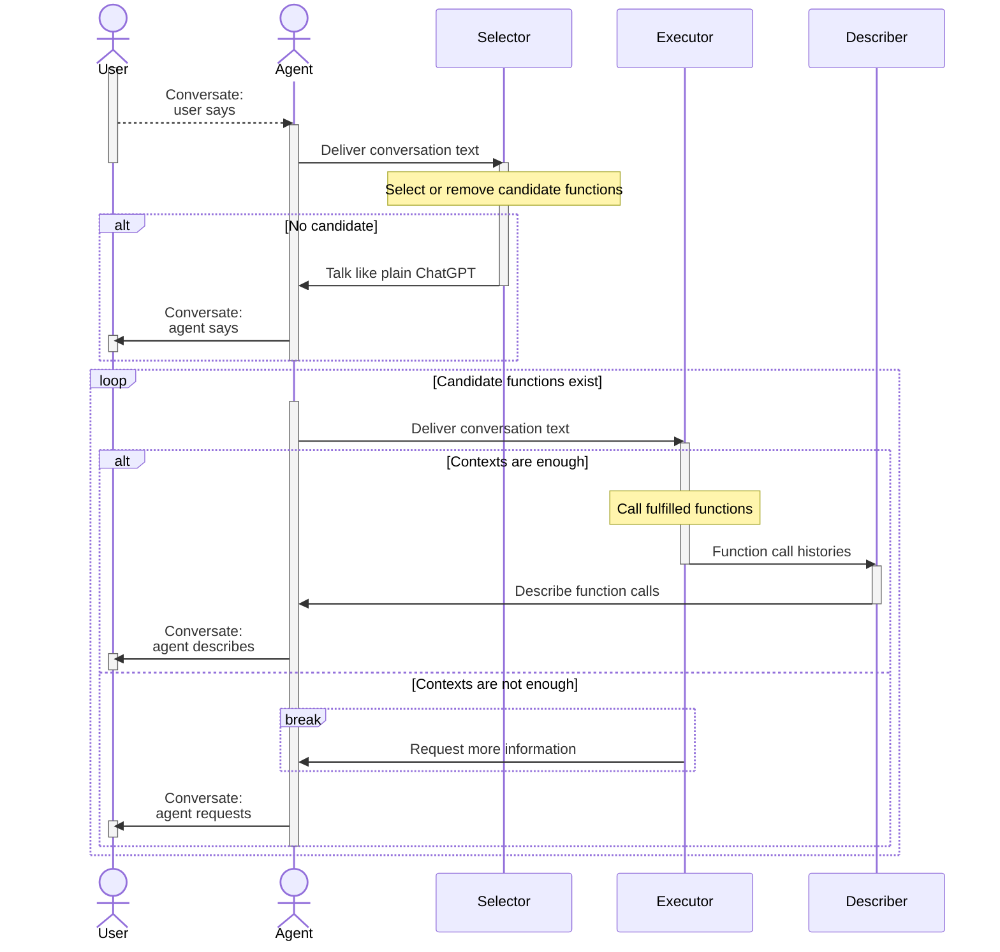
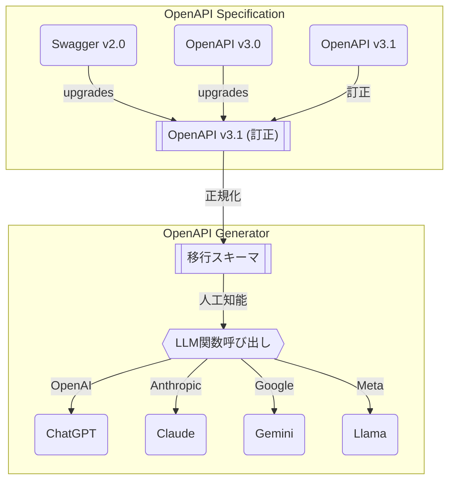
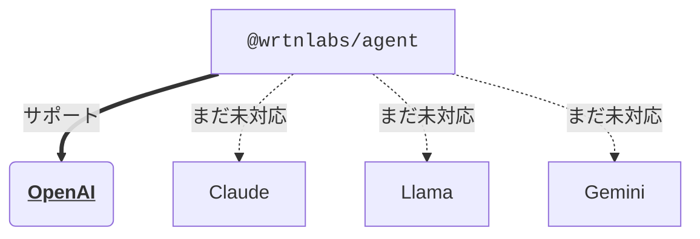

# `@wrtnlabs/agent`

*他の言語で読む: [English](README.md), [日本語](README.ja.md)*


[](https://github.com/wrtnlabs/agent/blob/master/LICENSE)
[](https://www.npmjs.com/package/@wrtnlabs/agent)
[](https://www.npmjs.com/package/@wrtnlabs/agent)
[](https://github.com/wrtnlabs/agent/actions?query=workflow%3Abuild)

**LLM関数呼び出し**に特化した、最もシンプルなAIエージェントライブラリ。

`@wrtnlabs/agent`は、LLM（大規模言語モデル）の関数呼び出しに特化した、最もシンプルなAIエージェントライブラリです。関数を呼び出すためのものを*Swagger/OpenAPI*ドキュメントまたは*TypeScriptクラス型*として提供し、あらゆることを可能にします。*スーパーAIチャットボット*の開発や*マルチエージェントオーケストレーション*など、全て関数呼び出しによって実現可能です。

たとえば、ショッピングモールサーバーの**Swaggerドキュメント**を提供すれば、`@wrtnlabs/agent`は**スーパーAIチャットボット**アプリケーションを構成します。このチャットボットアプリケーションでは、顧客は会話テキストだけで製品を購入することができます。カウンセリングや返金プロセスを自動化したい場合も、Swaggerドキュメントを提供するだけで実現可能です。

また、LLM関数呼び出し戦略は**マルチエージェントオーケストレーション**にも効果的で、どんな他の方法よりも簡単に開発できます。複雑なフレームワークやその特定のパラダイムやパターンを学ぶ必要はありません。クラスを介して接続し、**TypeScriptクラス型**を届けるだけです。`@wrtnlabs/agent`は関数呼び出しを通じてマルチエージェントオーケストレーションを集中させ、実現します。

> https://github.com/user-attachments/assets/01604b53-aca4-41cb-91aa-3faf63549ea6
>
> ショッピングAIチャットボットのデモビデオ

<!-- To do: re-capture demonstration video with Wrtnlabs title -->


## 使い方
### セットアップ
```bash
npm install @wrtnlabs/agent @samchon/openapi typia
npx typia setup
```

`@wrtnlabs/agent`だけでなく、[`@samchon/openapi`](https://github.com/samchon/openapi)と[`typia`](https://github.com/samchon/typia)もインストールしてください。

`@samchon/openapi`はOpenAPI仕様ライブラリで、Swagger/OpenAPIドキュメントをLLM関数呼び出しスキーマに変換できます。そして`typia`はTypeScriptクラス型からLLM関数呼び出しスキーマを作成するトランスフォーマライブラリです。

ところで、`typia`はコンパイルレベルでTypeScriptソースコードを分析するトランスフォーマライブラリであるため、追加で`npx typia setup`コマンドが必要です。また、非標準のTypeScriptコンパイラー（`tsc`）を使っていない場合や、フロントエンド環境でエージェントを開発している場合は、[`@ryoppippi/unplugin-typia`](https://typia.io/docs/setup/#unplugin-typia)も設定する必要があります。

### バックエンドサーバーとのチャット
```typescript
import { IHttpLlmApplication } from "@samchon/openapi";
import { WrtnAgent, createHttpApplication } from "@wrtnlabs/agent";
import OpenAI from "openai";
import { IValidation } from "typia";

const main = async (): Promise<void> => {
  // SWAGGERドキュメントをロードし、LLMアプリケーションスキーマに変換
  const application: IValidation<IHttpLlmApplication<"chatgpt">> =
    createHttpApplication({
      model: "chatgpt",
      document: OpenApi.convert(
        await fetch("https://shopping-be.wrtn.ai/editor/swagger.json").then(
          (r) => r.json()
        )
      ),
    });
  if (application.success === false) {
    console.error(application.errors);
    throw new Error("ターゲットのSwaggerドキュメントに型エラーがあります");
  }

  // アプリケーションでエージェントを作成
  const agent: WrtnAgent = new WrtnAgent({
    provider: {
      type: "chatgpt",
      model: "gpt-4o-mini",
      api: new OpenAI({
        apiKey: "YOUR_OPENAI_API_KEY",
      }),
    },
    controllers: [
      {
        protocol: "http",
        name: "shopping",
        application: application.data,
        connection: {
          host: "https://shopping-be.wrtn.ai",
        },
      },
    ],
    config: {
      locale: "en-US",
    },
  });

  // イベントリスナーを追加
  agent.on("select", async (select) => {
    console.log("選択された関数", select.operation.function.name);
  });
  agent.on("execute", async (execute) => {
    consoe.log("実行関数", {
      function: execute.operation.function.name,
      arguments: execute.arguments,
      value: execute.value,
    });
  });

  // AIチャットボットと対話
  await agent.conversate("What you can do?");
};
main().catch(console.error);
```

単にSwaggerドキュメントを読み込み、それを`@wrtnlabs/agent`に渡すだけです。

すると、バックエンドサーバーと対話を開始でき、バックエンドサーバーのAPI関数が自動的に呼び出されます。AIチャットボットは会話テキストを分析し、LLM（大規模言語モデル）の関数呼び出し機能によって適切なAPI関数を実行します。

これからは、全てのバックエンド開発者がAI開発者でもあります。

### TypeScriptクラスとのチャット
```typescript
import { WrtnAgent } from "@wrtnlabs/agent";
import typia, { tags } from "typia";
import OpenAI from "openai";

class BbsArticleService {
  /**
   * 新しい記事を作成する。
   *
   * 新しい記事を書いてDBにアーカイブする。
   *
   * @param props 作成関数のプロパティ
   * @returns 新しく作成された記事
   */
  public async create(props: {
    /**
     * 作成する記事の情報
     */
    input: IBbsArticle.ICreate;
  }): Promise<IBbsArticle>;

  /**
   * 記事を更新する。
   *
   * 新しいコンテンツで記事を更新する。
   *
   * @param props 更新関数のプロパティ
   * @param input 更新する新しいコンテンツ
   */
  public async update(props: {
    /**
     * ターゲット記事の{@link IBbsArticle.id}。
     */
    id: string & tags.Format<"uuid">;

    /**
     * 更新する新しいコンテンツ。
     */
    input: IBbsArticle.IUpdate;
  }): Promise<void>;
}

const main = async (): Promise<void> => {
  const api: OpenAI = new OpenAI({
    apiKey: "YOUR_OPENAI_API_KEY",
  });
  const agent: WrtnAgent = new WrtnAgent({
    provider: {
      type: "chatgpt",
      model: "gpt-4o-mini",
      api: new OpenAI({
        apiKey: "YOUR_OPENAI_API_KEY",
      }),
    },
    controllers: [
      {
        protocol: "class",
        name: "vectorStore",
        application: typia.llm.applicationOfValidate<
          BbsArticleService,
          "chatgpt"
        >(),
        execute: new BbsArticleService(),
      },
    ],
  });
  await agent.conversate("I wanna write an article.");
};
main().catch(console.error);
```

TypeScriptクラスともチャット可能です。

単にTypeScript型を`@wrtnlabs/agent`に渡し、会話を開始するだけで、`@wrtnlabs/agent`はLLMの関数呼び出し機能を利用して会話テキストを分析し、適切なクラス関数を呼び出します。

これからは、あなたが開発した全てのTypeScriptクラスがAIチャットボットになることができます。

### マルチエージェントオーケストレーション
```typescript
import { WrtnAgent } from "@wrtnlabs/agent";
import typia from "typia";
import OpenAI from "openai";

class OpenAIVectorStoreAgent {
  /**
   * RAGを使用してベクターデータベースを取得。
   *
   * @param props ベクターデータベース検索のプロパティ
   */
  public query(props: {
    /**
     * 検索するキーワード。
     *
     * 検索したいすべてのキーワードを入力します。ただし、キーワードはコアにのみ含め、あいまいなものは省いて、正確な結果を得ます。
     */
    keywords: string;
  }): Promise<IVectorStoreQueryResult>;
}

const main = async (): Promise<void> => {
  const api: OpenAI = new OpenAI({
    apiKey: "YOUR_OPENAI_API_KEY",
  });
  const agent: WrtnAgent = new WrtnAgent({
    provider: {
      type: "chatgpt",
      model: "gpt-4o-mini",
      api: new OpenAI({
        apiKey: "YOUR_OPENAI_API_KEY",
      }),
    },
    controllers: [
      {
        protocol: "class",
        name: "vectorStore",
        application: typia.llm.applicationOfValidate<
          OpenAIVectorStoreAgent,
          "chatgpt"
        >(),
        execute: new OpenAIVectorStoreAgent({
          api,
          id: "YOUR_OPENAI_VECTOR_STORE_ID",
        }),
      },
    ],
  });
  await agent.conversate("I wanna research economic articles");
};
main().catch(console.error);
```

`@wrtnlabs/agent`では、マルチエージェントオーケストレーションの実装が非常に簡単に行えます。

ベクターストアのようなエージェント機能を含むTypeScriptクラスを開発し、上記のようにTypeScriptクラス型を`@wrtnlabs/agent`に届けるだけで、`@wrtnlabs/agent`はTypeScriptクラスへのLLM関数呼び出し戦略を通じてマルチエージェントのオーケストレーションを集中化し、実現します。


## 原則
### エージェント戦略


ユーザーが発言すると、`@wrtnlabs/agent`は会話テキストをシ`レクター`エージェントに渡し、コンテキストから候補関数を見つける（またはキャンセルする）ためにシ`レクター`エージェントに行わせます。シ`レクター`エージェントが呼び出す候補関数を見つけられず、以前に選択された候補関数も存在しない場合、シ`レクター`エージェントは通常のChatGPTのように機能します。

そして、`@wrtnlabs/agent`は候補関数が空になるまでのループ文に入ります。ループ文では、`executor`エージェントがユーザーの会話テキストを分析してLLM関数呼び出しを試みます。コンテキストが十分で候補関数の引数を構成できた場合、`executor`エージェントは実際にターゲット関数を呼び出し、`decriber`エージェントに関数呼び出し結果を説明させます。逆に、引数を構成するのにコンテキストが不十分である場合、`executor`エージェントは追加情報をユーザーに要求します。

このようにシ`レクター`、`executor`、`decriber`を分離したLLM（大規模言語モデル）の関数呼び出し戦略は`@wrtnlabs/agent`のキーロジックです。

### バリデーションのフィードバック
```typescript
import { FunctionCall } from "pseudo";
import { ILlmFunctionOfValidate, IValidation } from "typia";

export const correctFunctionCall = (p: {
  call: FunctionCall;
  functions: Array<ILlmFunctionOfValidate<"chatgpt">>;
  retry: (reason: string, errors?: IValidation.IError[]) => Promise<unknown>;
}): Promise<unknown> => {
  // 関数を探す
  const func: ILlmFunctionOfValidate<"chatgpt"> | undefined =
    p.functions.find(f => f.name === p.call.name);
  if (func === undefined) {
    // 私の経験では起こりませんでした
    return p.retry(
      "一致する関数名を見つけられません。もう一度試してください。",
    );
  }

  // バリデーション
  const result: IValidation<unknown> = func.validate(p.call.arguments);
  if (result.success === false) {
    // 1回目の試行: 50% (ショッピングモールチャットボット内のgpt-4o-mini)
    // バリデーションフィードバックで修正後の再試行: 99%
    // 3回目の試行での失敗: 発生したことがありません
    return p.retry(
      "型エラーが検出されました。バリデーションエラーを通じて修正してください",
      {
        errors: result.errors,
      },
    );
  }
  return result.data;
}
```

LLMの関数呼び出しは完璧ですか？

その答えはノーで、OpenAIのようなLLM（大規模言語モデル）プロバイダーは、ターゲット関数を呼び出すための引数の構成において、多くの型レベルの間違いを犯します。たとえLLM関数呼び出しスキーマが`Array<string>`型として定義されていても、LLMはしばしば単一の`string`型としてしか解釈しません。

したがって、LLMの関数呼び出しエージェントを開発する際には、バリデーションフィードバックプロセスが本質的に必要です。LLMが引数の構成で型レベルの間違いを犯したら、エージェントは最も詳細なバリデーションエラーをフィードバックし、LLMがバリデーションエラーを参照して関数呼び出しを再試行することを許可しなければなりません。

バリデーションフィードバックについて、`@wrtnlabs/agent`は[`typia.validate<T>()`](https://typia.io/docs/validators/validate)および[`typia.llm.applicationOfValidate<Class, Model>()`](https://typia.io/docs/llm/application#applicationofvalidate)関数を利用しています。これらはコンパイルレベルでTypeScriptソースコードや型を分析することでバリデーションロジックを構成し、他のバリデーターよりも詳細で正確です。

こうしたバリデーションフィードバック戦略と`typia`ランタイムバリデーターとの組み合わせによって、`@wrtnlabs/agent`は最も理想的なLLM関数呼び出しを実現しています。私の経験では、OpenAIの`gpt-4o-mini`モデルを使用した場合、最初の試行で無効な関数呼び出し引数を構成する傾向が約50%の確率であります。しかしながら、`typia`を用いたバリデーションフィードバックでそれを訂正すると、成功率は99%に上昇します。そして、2回バリデーションフィードバックを試行した場合に失敗したことは一度もありません。

コンポーネント                          | `typia` | `TypeBox` | `ajv` | `io-ts` | `zod` | `C.V.`
----------------------------|--------|----------|-------|---------|-------|------------------
**使いやすさ**                  | ✅ | ❌ | ❌ | ❌ | ❌ | ❌ 
[オブジェクト（シンプル）](https://github.com/samchon/typia/blob/master/test/src/structures/ObjectSimple.ts)    | ✔ | ✔ | ✔ | ✔ | ✔ | ✔
[オブジェクト（階層構造）](https://github.com/samchon/typia/blob/master/test/src/structures/ObjectHierarchical.ts) | ✔ | ✔ | ✔ | ✔ | ✔ | ✔
[オブジェクト（再帰的）](https://github.com/samchon/typia/blob/master/test/src/structures/ObjectRecursive.ts)   | ✔ | ❌ | ✔ | ✔ | ✔ | ✔ | ✔
[オブジェクト（ユニオン、暗黙的）](https://github.com/samchon/typia/blob/master/test/src/structures/ObjectUnionImplicit.ts) | ✅ | ❌ | ❌ | ❌ | ❌ | ❌
[オブジェクト（ユニオン、明示的）](https://github.com/samchon/typia/blob/master/test/src/structures/ObjectUnionExplicit.ts) | ✔ | ✔ | ✔ | ✔ | ✔ | ❌
[オブジェクト（追加タグ）](https://github.com/samchon/typia/#comment-tags)      | ✔ | ✔ | ✔ | ✔ | ✔ | ✔
[オブジェクト（テンプレートリテラル型）](https://github.com/samchon/typia/blob/master/test/src/structures/TemplateUnion.ts) | ✔ | ✔ | ✔ | ❌ | ❌ | ❌
[オブジェクト（動的プロパティ）](https://github.com/samchon/typia/blob/master/test/src/structures/DynamicTemplate.ts) | ✔ | ✔ | ✔ | ❌ | ❌ | ❌
[配列（restタプル）](https://github.com/samchon/typia/blob/master/test/src/structures/TupleRestAtomic.ts) | ✅ | ❌ | ❌ | ❌ | ❌ | ❌
[配列（階層構造）](https://github.com/samchon/typia/blob/master/test/src/structures/ArrayHierarchical.ts)  | ✔ | ✔ | ✔ | ✔ | ✔ | ✔
[配列（再帰的）](https://github.com/samchon/typia/blob/master/test/src/structures/ArrayRecursive.ts)       | ✔ | ✔ | ✔ | ✔ | ✔ | ❌
[配列（再帰的、ユニオン）](https://github.com/samchon/typia/blob/master/test/src/structures/ArrayRecursiveUnionExplicit.ts) | ✔ | ✔ | ❌ | ✔ | ✔ | ❌
[配列（R+U、暗黙的）](https://github.com/samchon/typia/blob/master/test/src/structures/ArrayRecursiveUnionImplicit.ts)    | ✅ | ❌ | ❌ | ❌ | ❌ | ❌
[配列（繰り返し）](https://github.com/samchon/typia/blob/master/test/src/structures/ArrayRepeatedNullable.ts)    | ✅ | ❌ | ❌ | ❌ | ❌ | ❌
[配列（繰り返し、ユニオン）](https://github.com/samchon/typia/blob/master/test/structures/ArrayRepeatedUnionWithTuple.ts) | ✅ | ❌ | ❌ | ❌ | ❌ | ❌
[**究極のユニオン型**](https://github.com/samchon/typia/blob/master/src/schemas/IJsonSchema.ts)  | ✅ | ❌ | ❌ | ❌ | ❌ | ❌

> `C.V.`は`class-validator`を意味します。

### OpenAPI仕様


`@wrtnlabs/agent`は、Swagger/OpenAPIドキュメントとTypeScriptクラス型の両方からLLM関数呼び出しスキーマを取得します。TypeScriptクラス型は[`typia.llm.applicationOfValidate<Class, Model>()`](https://typia.io/docs/llm/application#applicationofvalidate)関数によってLLM関数呼び出しスキーマに変換できます。ではOpenAPIドキュメントの場合はどうでしょうか？SwaggerドキュメントはどのようにLLM関数呼び出しスキーマになるのでしょうか。

その秘密は上記の図にあります。

OpenAPI仕様には、異なる定義を持つ三つのバージョンがあります。そして、同じバージョン内においても、多くのあいまいで重複した表現があります。これらの問題を解決するために、[`@samchon/openapi`](https://github.com/samchon/openapi)はすべてのOpenAPIドキュメントをv3.1訂正仕様に変換しています。`@samchon/openapi`のv3.1訂正仕様は、あいまいで重複しているすべての表現を削除し、明確さを持たせています。

v3.1の訂正OpenAPIドキュメントを用いて、`@samchon/openapi`はそれを関数構造に近い移行スキーマに変換します。そして最後のステップとして、移行スキーマは特定のLLMプロバイダーの関数呼び出しスキーマに変換されます。LLMの関数呼び出しスキーマはこのように構成されています。

> **なぜ直接変換せずに中間を置くのですか？**
>
> 各バージョンのOpenAPI仕様から特定のLLMの関数呼び出しスキーマに直接変換する場合、カルテジアン積で増えるコンバータをかなり多く作成する必要があります。現行モデルでは、コンバータの数は12 = 3 x 4になります。
>
> ただし、中間スキーマを定義する場合、コンバータの数はプラス演算に縮まります。現行モデルでは、（7 = 3 + 4）コンバータだけを開発すれば済み、この方法が中間仕様を定義した理由です。この方法は経済的です。


## ロードマップ
### ガイドドキュメント
このREADMEドキュメントでは、`@wrtnlabs/agent`はその重要な概念、原則、いくつかの例を紹介しています。

しかし、AIチャットボット開発の新参者にとっては、この内容だけでは十分ではありません。さらに多くのガイドドキュメントと教育のための例のプロジェクトが必要です。LLM関数呼び出しに最適化された定義を書く背面エンド開発者を指導する必要があります。また、マルチエージェントオーケストレーション実装の最高の方法を紹介する必要があります。

2025年3月31日までに、詳細なガイドドキュメントを書き、制作中のドキュメントも継続的にリリースします。

### プレイグラウンド
https://nestia.io/chat/playground

以前、ずっと前にSwagger AIチャットボットのプレイグラウンドウェブサイトを開発しました。

しかし、TypeScriptクラス型から関数スキーマを取得する部分はまだ準備されていません。TypeScriptコンパイラ（`tsc`）を埋め込んで、TypeScriptクラス型に基づくプレイグラウンドウェブサイトを構築します。

新しいプレイグラウンドウェブサイトは、2025年3月15日までに公開される予定です。

### 最適化
初期段階のPOC（Proof of Concept、概念実証）開発に集中してきたため、`@wrtnlabs/agent`を構成する内部エージェントは、まだコスト最適化されていません。特に`selector`エージェントは、LLMトークンを繰り返し大量に消費しています。RAG（Retrieval Augmented Generation、取得拡張生成）技術を使用して`selector`エージェントを最適化します。

また、`@wrtnlabs/agent`が提供するアドオンエージェントを多数サポートします。これにより、`@wrtnlabs/agent`によるタイプスクリプトクラス関数呼び出しを通じてマルチエージェントシステムの相互作用を非常に簡単に理解することができます。

### WebSocketモジュール
```typescript
import { 
  IWrtnAgentEvent,
  IWrtnAgentHeader,
  IWrtnAgentListener,
  IWrtnAgentService 
} from "@wrtnlabs/agent";
import { Driver, WebSocketConnector } from "tgrid";

const main = async (): Promise<void> => {
  const connector: WebSocketConnector<
    IWrtnAgentHeader,
    IWrtnAgentListener,
    IWrtnAgentService
  > = new WebSocketConnector(
    {
      locale: "en-US",
    } satisfies IWrtnAgentHeader,
    {
      // イベントリスナー
      conversate: async (event: IWrtnAgentEvent.IConversate) => {},
      select: async (event: IWrtnAgentEvent.ISelect) => {},
      execute: async (event: IWrtnAgentEvent.IExecute) => {},
      describe: async (event: IWrtnAgentEvent.IDescribe) => {},
    } satisfies IWrtnAgentService,
  );
  await connector.connect("http://localhost:3000/chat");

  // サーバーの関数を呼び出す
  const service: Driver<IWrtnAgentService> = connector.getDriver();
  await service.conversate("Hello, what you can do?");
};
main().catch(console.error);
```

`@wrtnlabs/agent`はRPC（リモートプロシージャコール）パラダイムのWebSocketモジュールを提供します。

これにより、エージェントバックエンドサーバーとAIチャットボットフロントエンドアプリケーションとの簡単な統合を支援します。

この機能は2025年2月28日までにサポートされる予定です。

### LLMプロバイダ


現在、`@wrtnlabs/agent`はOpenAIのみをサポートしています。

これは`@wrtnlabs/agent`がまだPOC（Proof of Concept、概念実証）およびデモ段階にあるためですが、AIの世界で最も有名なモデルであるにも関わらず、`@wrtnlabs/agent`はより多くのモデルをサポートして広範なユーザーに提供する必要があります。

2025年4月30日までに、さらに多くのモデルをサポートする予定です。