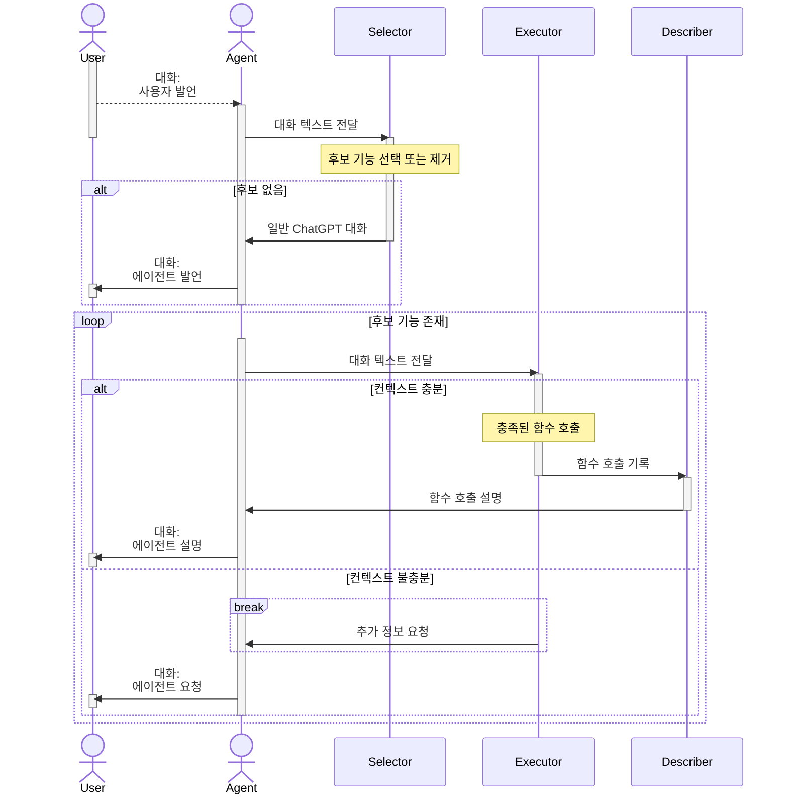
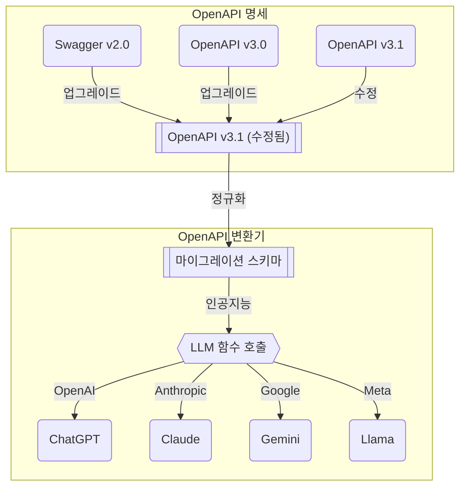
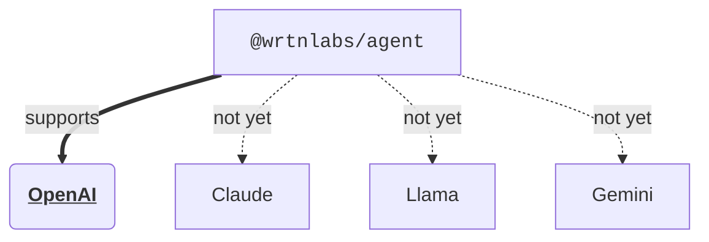

# `@wrtnlabs/agent`

*다른 언어로 읽기: [English](README.md), [日本語](README.ja.md)*


[](https://github.com/wrtnlabs/agent/blob/master/LICENSE)
[](https://www.npmjs.com/package/@wrtnlabs/agent)
[](https://www.npmjs.com/package/@wrtnlabs/agent)
[](https://github.com/wrtnlabs/agent/actions?query=workflow%3Abuild)

LLM 함수 호출에 특화된 가장 간단한 AI 에이전트 라이브러리예요.

`@wrtnlabs/agent`는 LLM(대규모 언어 모델) 함수 호출에 특화된 가장 간단한 AI 에이전트 라이브러리에요. Swagger/OpenAPI 문서나 TypeScript 클래스 타입을 통해 호출할 함수를 제공하면 모든 기능이 가능해져요. *슈퍼 AI 챗봇* 개발이나 *멀티 에이전트 오케스트레이션*, 모든 것을 함수 호출을 통해 실현할 수 있어요.

예를 들어, 쇼핑몰 서버의 **Swagger 문서**를 제공하면 `@wrtnlabs/agent`는 **슈퍼 AI 챗봇** 애플리케이션을 구성해요. 이 챗봇 애플리케이션에서 고객은 대화 텍스트만으로 제품을 구매할 수 있어요. 상담이나 환불 프로세스를 자동화하고 싶다면 Swagger 문서만 전달하면 돼요.

또한, LLM 함수 호출 전략은 **멀티 에이전트 오케스트레이션**에 효과적이에요. 더 복잡한 프레임워크를 배우고 특정 패러다임이나 패턴을 따르는 것보다 훨씬 쉽게 개발할 수 있어요. 클래스 연결만 하면 되고 **TypeScript 클래스 타입**을 전달하세요. `@wrtnlabs/agent`가 함수 호출을 통해 멀티 에이전트 오케스트레이션을 중앙 집중화하고 실현할 거예요.

> https://github.com/user-attachments/assets/01604b53-aca4-41cb-91aa-3faf63549ea6
>
> 쇼핑 AI 챗봇의 시연 동영상이에요.

<!-- 할 일: Wrtnlabs 제목으로 시연 동영상 다시 캡처 -->


## 사용 방법
### 셋업
```bash
npm install @wrtnlabs/agent @samchon/openapi typia
npx typia setup
```

`@wrtnlabs/agent`뿐만 아니라 [`@samchon/openapi`](https://github.com/samchon/openapi)와 [`typia`](https://github.com/samchon/typia)도 설치해야 해요.

`@samchon/openapi`는 Swagger/OpenAPI 문서를 LLM 함수 호출 스키마로 변환할 수 있는 OpenAPI 사양 라이브러리에요. `typia`는 TypeScript 클래스 타입에서 LLM 함수 호출 스키마를 구성할 수 있는 변환기(컴파일러) 라이브러리에요.

참고로, `typia`는 컴파일 수준에서 TypeScript 소스 코드와 타입을 분석하는 변환기 라이브러리이므로 추가 설정 명령인 `npx typia setup`이 필요해요. 표준이 아닌 TypeScript 컴파일러(`tsc`)를 사용하지 않거나 프론트엔드 환경에서 에이전트를 개발하는 경우 [`@ryoppippi/unplugin-typia`](https://typia.io/docs/setup/#unplugin-typia)도 설정해야 해요.

### 백앤드 서버와 대화하기
```typescript
import { IHttpLlmApplication } from "@samchon/openapi";
import { WrtnAgent, createHttpApplication } from "@wrtnlabs/agent";
import OpenAI from "openai";
import { IValidation } from "typia";

const main = async (): Promise<void> => {
  // SWAGGER 문서를 로드하고 LLM 응용 스키마로 변환
  const application: IValidation<IHttpLlmApplication<"chatgpt">> =
    createHttpApplication({
      model: "chatgpt",
      document: OpenApi.convert(
        await fetch("https://shopping-be.wrtn.ai/editor/swagger.json").then(
          (r) => r.json()
        )
      ),
    });
  if (application.success === false) {
    console.error(application.errors);
    throw new Error("대상 swagger 문서에 유형 오류 발생");
  }

  // 에이전트를 애플리케이션과 함께 생성
  const agent: WrtnAgent = new WrtnAgent({
    provider: {
      type: "chatgpt",
      model: "gpt-4o-mini",
      api: new OpenAI({
        apiKey: "YOUR_OPENAI_API_KEY",
      }),
    },
    controllers: [
      {
        protocol: "http",
        name: "shopping",
        application: application.data,
        connection: {
          host: "https://shopping-be.wrtn.ai",
        },
      },
    ],
    config: {
      locale: "en-US",
    },
  });

  // 이벤트 리스너 추가
  agent.on("select", async (select) => {
    console.log("선택된 함수", select.operation.function.name);
  });
  agent.on("execute", async (execute) => {
    consoe.log("실행된 함수", {
      function: execute.operation.function.name,
      arguments: execute.arguments,
      value: execute.value,
    });
  });

  // AI 챗봇과 대화
  await agent.conversate("What you can do?");
};
main().catch(console.error);
```

Swagger 문서를 로드하고 그것을 `@wrtnlabs/agent`에 전달하기만 하면 돼요.

그러면 백엔드 서버와의 대화가 시작되고, 백엔드 서버의 API 함수가 자동으로 호출될 거예요. AI 챗봇은 대화 텍스트를 분석하고 LLM 함수 호출 기능을 통해 적절한 API 함수를 실행해요.

이제부터 모든 백엔드 개발자는 동시에 AI 개발자에요.

### TypeScript 클래스와 대화하기
```typescript
import { WrtnAgent } from "@wrtnlabs/agent";
import typia, { tags } from "typia";
import OpenAI from "openai";

class BbsArticleService {
  /**
   * 새로운 기사를 작성하세요.
   *
   * 새 기사를 작성하고 DB에 보관하세요.
   *
   * @param props 작성 함수의 속성
   * @returns 새로 작성된 기사
   */
  public async create(props: {
    /**
     * 작성할 기사의 정보
     */
    input: IBbsArticle.ICreate;
  }): Promise<IBbsArticle>;

  /**
   * 기사를 업데이트하세요.
   *
   * 기사를 새로운 콘텐츠로 업데이트하세요.
   *
   * @param props 업데이트 함수의 속성
   * @param input 업데이트할 새로운 콘텐츠
   */
  public async update(props: {
    /**
     * 타겟 기사의 {@link IBbsArticle.id}.
     */
    id: string & tags.Format<"uuid">;

    /**
     * 업데이트할 새로운 콘텐츠.
     */
    input: IBbsArticle.IUpdate;
  }): Promise<void>;
}

const main = async (): Promise<void> => {
  const api: OpenAI = new OpenAI({
    apiKey: "YOUR_OPENAI_API_KEY",
  });
  const agent: WrtnAgent = new WrtnAgent({
    provider: {
      type: "chatgpt",
      model: "gpt-4o-mini",
      api: new OpenAI({
        apiKey: "YOUR_OPENAI_API_KEY",
      }),
    },
    controllers: [
      {
        protocol: "class",
        name: "vectorStore",
        application: typia.llm.applicationOfValidate<
          BbsArticleService,
          "chatgpt"
        >(),
        execute: new BbsArticleService(),
      },
    ],
  });
  await agent.conversate("I wanna write an article.");
};
main().catch(console.error);
```

TypeScript 클래스와도 대화할 수 있어요.

TypeScript 타입을 `@wrtnlabs/agent`에 전달하고 대화를 시작해 보세요. 그러면 `@wrtnlabs/agent`가 LLM 함수 호출 기능을 통해 대화 텍스트를 분석하여 적절한 클래스 함수를 호출할 거예요.

이제부터 여러분이 개발한 모든 TypeScript 클래스가 AI 챗봇이 될 수 있어요.

### 멀티 에이전트 오케스트레이션
```typescript
import { WrtnAgent } from "@wrtnlabs/agent";
import typia from "typia";
import OpenAI from "openai";

class OpenAIVectorStoreAgent {
  /**
   * RAG로 벡터 DB를 검색하세요.
   *
   * @param props 벡터 DB 검색 속성
   */
  public async query(props: {
    /**
     * 조회할 키워드.
     *
     * 조회하고 싶은 모든 키워드를 넣으세요. 그러나 핵심만 포함시키고
     * 불명확한 내용을 제외하여 정확한 결과를 얻으세요.
     */
    keywords: string;
  }): Promise<IVectorStoreQueryResult>;
}

const main = async (): Promise<void> => {
  const api: OpenAI = new OpenAI({
    apiKey: "YOUR_OPENAI_API_KEY",
  });
  const agent: WrtnAgent = new WrtnAgent({
    provider: {
      type: "chatgpt",
      model: "gpt-4o-mini",
      api: new OpenAI({
        apiKey: "YOUR_OPENAI_API_KEY",
      }),
    },
    controllers: [
      {
        protocol: "class",
        name: "vectorStore",
        application: typia.llm.applicationOfValidate<
          OpenAIVectorStoreAgent,
          "chatgpt"
        >(),
        execute: new OpenAIVectorStoreAgent({
          api,
          id: "YOUR_OPENAI_VECTOR_STORE_ID",
        }),
      },
    ],
  });
  await agent.conversate("I wanna research economic articles");
};
main().catch(console.error);
```

`@wrtnlabs/agent`에서는 멀티 에이전트 오케스트레이션을 아주 쉽게 구현할 수 있어요.

Vector Store와 같은 에이전트 기능을 갖춘 TypeScript 클래스를 개발하고, 위와 같이 TypeScript 클래스 타입을 `@wrtnlabs/agent`에 전달하세요. `@wrtnlabs/agent`는 TypeScript 클래스로 LLM 함수 호출 전략을 통해 멀티 에이전트 오케스트레이션을 중앙 집중화하고 실현할 거예요.


## 원리
### 에이전트 전략


사용자가 발언을 하면, `@wrtnlabs/agent`는 대화 텍스트를 `selector` 에이전트에 전달하고, `selector` 에이전트가 컨텍스트에서 후보 함수를 찾거나 취소하도록 합니다. `selector` 에이전트가 호출할 후보 함수를 찾을 수 없고 이전에 선택된 후보 함수도 없다면, `selector` 에이전트는 일반 ChatGPT처럼 작동합니다.

그리고 `@wrtnlabs/agent`는 후보 함수가 비어질 때까지 반복문에 들어갑니다. 이 반복문에서 `executor` 에이전트는 사용자의 대화 텍스트를 분석해 LLM 함수 호출을 시도합니다. 만약 컨텍스트가 후보 함수의 인수를 구성하기에 충분하다면, `executor` 에이전트는 실제로 대상 함수를 호출하고, `describer` 에이전트가 함수 호출 결과를 설명하도록 합니다. 반대로 컨텍스트가 충분하지 않다면 `executor` 에이전트는 사용자에게 추가 정보를 요청합니다.

이러한 LLM(대규모 언어 모델) 함수 호출 전략에서 `selector`, `executor`, `describer`를 분리하는 것이 `@wrtnlabs/agent`의 핵심 로직입니다.

### 검증 피드백
```typescript
import { FunctionCall } from "pseudo";
import { ILlmFunctionOfValidate, IValidation } from "typia";

export const correctFunctionCall = (p: {
  call: FunctionCall;
  functions: Array<ILlmFunctionOfValidate<"chatgpt">>;
  retry: (reason: string, errors?: IValidation.IError[]) => Promise<unknown>;
}): Promise<unknown> => {
  // FIND FUNCTION
  const func: ILlmFunctionOfValidate<"chatgpt"> | undefined =
    p.functions.find(f => f.name === p.call.name);
  if (func === undefined) {
    // never happened in my experience
    return p.retry(
      "Unable to find the matched function name. Try it again.",
    );
  }

  // VALIDATE
  const result: IValidation<unknown> = func.validate(p.call.arguments);
  if (result.success === false) {
    // 1st trial: 50% (gpt-4o-mini in shopping mall chatbot)
    // 2nd trial with validation feedback: 99%
    // 3nd trial with validation feedback again: never have failed
    return p.retry(
      "Type errors are detected. Correct it through validation errors",
      {
        errors: result.errors,
      },
    );
  }
  return result.data;
}
```

LLM 함수 호출이 완벽할까요?

정답은 아니에요. OpenAI와 같은 LLM(대규모 언어 모델) 제공자는 대상 함수 호출의 인수를 구성할 때 많은 타입 오류를 저질러요. LLM 함수 호출 스키마가 `Array<string>` 타입으로 정의되어 있어도, LLM은 종종 단일 `string` 값만으로 구성을 하곤 해요.

따라서 LLM 함수 호출 에이전트를 개발할 때, 검증 피드백 프로세스가 필수적으로 요구됩니다. LLM이 인수 구성을 할 때 타입 오류를 범하면, 에이전트는 가장 상세한 검증 오류를 피드백 하고, LLM이 검증 오류를 참고하여 함수 호출을 재시도 하도록 해야 돼요.

검증 피드백 관련하여, `@wrtnlabs/agent`는 [`typia.validate<T>()`](https://typia.io/docs/validators/validate)와 [`typia.llm.applicationOfValidate<Class, Model>()`](https://typia.io/docs/llm/application/#applicationofvalidate) 기능을 활용해요. 이들은 컴파일 수준에서 TypeScript 소스 코드를 분석하여 검증 논리를 구축하기 때문에 다른 어느 검증기 보다도 상세하고 정확해요. 그러므로 가장 이상적인 LLM 함수 호출을 실현하게 되었어요. 제 경험에서 OpenAI의 `gpt-4o-mini` 모델을 사용할 때, 처음 시도에 약 50% 정도는 유효하지 않은 함수 호출 인수를 구성하는 경향을 보였어요. 하지만 `typia`의 검증 피드백을 통해 수정하게 되면 성공률이 99%로 급격히 상승해요. 그리고 검증 피드백을 두 번 시도하면 실패한 적이 없어요.

**컴포넌트**       | `typia` | `TypeBox` | `ajv` | `io-ts` | `zod` | `C.V.`
------------|--------|-----------|-------|---------|-------|------------------
**사용하기 쉬움** | ✅ | ❌ | ❌ | ❌ | ❌ | ❌ 
[객체 (간단)](https://github.com/samchon/typia/blob/master/test/src/structures/ObjectSimple.ts)          | ✔ | ✔ | ✔ | ✔ | ✔ | ✔
[객체 (계층)](https://github.com/samchon/typia/blob/master/test/src/structures/ObjectHierarchical.ts)    | ✔ | ✔ | ✔ | ✔ | ✔ | ✔
[객체 (재귀)](https://github.com/samchon/typia/blob/master/test/src/structures/ObjectRecursive.ts)       | ✔ | ❌ | ✔ | ✔ | ✔ | ✔ | ✔
[객체 (유니온, 암시)](https://github.com/samchon/typia/blob/master/test/src/structures/ObjectUnionImplicit.ts) | ✅ | ❌ | ❌ | ❌ | ❌ | ❌
[객체 (유니온, 명시)](https://github.com/samchon/typia/blob/master/test/src/structures/ObjectUnionExplicit.ts) | ✔ | ✔ | ✔ | ✔ | ✔ | ❌
[객체 (추가 태그)](https://github.com/samchon/typia/#comment-tags)        | ✔ | ✔ | ✔ | ✔ | ✔ | ✔
[객체 (템플릿 리터럴 타입)](https://github.com/samchon/typia/blob/master/test/src/structures/TemplateUnion.ts) | ✔ | ✔ | ✔ | ❌ | ❌ | ❌
[객체 (동적 속성)](https://github.com/samchon/typia/blob/master/test/src/structures/DynamicTemplate.ts) | ✔ | ✔ | ✔ | ❌ | ❌ | ❌
[배열 (후행 튜플)](https://github.com/samchon/typia/blob/master/test/src/structures/TupleRestAtomic.ts) | ✅ | ❌ | ❌ | ❌ | ❌ | ❌
[배열 (계층)](https://github.com/samchon/typia/blob/master/test/src/structures/ArrayHierarchical.ts)     | ✔ | ✔ | ✔ | ✔ | ✔ | ✔
[배열 (재귀)](https://github.com/samchon/typia/blob/master/test/src/structures/ArrayRecursive.ts)        | ✔ | ✔ | ✔ | ✔ | ✔ | ❌
[배열 (재귀, 유니온)](https://github.com/samchon/typia/blob/master/test/src/structures/ArrayRecursiveUnionExplicit.ts) | ✔ | ✔ | ❌ | ✔ | ✔ | ❌
[배열 (R+U, 암시)](https://github.com/samchon/typia/blob/master/test/src/structures/ArrayRecursiveUnionImplicit.ts)    | ✅ | ❌ | ❌ | ❌ | ❌ | ❌
[배열 (중복)](https://github.com/samchon/typia/blob/master/test/src/structures/ArrayRepeatedNullable.ts)    | ✅ | ❌ | ❌ | ❌ | ❌ | ❌
[배열 (중복, 유니온)](https://github.com/samchon/typia/blob/master/test/structures/ArrayRepeatedUnionWithTuple.ts)    | ✅ | ❌ | ❌ | ❌ | ❌ | ❌
[**궁극의 유니온 타입**](https://github.com/samchon/typia/blob/master/src/schemas/IJsonSchema.ts)  | ✅ | ❌ | ❌ | ❌ | ❌ | ❌

> `C.V.`는 `class-validator`를 의미해요

### OpenAPI 명세


`@wrtnlabs/agent`는 Swagger/OpenAPI 문서와 TypeScript 클래스 타입에서 LLM 함수 호출 스키마를 얻어요. TypeScript 클래스 타입은 [`typia.llm.applicationOfValidate<Class, Model>()`](https://typia.io/docs/llm/application#applicationofvalidate) 함수를 통해 LLM 함수 호출 스키마로 변환될 수 있어요. 그렇다면 OpenAPI 문서는 어떻게 LLM 함수 호출 스키마가 될 수 있을까요?

비밀은 위의 다이어그램에 있습니다.

OpenAPI 명세에는 서로 다른 정의를 가진 세 가지 버전이 있어요. 심지어 같은 버전에서도 너무 많은 모호하고 중복된 표현이 포함되어 있어요. 이 문제를 해결하기 위해 [`@samchon/openapi`](https://github.com/samchon/openapi)는 모든 OpenAPI 문서를 v3.1의 수정된 명세로 변환하고 있어요. `@samchon/openapi`의 수정된 v3.1 명세는 모호하고 중복된 모든 표현을 제거하여 명확함을 추구해요.

수정된 v3.1 OpenAPI 문서를 통해, `@samchon/openapi`는 이를 함수 구조에 가까운 마이그레이션 스키마로 변환합니다. 그리고 마지막 단계에서는 마이그레이션 스키마가 특정 LLM 제공자의 함수 호출 스키마로 변환됩니다. LLM 함수 호출 스키마는 이렇게 구성됩니다.

> **왜 직접 변환하지 않고, 중간 단계를 거치나요?**
>
> 각 버전의 OpenAPI 명세에서 특정 LLM의 함수 호출 스키마로 직접 변환한다면 데카르트 곱에 의해 훨씬 더 많은 변환기를 만들어야 해요. 현재 모델에서는 변환기의 수가 12 = 3 x 4 가 됩니다.
>
> 하지만 중간 스키마를 정의하면 변환기의 숫자는 덧셈 연산으로 줄어들어요. 현재 모델에서는 7 = 3 + 4 만 있으면 되고, 이것이 중간 명세를 정의한 이유입니다. 이 방법은 경제적이에요.


## 로드맵
### 가이드 문서
여기 README 문서에서 `@wrtnlabs/agent`는 주요 개념과 원칙을 소개하고 일부 예시를 보여주고 있어요. 

하지만, AI 챗봇 개발의 뉴 커머들에게는 이 내용만으로는 충분하지 않아요. 가이드 문서와 예제 프로젝트가 교육을 위해 많이 필요해요. 우리는 LLM 함수 호출에 최적화된 올바른 정의를 작성하는 방법을 백엔드 개발자에게 안내하고, 멀티 에이전트 오케스트레이션 구현에 있어서 최상의 방법을 소개할 필요가 있어요.

2025년 3월 31일까지 이러한 상세한 가이드 문서를 작성할 예정이고, 완성되기까지 계속해서 문서를 발표할 예정이에요.

### 플레이그라운드
https://nestia.io/chat/playground

저는 예전에 Swagger AI 챗봇 플레이그라운드 웹사이트를 개발한 적이 있어요.

그러나 TypeScript 클래스 타입에서 함수 스키마를 얻는 다른 부분은 아직 준비되지 않았어요. TypeScript 컴파일러(`tsc`)를 내장하여 TypeScript 클래스 타입 기반의 플레이그라운드 웹사이트를 만들 거예요.

새로운 플레이그라운드 웹사이트는 2025년 3월 15일까지 공개될 예정이에요.

### 최적화
초기에는 POC(개념 증명) 개발에 집중했기 때문에, `@wrtnlabs/agent`를 구성하는 내부 에이전트들이 아직 비용 최적화되지 않았어요. 특히, `selector` 에이전트는 LLM 토큰을 과도하게 반복 소비하고 있어요. `selector` 에이전트를 RAG(검색 증강 생성을 통한 최적화) 기술을 통해 최적화할 예정이에요.

또한, `@wrtnlabs/agent`에 연결할 수 있는 다수의 유용한 애드온 에이전트를 지원할 예정이에요. 그 중 하나인 `@wrtnlabs/hive`는 `selector` 에이전트를 최적화하여 LLM 비용을 크게 줄여줍니다. 그 외에도 OpenAI 벡터 스토어 핸들러와 Postgres 기반 RAG 엔진도 제공될 예정이에요.

이러한 `@wrtnlabs/agent`가 제공하는 애드온 에이전트를 통해 TypeScript 클래스 함수 호출을 통한 멀티 에이전트 오케스트레이션 구현 방법을 배울 수 있고, `@wrtnlabs/agent`가 멀티 에이전트 시스템 상호작용을 얼마나 쉽게 만드는지 이해할 수 있어요.

### 웹소켓 모듈
```typescript
import { 
  IWrtnAgentEvent,
  IWrtnAgentHeader,
  IWrtnAgentListener,
  IWrtnAgentService 
} from "@wrtnlabs/agent";
import { Driver, WebSocketConnector } from "tgrid";

const main = async (): Promise<void> => {
  const connector: WebSocketConnector<
    IWrtnAgentHeader,
    IWrtnAgentListener,
    IWrtnAgentService
  > = new WebSocketConnector(
    {
      locale: "en-US",
    } satisfies IWrtnAgentHeader,
    {
      // EVENT LISTENERS
      conversate: async (event: IWrtnAgentEvent.IConversate) => {},
      select: async (event: IWrtnAgentEvent.ISelect) => {},
      execute: async (event: IWrtnAgentEvent.IExecute) => {},
      describe: async (event: IWrtnAgentEvent.IDescribe) => {},
    } satisfies IWrtnAgentService,
  );
  await connector.connect("http://localhost:3000/chat");

  // CALL SERVER'S FUNCTION
  const service: Driver<IWrtnAgentService> = connector.getDriver();
  await service.conversate("Hello, what you can do?");
};
main().catch(console.error);
```

`@wrtnlabs/agent`는 RPC(원격 프로시저 호출) 패러다임의 웹소켓 모듈을 제공할 예정이에요.

이 웹소켓 모듈은 에이전트 백엔드 서버와 AI 챗봇 프론트엔드 애플리케이션을 쉽게 통합할 수 있게 도와줄 거예요.

이 기능은 2025년 2월 28일까지 지원할 예정이에요.

### LLM 제공자


현재 `@wrtnlabs/agent`는 OpenAI만 지원해요.

초기에는 POC(개념 증명) 및 데모 단계이기 때문에 OpenAI만 지원했지만, AI 세상에서 가장 유명한 모델인 OpenAI 외에도, `@wrtnlabs/agent`는 더 넓은 사용자층을 위해 많은 모델을 지원해야 해요.

2025년 4월 30일까지 더 많은 모델을 지원할 예정이에요.