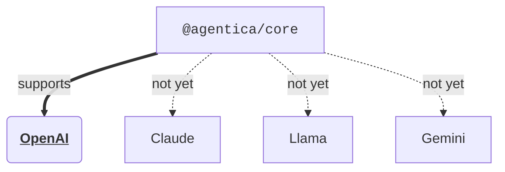

# Agentica


[](https://github.com/wrtnlabs/agentica/blob/master/LICENSE)
[](https://www.npmjs.com/package/@agentica/core)
[](https://www.npmjs.com/package/@agentica/core)
[](https://github.com/wrtnlabs/agentica/actions?query=workflow%3Abuild)

The simplest **Agentic AI** library, specialized in **LLM Function Calling**.

Just deliver **Swagger/OpenAPI** document or **TypeScript class type** to the `agentica`. Then `agentica` will do everything.

Look at the below demonstration, and feel how `agentica` is easy and powerful.

```typescript
import typia from "typia";
import { Agentica } from "@agentica/core";

const agent: Agentica = new Agentica({
  controllers: [
    await fetch(
      "https://shopping-be.wrtn.ai/editor/swagger.json",
    ).then(r => r.json()),
    typia.llm.application<ShoppingCounselor>(),
    typia.llm.application<ShoppingPolicy>(),
    typia.llm.application<ShoppingSearchRag>(),
  ],
});
await agent.conversate("I wanna buy MacBook Pro");
```

> https://github.com/user-attachments/assets/01604b53-aca4-41cb-91aa-3faf63549ea6
>
> Demonstration video of Shopping AI Chatbot

<!-- To do: re-capture demonstration video with Wrtnlabs title -->


## Guide Documents
### 🏠 Home
Preparing detailed guide documents.

Until that, please satisfy with README document of each module.

### 📖 Features
- **Core Library**
  - [Introduction](https://github.com/wrtnlabs/agentica/tree/main/packages/core)
  - [How to Use](https://github.com/wrtnlabs/agentica/tree/main/packages/core#how-to-use)
    - [Setup](https://github.com/wrtnlabs/agentica/tree/main/packages/core#setup)
    - [Chat with Backend Server](https://github.com/wrtnlabs/agentica/tree/main/packages/core#chat-with-backend-server)
    - [Chat with TypeScript Class](https://github.com/wrtnlabs/agentica/tree/main/packages/core#chat-with-typescript-class)
    - [Multi Agent Orchestration](https://github.com/wrtnlabs/agentica/tree/main/packages/core#multi-agent-orchestration)
  - [Principles](https://github.com/wrtnlabs/agentica/tree/main/packages/core#principles)
    - [Agent Strategy](https://github.com/wrtnlabs/agentica/tree/main/packages/core#agent-strategy)
    - [Validation Feedback](https://github.com/wrtnlabs/agentica/tree/main/packages/core#validation-feedback)
    - [OpenAPI Specification](https://github.com/wrtnlabs/agentica/tree/main/packages/core#openapi-specification)
- **Benchmark Program**
  - [Introduction](https://github.com/wrtnlabs/agentica/tree/main/packages/rpc)
  - [How to Use](https://github.com/wrtnlabs/agentica/tree/main/packages/rpc#how-to-use)
    - [Setup](https://github.com/wrtnlabs/agentica/tree/main/packages/rpc#setup)
    - [Server Application](https://github.com/wrtnlabs/agentica/tree/main/packages/rpc#server-application)
    - [Client Application](https://github.com/wrtnlabs/agentica/tree/main/packages/rpc#client-application)
- **WebSocket RPC**
  - [Introduction](https://github.com/wrtnlabs/agentica/tree/main/packages/rpc#introduction)
  - [How to Use](https://github.com/wrtnlabs/agentica/tree/main/packages/rpc#how-to-use)
    - [Setup](https://github.com/wrtnlabs/agentica/tree/main/packages/rpc#setup)
    - [Server Application](https://github.com/wrtnlabs/agentica/tree/main/packages/rpc#server-application)
    - [Client Application](https://github.com/wrtnlabs/agentica/tree/main/packages/rpc#client-application)
  - [Principles](https://github.com/wrtnlabs/agentica/tree/main/packages/rpc#principles)
    - [Remote Procedure Call](https://github.com/wrtnlabs/agentica/tree/main/packages/rpc#remote-procedure-call)

### Appendix
  - [API Documents](http://wrtnlabs.github.io/agentica/api)
  - [⇲ Benchmark Result](https://github.com/wrtnlabs/agentica/tree/main/test/examples/benchmarks/select)


## Roadmap
### Guide Documents
In here README document, `@agentica/core` is introducing its key concepts, principles, and demonstrating some examples. 

However, this contents are not fully enough for new comers of AI Chatbot development. We need much more guide documents and example projects are required for education. We have to guide backend developers to write proper definitions optimized for LLM function calling. We should introduce the best way of multi-agent orchestration implementation.

We'll write such fully detailed guide documents until 2025-03-31, and we will continuously release documents that are in the middle of being completed.

### Playground
https://nestia.io/chat/playground

I had developed Swagger AI chatbot playground website for a long time ago.

However, the another part obtaining function schemas from TypeScript class type, it is not prepared yet. I'll make the TypeScript class type based playground website by embedding TypeScript compiler (`tsc`).

The new playground website would be published until 2025-03-15.

### Optimization
As I've concenstrated on POC (Proof of Concept) development on the early stage level, internal agents composing `@agentica/core` are not cost optimized yet. Especially, `selector` agent is consuming LLM tokens too much repeatedly. We'll optimize the `selector` agent by RAG (Retrieval Augmented Generation) skills.

Also, we will support dozens of useful add-on agents which can connect with `@agentica/core` by TypeScript class function calling. One of them is `@wrtnlabs/hive` which optimizes `selector` agent so that reducing LLM costs dramatically. The others would be OpenAI Vector Store handler and Postgres based RAG engine.

With these `@agentica/core` providing add-on agents, you can learn how to implement the Multi-agent orchestration through TypeScript class function calling, and understand how `@agentica/core` makes the Multi agent system interaction super easily.

### LLM Providers


Currently, `@agentica/core` supports only OpenAI. 

It is because `@agentica/core` is still in the POC (Proof of Concept) and demonstration stage. However, even nthough OpenAI is the most famous model in the AI world, `@agentica/core` have to support much more models for broad users.

We're going to support much more models until 2025-04-30.
