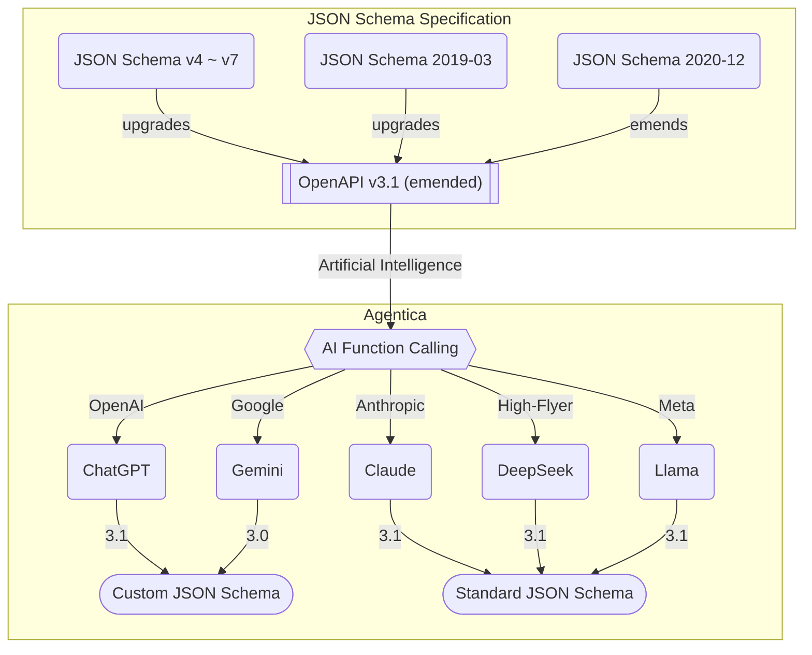

# Agentica, AI Function Calling Framework

<!-- https://github.com/user-attachments/assets/5326cc59-5129-470d-abcb-c3f458b5c488 -->


[](https://github.com/wrtnlabs/agentica/blob/master/LICENSE)
[](https://www.npmjs.com/package/@agentica/core)
[](https://www.npmjs.com/package/@agentica/core)
[](https://github.com/wrtnlabs/agentica/actions?query=workflow%3Abuild)
[](https://wrtnlabs.io/agentica/)
[](https://discord.gg/aMhRmzkqCx)

Agentic AI framework specialized in AI Function Calling.

Don't be afraid of AI agent development. Just list functions from three protocols below. This is everything you should do for AI agent development.

- TypeScript Class
- Swagger/OpenAPI Document
- MCP (Model Context Protocol) Server

Wanna make an e-commerce agent? Bring in e-commerce functions. Need a newspaper agent? Get API functions from the newspaper company. Just prepare any functions that you need, then it becomes an AI agent.

Are you a TypeScript developer? Then you're already an AI developer. Familiar with backend development? You're already well-versed in AI development. Anyone who can make functions can make AI agents.

```typescript
import { Agentica, assertHttpLlmApplication } from "@agentica/core";
import OpenAI from "openai";
import typia from "typia";

import { MobileFileSystem } from "./services/MobileFileSystem";

const agent = new Agentica({
  vendor: {
    api: new OpenAI({ apiKey: "********" }),
    model: "gpt-4o-mini",
  },
  controllers: [
    // functions from TypeScript class
    {
      protocol: "http",
      application: typia.llm.application<MobileFileSystem, "chatgpt">(),
      execute: new MobileFileSystem(),
    },
    // functions from Swagger/OpenAPI
    {
      protocol: "http",
      application: assertHttpLlmApplication({
        model: "chatgpt",
        document: await fetch(
          "https://shopping-be.wrtn.ai/editor/swagger.json",
        ).then(r => r.json()),
      }),
      connection: {
        host: "https://shopping-be.wrtn.ai",
        headers: { Authorization: "Bearer ********" },
      },
    },
  ],
});
await agent.conversate("I wanna buy MacBook Pro");
```

## 📦 Setup

```bash
$ npx agentica start <directory>

----------------------------------------
 Agentica Setup Wizard
----------------------------------------
? Package Manager (use arrow keys)
  > npm
    pnpm
    yarn (berry is not supported)
? Project Type
    NodeJS Agent Server
  > NestJS Agent Server
    React Client Application
    Standalone Application
? Embedded Controllers (multi-selectable)
    (none)
    Google Calendar
    Google News
  > Github
    Reddit
    Slack
    ...
```

The setup wizard helps you create a new project tailored to your needs.

For reference, when selecting a project type, any option other than "Standalone Application" will implement the [WebSocket Protocol](https://wrtnlabs.io/agentica/docs/websocket/) for client-server communication.

For comprehensive setup instructions, visit our [Getting Started](https://wrtnlabs.io/agentica/docs/) guide.

## 💻 Playground

Experience Agentica firsthand through our [interactive playground](https://wrtnlabs.io/agentica/playground) before installing.

Our demonstrations showcase the power and simplicity of Agentica's function calling capabilities across different integration methods.

- [TypeScript Class](https://wrtnlabs.io/agentica/playground/bbs)
- [Swagger/OpenAPI Document](https://wrtnlabs.io/agentica/playground/swagger)
- [Enterprise E-commerce Agent](https://wrtnlabs.io/agentica/playground/shopping)

<!--
@todo this section would be changed after making tutorial playground
-->

## 📚 Documentation Resources

Find comprehensive resources at our [official website](https://wrtnlabs.io/agentica).

- [Home](https://wrtnlabs.io/agentica)
- [Guide Documents](https://wrtnlabs.io/agentica/docs)
- [Tutorial](https://wrtnlabs.io/agentica/tutorial)
- [API Documents](https://wrtnlabs.io/agentica/api)
- [Youtube](https://www.youtube.com/@wrtnlabs)
- [Paper](https://wrtnlabs.io/agentica/paper)

## 🌟 Why Agentica?



Agentica enhances AI function calling by the following strategies:

- [**JSON schema conversion**](https://wrtnlabs.io/agentica/docs/core/vendor/#schema-specification): Automatically handles specification differences between LLM vendors, ensuring seamless integration regardless of your chosen AI model.
- [**Validation Feedback**](https://wrtnlabs.io/agentica/docs/concepts/function-calling#validation-feedback): Detects and corrects AI mistakes in argument composition, dramatically reducing errors and improving reliability.
- [**Selector Agent**](https://wrtnlabs.io/agentica/docs/concepts/function-calling#orchestration-strategy): Filtering candidate functions to minimize context usage, optimize performance, and reduce token consumption.

Thanks to these innovations, Agentica makes AI function calling easier, safer, and more accurate than before. Development becomes more intuitive since you only need to prepare functions relevant to your specific use case, and scaling your agent's capabilities is as simple as adding or removing functions.

In 2023, when OpenAI announced function calling, many predicted that function calling-driven AI development would become the mainstream. However, in reality, due to the difficulty and instability of function calling, the trend in AI development became agent workflow. Agent workflow, which is inflexible and must be created for specific purposes, has conquered the AI ​​agent ecosystem.

By the way, as Agentica has resolved the difficulty and instability problems of function calling, the time has come to embrace function-driven AI development once again.

| Type        | Workflow      | Vanilla Function Calling | Agentica Function Calling |
| ----------- | ------------- | ------------------------ | ------------------------- |
| Purpose     | ❌ Specific   | 🟢 General               | 🟢 General                |
| Difficulty  | ❌ Difficult  | ❌ Difficult             | 🟢 Easy                   |
| Stability   | 🟢 Stable     | ❌ Unstable              | 🟢 Stable                 |
| Flexibility | ❌ Inflexible | 🟢 Flexible              | 🟢 Flexible               |
