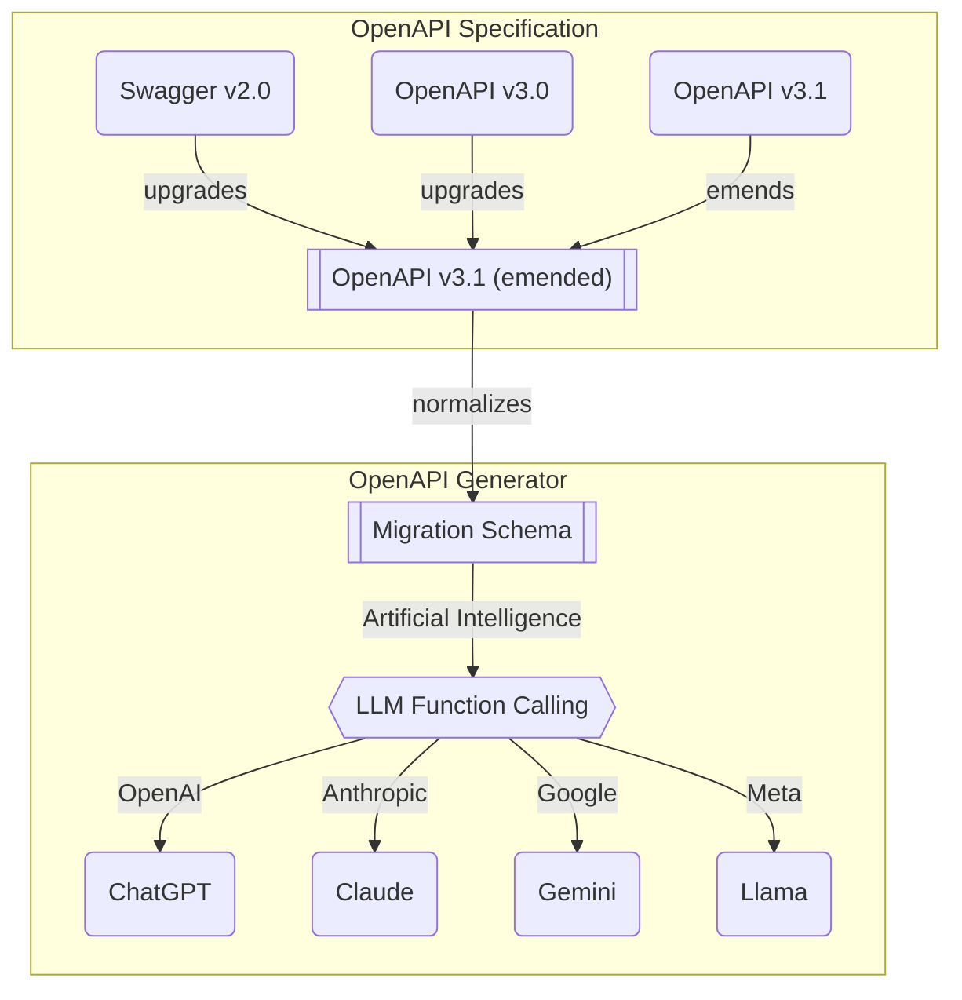

<!--
New backend development paradigm in the new AI era (Swagger/OpenAPI is the everything)
-->

## 1. Preface

<!--
Youtube Video demonstrating the Super AI Chatbot
-->

Principle keywords:

- Every backend servers can be Super AI Chatbot
- Human forgives mistake, but AI never forgives
- Compiler based Swagger generator is required
- And everything is prepared for you

In the new AI era, **Swagger document** will become the most important in the backend ecosystem.

It's because the Swagger document can be converted to the LLM (Large Language Model) function calling schema, so that every backend servers can be **Super AI Chatbot**. In the Super AI Chatbot, users can call the backend API functions just by the conversation texts. Consequently, in the new AI era, every backend developer is also an AI developer.

However, if a backend developer takes a mistake on the Swagger documentation, it can lead to a significant issue. While human (client or frontend developer) forgives the documentation mistake and avoids it through intuition and experimentations, **AI never forgives** it. Therefore, it is essential that Swaggeer documentation is error-free in the new AI era's landscape.

By the way, how can a human does not take any mistake? To solve this human mistake problem, I think that the new AI era's Swagger document generator must be based on the **compiler**. The new AI er's Swagger generator will analyze the backend source code in the compilation level, so that make the Swagger document to be perfect without any error. In the new AI error, the error must be caught such automatically and systematically.

In this article, I'll demonstrate you how to develop Super AI chatbot with Swagger document. And then, I'll introduce you the new AI era's backend development way, the compiler based Swagger generator. You backend developers, let's be the AI developers.

- Related Repositories
  - [`@agentica/core`](https://github.com/wrtnlabs/agentica): Super AI Chatbot agent library using Swagger document
  - [`@wrtnlabs/autoview`](https://github.com/wrtnlabs/autoview): Automatic frontend component renderer
  - [`@samchon/openapi`](https://github.com/samchon/openapi): Swagger to LLM function calling schema converter
  - [`typia`](https://github.com/samchon/typia): TypeScript compiled based schema generator
  - [`nestia`](https://github.com/samchon/nestia): Compiler based Swagger generator of NestJS

> ### Swagger vs OpenAPI
>
> When Swagger publishing v3 major update, its name has been changed to the "OpenAPI". Therefore, "OpenAPI Document" is the right notation, and "Swagger document" is the legacy expression. But in this article, I'll keep using the "Swagger Document", because the word "OpenAPI" can be confused with the a famous AI corporation name "OpenAI".

## 2. Every backend servers can be Super AI Chatbot

### 2.1. Swagger to LLM function calling schema



I made a library [`@samchon/openapi`](https://github.com/samchon/openapi) converting Swagger document to the LLM function calling schemas.

It supports every versions of Swagger/OpenAPI specifications, and also supports LLM function calling schemas of the most LLM providers like {OpenAI, Claude, gemini, and Llama}. For the efficient and accrurate conversion process, `@samchon/openapi` has OpenAPI v3.1 emended specification for intermediate purpose. The LLM function calling schema conversion starts from the OpenAPI v3.1 emended specification.

Therefore, the first thing what should do is composing the OpenAPI v3.1 emended specified document by the calling the `OpenApi.convert()` function. And then, compose the `IHttpLlmApplication` typed structure by calling the `HttpLlm.application()` function with target model and emended OpenAPI document.

```typescript
import {
  HttpLlm,
  IHttpLlmApplication,
  OpenApi,
  OpenApiV3,
  OpenApiV3_1,
  SwaggerV2,
} from "@samchon/openapi";

const main = async (): Promise<void> => {
  const input:
    | SwaggerV2.IDocument
    | OpenApiV3.IDocument
    | OpenApiV3_1.IDocument = await fetch(
    "https://raw.githubusercontent.com/samchon/shopping-backend/refs/heads/master/packages/api/swagger.json"
  ).then((r) => r.json());
  const document: OpenApi.IDocument = OpenApi.convert(input);
  const application: IHttpLlmApplication<"chatgpt"> = HttpLlm.application({
    model: "chatgpt",
    document,
    options: {
      reference: true,
    },
  });
  console.log(application);
};
main().catch(console.error);
```

> [💻 Playground Link](https://typia.io/playground/?script=JYWwDg9gTgLgBAbwFBzgCRjMAZANiAGhTgEkMs8QBBMMXYAYwEMZgIA7I1AeTAFN2NYFzi8BQgGoBmEWMFhg0gPoBGEQGUA7kwDmOvlAkAmIgF84AMygQQcAEQABAM5MQDABYcA9BH7smCnYA3EhIDBxO8CBMwOxwALxwTE4AnuwMcAAUAJQAXHAACtYgwE58ADwAbhDAACYAfAmNyKjh7JFwsWAArjC5xKgAPnBauvqGRgB0JAAiEAzdIAIwA3DDcpJS03MLS+wrqEOifpuq2-OLywlJ2sDwFnwwHpmrdu6YYE65Xl5QTJqTHR3dzdABG3TKUDaMGWk3CIC8LjcnnYiM8tFiOgAtKCmAwANYCWq-PgWJxedx8Ji1cnRSIGLxgPH43R8ckBYCI7R6AyTABWTg4dhE2UmMEp7EymSg2SacCg-MFkuy2RCrQi8FqFz2fWO4gU512V0SGwNbUqBhgmS6vVVxDaHQCdEYLDY7HyZA+lBozuYrA45TsHhYOjAMDsjUS5Bw+EmTvofrdmRahxAEFqfFw+SD7hDYeFqy1Rv2IlQvn97XyKcO8tJBgEDD4+RgUG6fFLcFMIlMdvV7QguD4k1wEB0mXjLordtMIWisRycJYzwdA6HBmsMqCQA)

### 2.2. Super AI Chatbot Development

```typescript
import { HttpLlm, IHttpLlmApplication, OpenApi } from "@samchon/openapi";
import { Agentica } from "@agentica/core";
import OpenAI from "openai";

const main = async (): Promise<void> => {
  const application: IHttpLlmApplication<"chatgpt"> = HttpLlm.application({
    model: "chatgpt",
    document: OpenApi.convert(
      await fetch("https://shopping-be.wrtn.ai/editor/swagger.json").then((r) =>
        r.json()
      )
    ),
  });
  const agent: Agentica = new Agentica({
    provider: {
      type: "chatgpt",
      model: "gpt-4o-mini",
      api: new OpenAI({
        apiKey: "YOUR_OPENAI_API_KEY",
      }),
    },
    controllers: [
      {
        protocol: "http",
        name: "shopping",
        application,
        connection: {
          host: "https://shopping-be.wrtn.ai",
        },
      },
    ],
    config: {
      locale: "en-US",
    },
  });
  agent.on("select", async (select) => {});
  agent.on("execute", async (execute) => {});
  await agent.conversate("What you can do?");
};
main().catch(console.error);
```

https://nestia.io/chat/shopping/

### 2.3. Frontend Application Development

```typescript
import { Agentica } from "@agentica/core";
import { WrtnChatApplication } from "@wrtnlabs/chat";
import {
  HttpLlm,
  IHttpConnection,
  IHttpLlmApplication,
  OpenApi,
} from "@samchon/openapi";
import OpenAI from "openai";
import { useEffect, useState } from "react";

export const ShoppingChatApplication = (
  props: ShoppingChatApplication.IProps
) => {
  const [application, setApplication] =
    useState<IHttpLlmApplication<"chatgpt"> | null>(null);
  useEffect(() => {
    (async () => {
      setApplication(
        HttpLlm.application({
          model: "chatgpt",
          document: OpenApi.convert(
            await fetch("https://shopping-be.wrtn.ai/editor/swagger.json").then(
              (r) => r.json()
            )
          ),
        })
      );
    })().catch(console.error);
  }, []);
  if (application === null)
    return (
      <div>
        <h2>Loading Swagger document</h2>
        <hr />
        <p>Wait for a moment please.</p>
        <p>Loading Swagger document...</p>
      </div>
    );

  const agent: Agentica = new Agentica({
    provider: {
      type: "chatgpt",
      model: "gpt-4o-mini",
      api: props.api,
    },
    controllers: [
      {
        protocol: "http",
        name: "main",
        application,
        connection: props.connection,
      },
    ],
    config: {
      locale: props.locale,
    },
  });
  return <WrtnChatApplication agent={agent} />;
};
export namespace ShoppingChatApplication {
  export interface IProps {
    api: OpenAI;
    connection: IHttpConnection;
    name: string;
    mobile: string;
    locale?: string;
  }
}
```

https://nestia.io/chat/shopping/

### 2.4. TypeScript Class Chatbot

## 3. Human forgives mistake, but AI never forgives.

### 3.1. Java Spring Framework

```kotlin
@ExtendWith(RestDocumentationExtension::class, SpringExtension::class)
@SpringBootTest
class SampleControllerTest {
  private lateinit var mockMvc: MockMvc

  @BeforeEach
  internal fun setUp(context: WebApplicationContext, restDocumentation: RestDocumentationContextProvider) {
    mockMvc = MockMvcBuilders.webAppContextSetup(context)
      .apply<DefaultMockMvcBuilder>(MockMvcRestDocumentation.documentationConfiguration(restDocumentation))
      .build()
  }

  @Test
  fun getSampleByIdTest() {
    val sampleId = "aaa"
    mockMvc.perform(
      get("/api/v1/samples/{sampleId}", sampleId)
    )
      .andExpect(status().isOk)
      .andExpect(jsonPath("sampleId", `is`(sampleId)))
      .andExpect(jsonPath("name", `is`("sample-$sampleId")))
      .andDo(
        MockMvcRestDocumentationWrapper.document(
          identifier = "sample",
          resourceDetails = ResourceSnippetParametersBuilder()
            .tag("Sample")
            .description("Get a sample by id")
            .pathParameters(
              parameterWithName("sampleId")
                .description("the sample id"),
            )
            .responseFields(
              fieldWithPath("sampleId")
                .type(JsonFieldType.STRING)
                .description("The sample identifier."),
              fieldWithPath("name")
                .type(JsonFieldType.STRING)
                .description("The name of sample."),
            ),
        ),
      )
  }
}
```

In the existing backend development ecosystem, as API documents are written by hands, it is very difficult, dangerous and not suitable for Super AI Chatbot development. As I am a Korean, I will talk about this story within framework of the Korean backend ecosystem.

In Korea, **Java** takes about 90% of the backend development ecosystem of major IT companies (experience of other languages are not recognized in Korea). And in the Java ecosystem, most of them have adopted [Spring Framework](https://spring.io/projects/spring-framework), and force to use [Spring RectDocs](https://spring.io/projects/spring-restdocs) for the API documentation purpose. Even when generating Swagger/OpenAPI documents, company policy dictates to convert from the `RestDocs`.

And in the `RestDocs`, you have to write the API documents manually by your hands. As you can see from the above example code, you have to write the API endpoint (`"/api/v1/samples/{sampleId}"`) by yourself, and also must write the schema types (`fieldWithPath("name").type(JsonFieldType.STRING).description("The name of sample.")`) manually.

If you take some mistakes on the documentation, it only can be caught by the runtime level test functions. The mistake never can be caught in the compilation level, so that API documentation is extremely hard work for backend developers.

And in most cases, backend developers in Korea have roles divided within the team, with those who develop the main program, those who write test code, and those who write API documentation. And in most cases, the main program is developed by senior developers, and test programs or API documentations are shifted to the junior developers.

> I am not a backend dedicated developer and have never used Java/Spring, so I do not know this ecosystem in detail. I wrote this article based on company regulations and interviews with backend developers and technical blog articles of them.
>
> And while researching information about Java's OpenAPI documentation ecosystem, I suddenly had a question. Looking at Java Spring Framework, there is a way to build Swagger directly and there are annonations related to the Swagger documentation, so why use `RestDocs`? Regarding this, the company regulations and senior backend developers are saying the same word even in their technical blogs.
>
> "Swagger is invasive to the operation code, and RestDocs is not"
>
> This is probably the answer to why there is a division of main program developers, test developers, and documentation developers within the backend team. However, as I am not a developer in this ecosystem, so I cannot understand it exactly. If anyone knows more about this subject, please let me know in the comments.

References:

- https://techblog.woowahan.com/2597/
- https://toss.tech/article/tosspayments-restdocs
- https://helloworld.kurly.com/blog/spring-rest-docs-guide/#%EB%B0%8B%EB%B0%8B%ED%95%9C%EA%B2%8C-%EC%95%84%EC%89%AC%EC%9A%B0%EB%8B%88%EA%B9%8C-spring-rest-docs-%EC%97%90-swagger-%EB%A5%BC-%EB%84%A3%EC%96%B4%EB%B3%B4%EC%9E%90
- https://tech.kakaopay.com/post/openapi-documentation/

### 3.2. Php Laravel Framework

```php
<?php
class BbsArticleController {
  /**
   * @OA\Post(
   *   path="/boards",
   *   tags={"BBS"},
   *   summary="Create a new article",
   *   description="Create a new article with its first snapshot",
   *   @OA\RequestBody(
   *     description="Article information to create",
   *     required=true,
   *     @OA\MediaType(
   *       mediaType="application/json",
   *       @OA\Schema(
   *         @OA\Property(
   *           property="title",
   *           type="string",
   *           description="Title of article",
   *         ),
   *         @OA\Property(
   *           property="content",
   *           type="string",
   *           description="Content body of article"
   *         ),
   *         @QA\Property(
   *           property="files",
   *           type="array",
   *           @QA\Items(
   *             @QA\Schema(
   *               @QA\Property(
   *                 property="name",
   *                 type="string",
   *                 maxLength=255,
   *                 description="File name, except the extension"
   *               ),
   *               @QA\Property(
   *                 property="extension",
   *                 type="string",
   *                 nullable=true,
   *                 maxLength=8,
   *                 description="File extension. If no extension, then set null"
   *               ),
   *               @QA\Property(
   *                 property="url",
   *                 type="string",
   *                 format="url",
   *                 description="URL address that the file is located in"
   *               )
   *             )
   *           )
   *         )
   *       )
   *     )
   *   ),
   *   @OA\Response(response="200", description="Success"),
   *   @OA\Response(response="400", description="Fail")
   * )
   */
  public function store(Request $request);
}
?>
```

In globally, Php seems like the major language of backend development ecosystem, and [Laravel](https://laravel.com/) is the most popular framework in the Php language. When making a Swagger/OpenAPI document in the Php Laravel Framework, you have to write documentation comments like above with `@OA` tags.

This is the most horrible and dangerous way of building swagger documents I have ever seen. At this point, CDD (Contract Driven Development) advocated by OpenAPI Foundation seems better. Isn't it the same thing as writing Swagger specs by hand as Php comments, versus writing Swagger documents by hand?

Researching it, I understood one thing. If you take mistake when writing the Swagger documentation comment, it never can be caught automatically as `RestDocs` case. And even just typo mistake like `OAA\Respons()` or `QA\Proper(type='stringggg')` never can be caught until actually opening the Swagger document. Unless `RestDocs ` forces user to write a test program validating the operation and its schemas, the Laravel's swagger generator does not any restriction, so that I could hear that no one of Php co-working client developer believes the Swagger document.

I can clearly say that, Php has fuXXing ecosystem for Super AI chatbot development. This is the most terrible solution I've ever seen.

### 3.3. Python (Django and FastAPI)

```python
from drf_spectacular.utils import extend_schema, OpenApiParameter, OpenApiExample
from drf_spectacular.types import OpenApiTypes

class AlbumViewset(viewset.ModelViewset):
  serializer_class = AlbumSerializer

  @extend_schema(
      request=AlbumCreationSerializer,
      responses={201: AlbumSerializer},
  )
  def create(self, request):
      # your non-standard behavior
      return super().create(request)

  @extend_schema(
      # extra parameters added to the schema
      parameters=[
          OpenApiParameter(name='artist', description='Filter by artist', required=False, pe=str),
          OpenApiParameter(
              name='release',
              type=OpenApiTypes.DATE,
              location=OpenApiParameter.QUERY,
              description='Filter by release date',
              examples=[
                  OpenApiExample(
                      'Example 1',
                      summary='short optional summary',
                      description='longer description',
                      value='1993-08-23'
                  ),
                  ...
              ],
          ),
      ],
      # override default docstring extraction
      description='More descriptive text',
      # provide Authentication class that deviates from the views default
      auth=None,
      # change the auto-generated operation name
      operation_id=None,
      # or even completely override what AutoSchema would generate. Provide raw Open API spec  Dict.
      operation=None,
      # attach request/response examples to the operation.
      examples=[
          OpenApiExample(
              'Example 1',
              description='longer description',
              value=...
          ),
          ...
      ],
  )
  def list(self, request):
      # your non-standard behavior
      return super().list(request)

  @extend_schema(
    request=AlbumLikeSerializer,
    responses={204: None},
    methods=["POST"]
  )
  @extend_schema(description='Override a specific method', methods=["GET"])
  @action(detail=True, methods=['post', 'get'])
  def set_password(self, request, pk=None):
    # your action behavior
    ...
```

In the Python backend ecosystem, there are two major frameworks [`Django`](https://www.djangoproject.com/) and [`FastAPI`](https://fastapi.tiangolo.com/).

Above example code is demonstrating the way to generate the Swagger document in the Django framework with [`DRF-Speculator`](https://drf-spectacular.readthedocs.io/). As you can see, it is horrible like `Spring RestDocs` and `Php Laravel` cases. Human must write the most of Swagger document parts manually by their hands. If human takes some mistake, it will break the Super AI chatbot.

Therefore, `DJango` is not suitable for new AI era.

```python
class Item(BaseModel):
  id: int
  name: str
  description: str = Field(None, description="The description of the item")
  price: float = Field(..., description="The price of the item")
  tags: List[str] = Field(default_factory=list, description="A list of tags associated with the item")

@app.post("/items/")
async def create_item(item: Item):
  return item
```

In contrary, [`FastAPI`](https://fastapi.tiangolo.com/) shows another world.

It does not need hand-writing documentation. As it can parse type hints and descriptions, the Swagger/OpenAPI documentation can be published automatically without extra working or additional efforts. This is the clear way of new AI era's backend development, and we need such paradigm's framework to accomplish the ideal Super AI chatbot implementation.

However, as Python is a script language which does not have the compilation step, type hints written in DTOs do not automatically detect type errors until runtime. If human takes a mistake on the DTO definition/documentation or its utilizing code, it can't be detected automatically either.

## 4. Compiler based Swagger Generator is required

### 4.1. Compare legacy solutions

| Type                 | Automatation | Compilation | Sole Schema |
| -------------------- | ------------ | ----------- | ----------- |
| Java Spring RestDocs | ❌           | ✅          | ❌          |
| Python FastAPI       | ✅           | ❌          | ✅          |
| Python Django        | ❌           | ❌          | ❌          |

As you can see from the above section [3. Human forgives mistake, but AI never forgives](#3-human-forgives-mistake-but-ai-never-forgives), **Java (Spring RestDocs)** can detect compilation error, but its documentation is not automated and needs duplicated extra schema definitions. Besides, **FastAPI** can automate the Swagger documentation and it does not require extra schema definition, but as its basic language **Python** cannot detect compilation errors, human mistake risk still remains.

How great would it be if swagger documentation in compiled languages ​​like `Java` were automated like `FastAPI`, without the need to define duplicate schemas? Conversely, how great would it be if a framework that could automate swagger documentation and JSON schema composition, like `FastAPI`, was launched in compiled languages?

### 4.2. Software Development Kit

### 4.3. Benchmark Solution

## 5. Everything is prepared

### 5.1. Compiler based Schema generator

### 5.2. Compiler based Swagger generator

### 5.3. Compiler based SDK generator

### 5.3. Super AI Chatbot Agent Library

### 5.4. Frontend Automation Library
