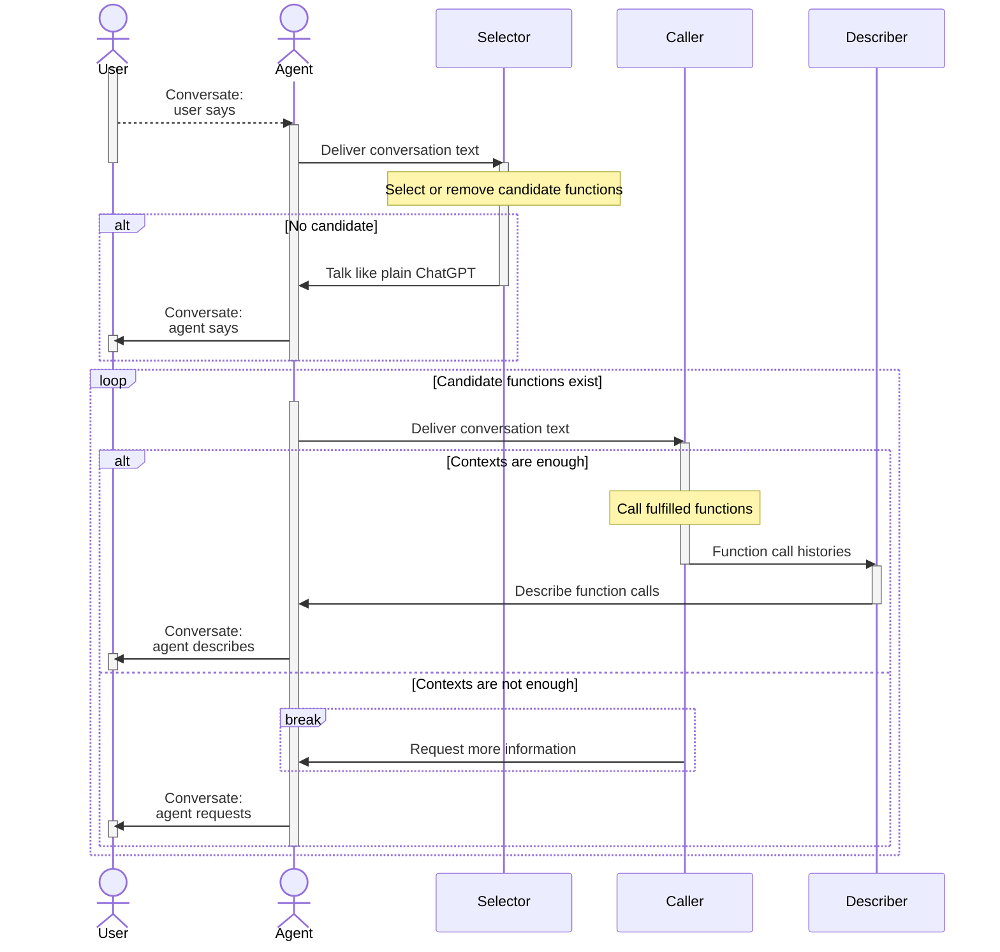
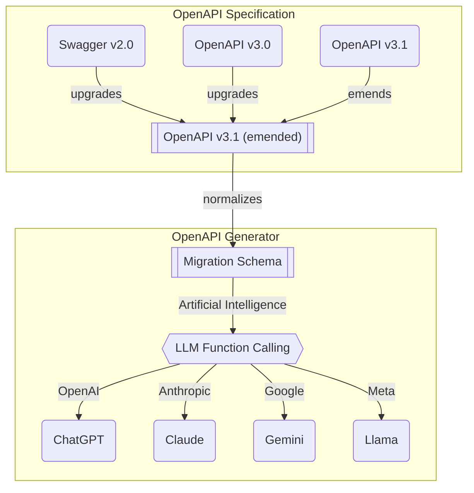

# `@agentica/core`


[](https://github.com/wrtnlabs/agentica/blob/master/LICENSE)
[](https://www.npmjs.com/package/@agentica/core)
[](https://www.npmjs.com/package/@agentica/core)
[](https://github.com/wrtnlabs/agentica/actions?query=workflow%3Abuild)

The simplest **Agentic AI Library**, specialized in **LLM Function Calling**.

`@agentica/core` is the simplest library specialized for LLM (Large Language Model) function calling. You can provide functions to call by *Swagger/OpenAPI* document or *TypeScript class type*, and it will make everything possible. *Super AI Chatbot* development, or *Multi Agent Orchestration*, all of them can be realized by the function calling.

For example, if you provide **Swagger document** of a Shopping Mall Server, `@agentica/core` will compose **Super AI Chatbot** application. In the chatbot application, customers can purchase products just by conversation texts. If you wanna automate the counseling or refunding process, you also can do it just by delivering the Swagger document.

Also, the LLM function calling strategy is effective for the **Multi-Agent Orchestration**, and it is easier to develop than any other way. You don't need to learn any complicate framework and its specific paradigms and patterns. Just connect them through class, and deliver the **TypeScript class type**. `@agentica/agentica` will centralize and realize the multi-agent orchestration through function calling.

> https://github.com/user-attachments/assets/01604b53-aca4-41cb-91aa-3faf63549ea6
>
> Demonstration video of Shopping AI Chatbot


## How to Use
### Setup
```bash
npm install @agentica/core @samchon/openapi typia
npx typia setup
```

Install not only `@agentica/core`, but also [`@samchon/openapi`](https://github.com/samchon/openapi) and [`typia`](https://github.com/samchon/typia).

`@samchon/openapi` is an OpenAPI specification library which can convert Swagger/OpenAPI document to LLM function calling schema. And `typia` is a transformer (compiler) library which can compose LLM function calling schema from a TypeScript class type.

By the way, as `typia` is a transformer library analyzing TypeScript source code in the compilation level, it needs additional setup command `npx typia setup`. Also, if you're not using non-standard TypeScript compiler (not `tsc`) or developing the agent in the frontend environment, you have to setup [`@ryoppippi/unplugin-typia`](https://typia.io/docs/setup/#unplugin-typia) too.

### Chat with Backend Server
```typescript
import { IHttpLlmApplication } from "@samchon/openapi";
import { Agentica, createHttpApplication } from "@agentica/core";
import OpenAI from "openai";
import { IValidation } from "typia";

const main = async (): Promise<void> => {
  // LOAD SWAGGER DOCUMENT, AND CONVERT TO LLM APPLICATION SCHEMA
  const application: IValidation<IHttpLlmApplication<"chatgpt">> =
    createHttpApplication({
      model: "chatgpt",
      document: OpenApi.convert(
        await fetch("https://shopping-be.wrtn.ai/editor/swagger.json").then(
          (r) => r.json()
        )
      ),
    });
  if (application.success === false) {
    console.error(application.errors);
    throw new Error("Type error on the target swagger document");
  }

  // CREATE AN AGENT WITH THE APPLICATION
  const agent: Agentica = new Agentica({
    provider: {
      type: "chatgpt",
      model: "gpt-4o-mini",
      api: new OpenAI({
        apiKey: "YOUR_OPENAI_API_KEY",
      }),
    },
    controllers: [
      {
        protocol: "http",
        name: "shopping",
        application: application.data,
        connection: {
          host: "https://shopping-be.wrtn.ai",
        },
      },
    ],
    config: {
      locale: "en-US",
    },
  });

  // ADD EVENT LISTENERS
  agent.on("select", async (select) => {
    console.log("selected function", select.operation.function.name);
  });
  agent.on("execute", async (execute) => {
    consoe.log("execute function", {
      function: execute.operation.function.name,
      arguments: execute.arguments,
      value: execute.value,
    });
  });

  // CONVERSATE TO AI CHATBOT
  await agent.conversate("What you can do?");
};
main().catch(console.error);
```

Just load your swagger document, and put it into the `@agentica/core`.

Then you can start conversation with your backend server, and the API functions of the backend server would be automatically called. AI chatbot will analyze your conversation texts, and executes proper API functions by the LLM (Large Language Model) function calling feature.

From now on, every backend developer is also an AI developer.

### Chat with TypeScript Class
```typescript
import { Agentica } from "@agentica/core";
import typia, { tags } from "typia";
import OpenAI from "openai";

class BbsArticleService {
  /**
   * Create a new article.
   *
   * Writes a new article and archives it into the DB.
   *
   * @param props Properties of create function
   * @returns Newly created article
   */
  public async create(props: {
    /**
     * Information of the article to create
     */
    input: IBbsArticle.ICreate;
  }): Promise<IBbsArticle>;

  /**
   * Update an article.
   *
   * Updates an article with new content.
   *
   * @param props Properties of update function
   * @param input New content to update
   */
  public async update(props: {
    /**
     * Target article's {@link IBbsArticle.id}.
     */
    id: string & tags.Format<"uuid">;

    /**
     * New content to update.
     */
    input: IBbsArticle.IUpdate;
  }): Promise<void>;
}

const main = async (): Promise<void> => {
  const api: OpenAI = new OpenAI({
    apiKey: "YOUR_OPENAI_API_KEY",
  });
  const agent: Agentica = new Agentica({
    provider: {
      type: "chatgpt",
      model: "gpt-4o-mini",
      api: new OpenAI({
        apiKey: "YOUR_OPENAI_API_KEY",
      }),
    },
    controllers: [
      {
        protocol: "class",
        name: "vectorStore",
        application: typia.llm.applicationOfValidate<
          BbsArticleService,
          "chatgpt"
        >(),
        execute: new BbsArticleService(),
      },
    ],
  });
  await agent.conversate("I wanna write an article.");
};
main().catch(console.error);
```

You also can chat with a TypeScript class.

Just deliver the TypeScript type to the `@agentica/core`, and start conversation. Then `@agentica/core` will call the proper class functions by analyzing your conversation texts with LLM function calling feature.

From now on, every TypeScript classes you've developed can be the AI chatbot.

### Multi Agent Orchestration
```typescript
import { Agentica } from "@agentica/core";
import typia from "typia";
import OpenAI from "openai";

class OpenAIVectorStoreAgent {
  /**
   * Retrieve Vector DB with RAG.
   *
   * @param props Properties of Vector DB retrievelance
   */
  public query(props: {
    /**
     * Keywords to look up.
     *
     * Put all the keywords you want to look up. However, keywords
     * should only be included in the core, and all ambiguous things
     * should be excluded to achieve accurate results.
     */
    keywords: string;
  }): Promise<IVectorStoreQueryResult>;
}

const main = async (): Promise<void> => {
  const api: OpenAI = new OpenAI({
    apiKey: "YOUR_OPENAI_API_KEY",
  });
  const agent: Agentica = new Agentica({
    provider: {
      type: "chatgpt",
      model: "gpt-4o-mini",
      api: new OpenAI({
        apiKey: "YOUR_OPENAI_API_KEY",
      }),
    },
    controllers: [
      {
        protocol: "class",
        name: "vectorStore",
        application: typia.llm.applicationOfValidate<
          OpenAIVectorStoreAgent,
          "chatgpt"
        >(),
        execute: new OpenAIVectorStoreAgent({
          api,
          id: "YOUR_OPENAI_VECTOR_STORE_ID",
        }),
      },
    ],
  });
  await agent.conversate("I wanna research economic articles");
};
main().catch(console.error);
```

In the `@agentica/core`, you can implement multi-agent orchestration super easily.

Just develop a TypeScript class which contains agent feature like Vector Store, and just deliver the TypeScript class type to the `@agentica/core` like above. The `@agentica/core` will centralize and realize the multi-agent orchestration by LLM function calling strategy to the TypeScript class.

### WebSocket Communication
`@agentica/core` provides WebSocket interaction module.

The websocket interface module is following RPC (Remote Procedure Call) paradigm of the [TGrid](https://github.com/samchon/tgrid), so it is very easy to interact between frontend application and backend server of the AI agent.

```typescript
import {
  IAgenticaRpcListener,
  IAgenticaRpcService,
  Agentica,
  AgenticaRpcService,
} from "@agentica/core";
import { WebSocketServer } from "tgrid";

const server: WebSocketServer<
  null,
  IAgenticaRpcService,
  IAgenticaRpcListener
> = new WebSocketServer();
await server.open(3001, async (acceptor) => {
  await acceptor.accept(
    new AgenticaRpcService({
      agent: new Agentica({ ... }),
      listener: acceptor.getDriver(),
    }),
  );
});
```

When developing backend server, wrap `Agentica` to `AgenticaRpcService`.

If you're developing WebSocket protocol backend server, create a new `Agentica` instance, and wrap it to the `AgenticaRpcService` class. And then open the websocket server like above code. The WebSocket server will call the client functions of the `IAgenticaRpcListener` remotely.

```typescript
import { IAgenticaRpcListener, IAgenticaRpcService } from "@agentica/core";
import { Driver, WebSocketConnector } from "tgrid";

const connector: WebSocketConnector<
  null,
  IAgenticaRpcListener,
  IAgenticaRpcService
> = new WebSocketConnector(null, {
  text: async (evt) => {
    console.log(evt.role, evt.text);
  },
  describe: async (evt) => {
    console.log("describer", evt.text);
  },
});
await connector.connect("ws://localhost:3001");

const driver: Driver<IAgenticaRpcService> = connector.getDriver();
await driver.conversate("Hello, what you can do?");
```

When developing frontend application, define `IAgenticaRpcListener` instance.

Otherwise you're developing WebSocket protocol client application, connect to the websocket backend server with its URL address, and provide `IAgenticaRpcListener` instance for event listening.

And then call the backend server's function `IAgenticaRpcService.conversate()` remotely through the `Driver<IAgenticaRpcService>` wrapping. The backend server will call your `IAgenticaRpcListener` functions remotely through the RPC paradigm.


## Principles
### Agent Strategy


When user says, `@agentica/core` delivers the conversation text to the `selector` agent, and let the `selector` agent to find (or cancel) candidate functions from the context. If the `selector` agent could not find any candidate function to call and there is not any candidate function previously selected either, the `selector` agent will work just like a plain ChatGPT.

And `@agentica/core` enters to a loop statement until the candidate functions to be empty. In the loop statement, `caller` agent tries to LLM function calling by analyzing the user's conversation text. If context is enough to compose arguments of candidate functions, the `caller` agent actually calls the target functions, and let `decriber` agent to explain the function calling results. Otherwise the context is not enough to compose arguments, `caller` agent requests more information to user.

Such LLM (Large Language Model) function calling strategy separating `selector`, `caller`, and `describer` is the key logic of `@agentica/core`.

### Validation Feedback
```typescript
import { FunctionCall } from "pseudo";
import { ILlmFunctionOfValidate, IValidation } from "typia";

export const correctFunctionCall = (p: {
  call: FunctionCall;
  functions: Array<ILlmFunctionOfValidate<"chatgpt">>;
  retry: (reason: string, errors?: IValidation.IError[]) => Promise<unknown>;
}): Promise<unknown> => {
  // FIND FUNCTION
  const func: ILlmFunctionOfValidate<"chatgpt"> | undefined =
    p.functions.find((f) => f.name === p.call.name);
  if (func === undefined) {
    // never happened in my experience
    return p.retry(
      "Unable to find the matched function name. Try it again.",
    );
  }

  // VALIDATE
  const result: IValidation<unknown> = func.validate(p.call.arguments);
  if (result.success === false) {
    // 1st trial: 50% (gpt-4o-mini in shopping mall chatbot)
    // 2nd trial with validation feedback: 99%
    // 3nd trial with validation feedback again: never have failed
    return p.retry(
      "Type errors are detected. Correct it through validation errors",
      {
        errors: result.errors,
      },
    );
  }
  return result.data;
}
```

Is LLM function calling perfect? 

The answer is not, and LLM (Large Language Model) providers like OpenAI take a lot of type level mistakes when composing the arguments of the target function to call. Even though an LLM function calling schema has defined an `Array<string>` type, LLM often fills it just by a `string` typed value.

Therefore, when developing an LLM function calling agent, the validation feedback process is essentially required. If LLM takes a type level mistake on arguments composition, the agent must feedback the most detailed validation errors, and let the LLM to retry the function calling referencing the validation errors.

About the validation feedback, `@agentica/core` is utilizing [`typia.validate<T>()`](https://typia.io/docs/validators/validate) and [`typia.llm.applicationOfValidate<Class, Model>()`](https://typia.io/docs/llm/application/#applicationofvalidate) functions. They construct validation logic by analyzing TypeScript source codes and types in the compilation level, so that detailed and accurate than any other validators like below.

Such validation feedback strategy and combination with `typia` runtime validator, `@agentica/core` has achieved the most ideal LLM function calling. In my experience, when using OpenAI's `gpt-4o-mini` model, it tends to construct invalid function calling arguments at the first trial about 50% of the time. By the way, if correct it through validation feedback with `typia`, success rate soars to 99%. And I've never had a failure when trying validation feedback twice.

Components               | `typia` | `TypeBox` | `ajv` | `io-ts` | `zod` | `C.V.`
-------------------------|--------|-----------|-------|---------|-------|------------------
**Easy to use**          | ✅ | ❌ | ❌ | ❌ | ❌ | ❌ 
[Object (simple)](https://github.com/samchon/typia/blob/master/test/src/structures/ObjectSimple.ts)          | ✔ | ✔ | ✔ | ✔ | ✔ | ✔
[Object (hierarchical)](https://github.com/samchon/typia/blob/master/test/src/structures/ObjectHierarchical.ts)    | ✔ | ✔ | ✔ | ✔ | ✔ | ✔
[Object (recursive)](https://github.com/samchon/typia/blob/master/test/src/structures/ObjectRecursive.ts)       | ✔ | ❌ | ✔ | ✔ | ✔ | ✔ | ✔
[Object (union, implicit)](https://github.com/samchon/typia/blob/master/test/src/structures/ObjectUnionImplicit.ts) | ✅ | ❌ | ❌ | ❌ | ❌ | ❌
[Object (union, explicit)](https://github.com/samchon/typia/blob/master/test/src/structures/ObjectUnionExplicit.ts) | ✔ | ✔ | ✔ | ✔ | ✔ | ❌
[Object (additional tags)](https://github.com/samchon/typia/#comment-tags)        | ✔ | ✔ | ✔ | ✔ | ✔ | ✔
[Object (template literal types)](https://github.com/samchon/typia/blob/master/test/src/structures/TemplateUnion.ts) | ✔ | ✔ | ✔ | ❌ | ❌ | ❌
[Object (dynamic properties)](https://github.com/samchon/typia/blob/master/test/src/structures/DynamicTemplate.ts) | ✔ | ✔ | ✔ | ❌ | ❌ | ❌
[Array (rest tuple)](https://github.com/samchon/typia/blob/master/test/src/structures/TupleRestAtomic.ts) | ✅ | ❌ | ❌ | ❌ | ❌ | ❌
[Array (hierarchical)](https://github.com/samchon/typia/blob/master/test/src/structures/ArrayHierarchical.ts)     | ✔ | ✔ | ✔ | ✔ | ✔ | ✔
[Array (recursive)](https://github.com/samchon/typia/blob/master/test/src/structures/ArrayRecursive.ts)        | ✔ | ✔ | ✔ | ✔ | ✔ | ❌
[Array (recursive, union)](https://github.com/samchon/typia/blob/master/test/src/structures/ArrayRecursiveUnionExplicit.ts) | ✔ | ✔ | ❌ | ✔ | ✔ | ❌
[Array (R+U, implicit)](https://github.com/samchon/typia/blob/master/test/src/structures/ArrayRecursiveUnionImplicit.ts)    | ✅ | ❌ | ❌ | ❌ | ❌ | ❌
[Array (repeated)](https://github.com/samchon/typia/blob/master/test/src/structures/ArrayRepeatedNullable.ts)    | ✅ | ❌ | ❌ | ❌ | ❌ | ❌
[Array (repeated, union)](https://github.com/samchon/typia/blob/master/test/src/structures/ArrayRepeatedUnionWithTuple.ts)    | ✅ | ❌ | ❌ | ❌ | ❌ | ❌
[**Ultimate Union Type**](https://github.com/samchon/typia/blob/master/test/src/structures/UltimateUnion.ts)  | ✅ | ❌ | ❌ | ❌ | ❌ | ❌

> `C.V.` means `class-validator`

### OpenAPI Specification


`@agentica/core` obtains LLM function calling schemas from both Swagger/OpenAPI documents and TypeScript class types. The TypeScript class type can be converted to LLM function calling schema by [`typia.llm.applicationOfValidate<Class, Model>()`](https://typia.io/docs/llm/application#applicationofvalidate) function. Then how about OpenAPI document? How Swagger document can be LLM function calling schema.

The secret is on the above diagram. 

In the OpenAPI specification, there are three versions with different definitions. And even in the same version, there are too much ambiguous and duplicated expressions. To resolve these problems, [`@samchon/openapi`](https://github.com/samchon/openapi) is transforming every OpenAPI documents to v3.1 emended specification. The `@samchon/openapi`'s emended v3.1 specification has removed every ambiguous and duplicated expressions for clarity.

With the v3.1 emended OpenAPI document, `@samchon/openapi` converts it to a migration schema that is near to the function structure. And as the last step, the migration schema will be transformed to a specific LLM provider's function calling schema. LLM function calling schemas are composed like this way.

> **Why do not directly convert, but intermediate?**
>
> If directly convert from each version of OpenAPI specification to specific LLM's function calling schema, I have to make much more converters increased by cartesian product. In current models, number of converters would be 12 = 3 x 4.
>
> However, if define intermediate schema, number of converters are shrunk to plus operation. In current models, I just need to develop only (7 = 3 + 4) converters, and this is the reason why I've defined intermediate specification. This way is economic.
