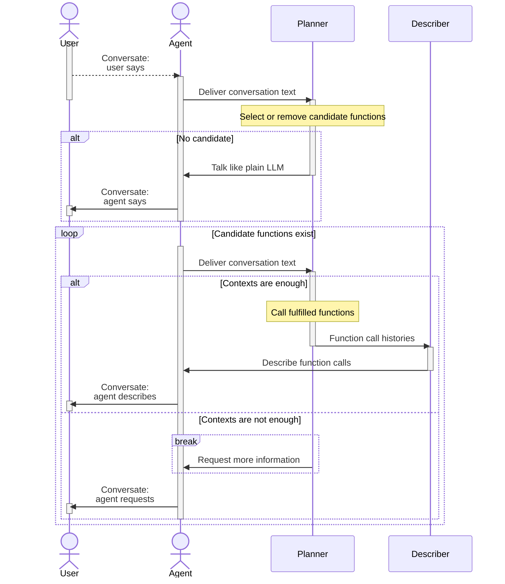
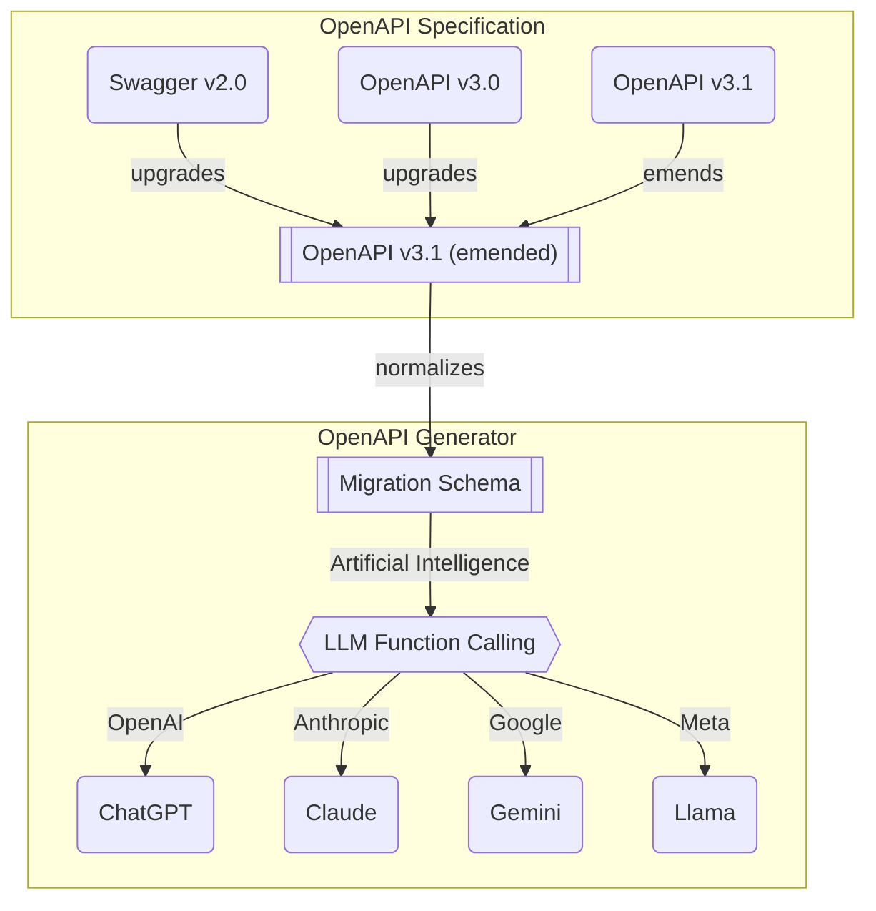

# `@agentica/rpc`


[](https://github.com/wrtnlabs/agentica/blob/master/LICENSE)
[](https://www.npmjs.com/package/@agentica/rpc)
[](https://www.npmjs.com/package/@agentica/rpc)
[](https://github.com/wrtnlabs/agentica/actions?query=workflow%3Abuild)

The micro version of Agentica for minimalism user

Agentica is the simplest Agentiic AI library specialized in **LLM Function Calling**, and `@agentica/micro` is an micro module of Agentica.  
If you want a more minimal version than Agentica, try using this.

```typescript
import { MicroAgentica } from "@agentica/micro";

import typia from "typia";

const agent = new MicroAgentica({
  controllers: [
    await fetch(
      "https://shopping-be.wrtn.ai/editor/swagger.json",
    ).then(r => r.json()),
    typia.llm.application<ShoppingCounselor>(),
    typia.llm.application<ShoppingPolicy>(),
    typia.llm.application<ShoppingSearchRag>(),
  ],
});
await agent.conversate("I wanna buy MacBook Pro");
```

However, since this is Micro, it is not a tool designed with the assumption of having 200 tools for an LLM.

In that case, use Agentica.

This one is a library designed for scenarios with fewer tools.


## How to use
### Setup
```bash
npm install @agentica/micro typia
npm install -D @samchon/openapi
npx typia setup
```

Install `@agentica/micro` with its dependent libraries.

Note that, you have to install not only `@agentica/micro`, but also [`typia`](https://github.com/samchon/typia) too.

`@samchon/openapi` is an OpenAPI specification library which can convert Swagger/OpenAPI document to LLM function calling schema. And `typia` is a transformer (compiler) library which can compose LLM function calling schema from a TypeScript class type.

By the way, as `typia` is a transformer library analyzing TypeScript source code in the compilation level, it needs additional setup command `npx typia setup`. Also, if your client (frontend) application is not using the standard TypeScript compiler (not `tsc`), you have to setup [`@ryoppippi/unplugin-typia`](https://typia.io/docs/setup/#unplugin-typia) too.

### Chat with Backend Server
```typescript
import { IHttpLlmApplication, HttpLlm } from "@samchon/openapi";
import { Agentica } from "@agentica/core";
import OpenAI from "openai";
import { IValidation } from "typia";

const main = async (): Promise<void> => {
  // LOAD SWAGGER DOCUMENT, AND CONVERT TO LLM APPLICATION SCHEMA
  const application: IValidation<IHttpLlmApplication<"chatgpt">> =
    HttpLlm.application({
      model: "chatgpt",
      document: OpenApi.convert(
        await fetch("https://shopping-be.wrtn.ai/editor/swagger.json").then(
          (r) => r.json()
        )
      ),
    });
  if (application.success === false) {
    console.error(application.errors);
    throw new Error("Type error on the target swagger document");
  }

  // CREATE AN AGENT WITH THE APPLICATION
  const agent: Agentica<"chatgpt"> = new Agentica({
    model: "chatgpt",
    vendor: {
      api: new OpenAI({
        apiKey: "YOUR_OPENAI_API_KEY",
      }),
      model: "gpt-4o-mini",
    },
    controllers: [
      {
        protocol: "http",
        name: "shopping",
        application: application.data,
        connection: {
          host: "https://shopping-be.wrtn.ai",
        },
      },
    ],
    config: {
      locale: "en-US",
    },
  });

  // ADD EVENT LISTENERS
  agent.on("select", async (select) => {
    console.log("selected function", select.operation.function.name);
  });
  agent.on("execute", async (execute) => {
    consoe.log("execute function", {
      function: execute.operation.function.name,
      arguments: execute.arguments,
      value: execute.value,
    });
  });

  // CONVERSATE TO AI CHATBOT
  await agent.conversate("What you can do?");
};
main().catch(console.error);
```

Just load your swagger document, and put it into the `@agentica/micro`.

Then you can start conversation with your backend server, and the API functions of the backend server would be automatically called. AI chatbot will analyze your conversation texts, and executes proper API functions by the LLM (Large Language Model) function calling feature.

From now on, every backend developer is also an AI developer.

### Chat with TypeScript Class
```typescript
import { MicroAgentica } from "@agentica/micro";
import typia, { tags } from "typia";
import OpenAI from "openai";

class BbsArticleService {
  /**
   * Create a new article.
   *
   * Writes a new article and archives it into the DB.
   *
   * @param props Properties of create function
   * @returns Newly created article
   */
  public async create(props: {
    /**
     * Information of the article to create
     */
    input: IBbsArticle.ICreate;
  }): Promise<IBbsArticle>;

  /**
   * Update an article.
   *
   * Updates an article with new content.
   *
   * @param props Properties of update function
   * @param input New content to update
   */
  public async update(props: {
    /**
     * Target article's {@link IBbsArticle.id}.
     */
    id: string & tags.Format<"uuid">;

    /**
     * New content to update.
     */
    input: IBbsArticle.IUpdate;
  }): Promise<void>;
}

const main = async (): Promise<void> => {
  const api: OpenAI = new OpenAI({
    apiKey: "YOUR_OPENAI_API_KEY",
  });
  const agent: MicroAgentica<"chatgpt"> = new MicroAgentica({
    model: "chatgpt",
    vendor: {
      api: new OpenAI({
        apiKey: "YOUR_OPENAI_API_KEY",
      }),
      model: "gpt-4o-mini",
    },
    controllers: [
      {
        protocol: "class",
        name: "vectorStore",
        application: typia.llm.application<
          BbsArticleService,
          "chatgpt"
        >(),
        execute: new BbsArticleService(),
      },
    ],
  });
  await agent.conversate("I wanna write an article.");
};
main().catch(console.error);
```

You also can chat with a TypeScript class.

Just deliver the TypeScript type to the `@agentica/micro`, and start conversation. Then `@agentica/micro` will call the proper class functions by analyzing your conversation texts with LLM function calling feature.

From now on, every TypeScript classes you've developed can be the AI chatbot.

### Multi Agent Orchestration
```typescript
import { MicroAgentica } from "@agentica/micro";
import typia from "typia";
import OpenAI from "openai";

class OpenAIVectorStoreAgent {
  /**
   * Retrieve Vector DB with RAG.
   *
   * @param props Properties of Vector DB retrievelance
   */
  public query(props: {
    /**
     * Keywords to look up.
     *
     * Put all the keywords you want to look up. However, keywords
     * should only be included in the core, and all ambiguous things
     * should be excluded to achieve accurate results.
     */
    keywords: string;
  }): Promise<IVectorStoreQueryResult>;
}

const main = async (): Promise<void> => {
  const api: OpenAI = new OpenAI({
    apiKey: "YOUR_OPENAI_API_KEY",
  });
  const agent: MicroAgentica<"chatgpt"> = new MicroAgentica({
    model: "chatgpt",
    context: {
      api: new OpenAI({
        apiKey: "YOUR_OPENAI_API_KEY",
      }),
      model: "gpt-4o-mini",
    },
    controllers: [
      {
        protocol: "class",
        name: "vectorStore",
        application: typia.llm.application<
          OpenAIVectorStoreAgent,
          "chatgpt"
        >(),
        execute: new OpenAIVectorStoreAgent({
          api,
          id: "YOUR_OPENAI_VECTOR_STORE_ID",
        }),
      },
    ],
  });
  await agent.conversate("I wanna research economic articles");
};
main().catch(console.error);
```

In the `@agentica/micro`, you can implement multi-agent orchestration super easily.

Just develop a TypeScript class which contains agent feature like Vector Store, and just deliver the TypeScript class type to the `@agentica/micro` like above. The `@agentica/micro` will centralize and realize the multi-agent orchestration by LLM function calling strategy to the TypeScript class.


## Principles
### Agent Strategy


When user says, `@agentica/micro` delivers the conversation text to the `planner` agent, which selects a function from the context.  
If the `planner` agent does not find suitable function to select, it operates like a plain LLM model.

Then, `@agentica/micro` executes the single selected function and passes the result to the `describer` agent, which explains the function call outcome.

On the other hand, if the context is insufficient, the `planner` functions as a plain LLM and requests additional information.


### Validation Feedback
```typescript
import { FunctionCall } from "pseudo";
import { ILlmFunction, IValidation } from "typia";

export const correctFunctionCall = (p: {
  call: FunctionCall;
  functions: Array<ILlmFunction<"chatgpt">>;
  retry: (reason: string, errors?: IValidation.IError[]) => Promise<unknown>;
}): Promise<unknown> => {
  // FIND FUNCTION
  const func: ILlmFunction<"chatgpt"> | undefined =
    p.functions.find((f) => f.name === p.call.name);
  if (func === undefined) {
    // never happened in my experience
    return p.retry(
      "Unable to find the matched function name. Try it again.",
    );
  }

  // VALIDATE
  const result: IValidation<unknown> = func.validate(p.call.arguments);
  if (result.success === false) {
    // 1st trial: 50% (gpt-4o-mini in shopping mall chatbot)
    // 2nd trial with validation feedback: 99%
    // 3nd trial with validation feedback again: never have failed
    return p.retry(
      "Type errors are detected. Correct it through validation errors",
      {
        errors: result.errors,
      },
    );
  }
  return result.data;
}
```

Is LLM function calling perfect? 

The answer is not, and LLM (Large Language Model) vendors like OpenAI take a lot of type level mistakes when composing the arguments of the target function to call. Even though an LLM function calling schema has defined an `Array<string>` type, LLM often fills it just by a `string` typed value.

Therefore, when developing an LLM function calling agent, the validation feedback process is essentially required. If LLM takes a type level mistake on arguments composition, the agent must feedback the most detailed validation errors, and let the LLM to retry the function calling referencing the validation errors.

About the validation feedback, `@agentica/micro` is utilizing [`typia.validate<T>()`](https://typia.io/docs/validators/validate) and [`typia.llm.application<Class, Model>()`](https://typia.io/docs/llm/application/#application) functions. They construct validation logic by analyzing TypeScript source codes and types in the compilation level, so that detailed and accurate than any other validators like below.

Such validation feedback strategy and combination with `typia` runtime validator, `@agentica/micro` has achieved the most ideal LLM function calling. In my experience, when using OpenAI's `gpt-4o-mini` model, it tends to construct invalid function calling arguments at the first trial about 50% of the time. By the way, if correct it through validation feedback with `typia`, success rate soars to 99%. And I've never had a failure when trying validation feedback twice.

Components               | `typia` | `TypeBox` | `ajv` | `io-ts` | `zod` | `C.V.`
-------------------------|--------|-----------|-------|---------|-------|------------------
**Easy to use**          | ✅ | ❌ | ❌ | ❌ | ❌ | ❌ 
[Object (simple)](https://github.com/samchon/typia/blob/master/test/src/structures/ObjectSimple.ts)          | ✔ | ✔ | ✔ | ✔ | ✔ | ✔
[Object (hierarchical)](https://github.com/samchon/typia/blob/master/test/src/structures/ObjectHierarchical.ts)    | ✔ | ✔ | ✔ | ✔ | ✔ | ✔
[Object (recursive)](https://github.com/samchon/typia/blob/master/test/src/structures/ObjectRecursive.ts)       | ✔ | ❌ | ✔ | ✔ | ✔ | ✔ | ✔
[Object (union, implicit)](https://github.com/samchon/typia/blob/master/test/src/structures/ObjectUnionImplicit.ts) | ✅ | ❌ | ❌ | ❌ | ❌ | ❌
[Object (union, explicit)](https://github.com/samchon/typia/blob/master/test/src/structures/ObjectUnionExplicit.ts) | ✔ | ✔ | ✔ | ✔ | ✔ | ❌
[Object (additional tags)](https://github.com/samchon/typia/#comment-tags)        | ✔ | ✔ | ✔ | ✔ | ✔ | ✔
[Object (template literal types)](https://github.com/samchon/typia/blob/master/test/src/structures/TemplateUnion.ts) | ✔ | ✔ | ✔ | ❌ | ❌ | ❌
[Object (dynamic properties)](https://github.com/samchon/typia/blob/master/test/src/structures/DynamicTemplate.ts) | ✔ | ✔ | ✔ | ❌ | ❌ | ❌
[Array (rest tuple)](https://github.com/samchon/typia/blob/master/test/src/structures/TupleRestAtomic.ts) | ✅ | ❌ | ❌ | ❌ | ❌ | ❌
[Array (hierarchical)](https://github.com/samchon/typia/blob/master/test/src/structures/ArrayHierarchical.ts)     | ✔ | ✔ | ✔ | ✔ | ✔ | ✔
[Array (recursive)](https://github.com/samchon/typia/blob/master/test/src/structures/ArrayRecursive.ts)        | ✔ | ✔ | ✔ | ✔ | ✔ | ❌
[Array (recursive, union)](https://github.com/samchon/typia/blob/master/test/src/structures/ArrayRecursiveUnionExplicit.ts) | ✔ | ✔ | ❌ | ✔ | ✔ | ❌
[Array (R+U, implicit)](https://github.com/samchon/typia/blob/master/test/src/structures/ArrayRecursiveUnionImplicit.ts)    | ✅ | ❌ | ❌ | ❌ | ❌ | ❌
[Array (repeated)](https://github.com/samchon/typia/blob/master/test/src/structures/ArrayRepeatedNullable.ts)    | ✅ | ❌ | ❌ | ❌ | ❌ | ❌
[Array (repeated, union)](https://github.com/samchon/typia/blob/master/test/src/structures/ArrayRepeatedUnionWithTuple.ts)    | ✅ | ❌ | ❌ | ❌ | ❌ | ❌
[**Ultimate Union Type**](https://github.com/samchon/typia/blob/master/test/src/structures/UltimateUnion.ts)  | ✅ | ❌ | ❌ | ❌ | ❌ | ❌

> `C.V.` means `class-validator`

### OpenAPI Specification


`@agentica/micro` obtains LLM function calling schemas from both Swagger/OpenAPI documents and TypeScript class types. The TypeScript class type can be converted to LLM function calling schema by [`typia.llm.application<Class, Model>()`](https://typia.io/docs/llm/application#application) function. Then how about OpenAPI document? How Swagger document can be LLM function calling schema.

The secret is on the above diagram. 

In the OpenAPI specification, there are three versions with different definitions. And even in the same version, there are too much ambiguous and duplicated expressions. To resolve these problems, [`@samchon/openapi`](https://github.com/samchon/openapi) is transforming every OpenAPI documents to v3.1 emended specification. The `@samchon/openapi`'s emended v3.1 specification has removed every ambiguous and duplicated expressions for clarity.

With the v3.1 emended OpenAPI document, `@samchon/openapi` converts it to a migration schema that is near to the function structure. And as the last step, the migration schema will be transformed to a specific LLM vendor's function calling schema. LLM function calling schemas are composed like this way.

> **Why do not directly convert, but intermediate?**
>
> If directly convert from each version of OpenAPI specification to specific LLM's function calling schema, I have to make much more converters increased by cartesian product. In current models, number of converters would be 12 = 3 x 4.
>
> However, if define intermediate schema, number of converters are shrunk to plus operation. In current models, I just need to develop only (7 = 3 + 4) converters, and this is the reason why I've defined intermediate specification. This way is economic.
