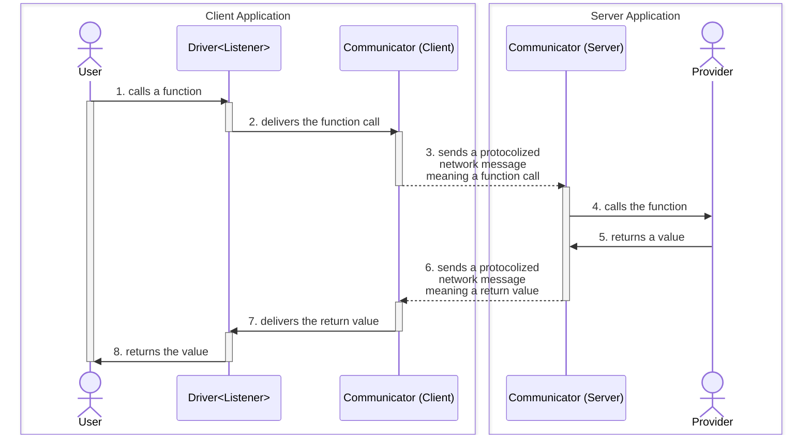

# `@agentica/rpc`


[](https://github.com/wrtnlabs/agentica/blob/master/LICENSE)
[](https://www.npmjs.com/package/@agentica/rpc)
[](https://www.npmjs.com/package/@agentica/rpc)
[](https://github.com/wrtnlabs/agentica/actions?query=workflow%3Abuild)

RPC module of Agentica for WebSocket Communication

Agentica is the simplest Agentiic AI library specialized in **LLM Function Calling**, and `@agentica/rpc` is an RPC (Remote Procedure Call) wrapper module. If you combine the RPC wrapper module with [`TGrid`](https://github.com/samchon/tgrid), you can develop the WebSocket AI Chatbot.

```typescript
import { IAgenticaRpcListener, IAgenticaRpcService } from "@agentica/rpc";
import { Driver, WebSocketConnector } from "tgrid";

const connector: WebSocketConnector<
  null,
  IAgenticaRpcListener,
  IAgenticaRpcService
> = new WebSocketConnector(null, {
  text: async (evt) => {
    console.log(evt.role, evt.text);
  },
  describe: async (evt) => {
    console.log("describer", evt.text);
  },
});
await connector.connect("ws://localhost:3001");

const driver: Driver<IAgenticaRpcService> = connector.getDriver();
await driver.conversate("Hello, what you can do?");
```


## How to use
### Setup
```bash
npm install @agentica/core @agentica/rpc @samchon/openapi typia tgrid
npx typia setup
```

Install `@agentica/rpc` with its dependent libraries.

Note that, you have to install not only `@agentica/core` and `@agentica/rpc`, but also [`@samchon/openapi`](https://github.com/samchon/openapi), [`typia`](https://github.com/samchon/typia) and [`tgrid`](https://github.com/samchon/tgrid) too.

`@samchon/openapi` is an OpenAPI specification library which can convert Swagger/OpenAPI document to LLM function calling schema. And `typia` is a transformer (compiler) library which can compose LLM function calling schema from a TypeScript class type. And then `tgrid` is an RPC (REmote Procedure Call) framework supporting the websocket protocol.

By the way, as `typia` is a transformer library analyzing TypeScript source code in the compilation level, it needs additional setup command `npx typia setup`. Also, if your client (frontend) application is not using the standard TypeScript compiler (not `tsc`), you have to setup [`@ryoppippi/unplugin-typia`](https://typia.io/docs/setup/#unplugin-typia) too.

### Server Application
```typescript
import { Agentica } from "@agentica/core";
import {
  AgenticaRpcService,
  IAgenticaRpcListener,
  IAgenticaRpcService,
} from "@agentica/rpc";
import { WebSocketServer } from "tgrid";

const server: WebSocketServer<
  null,
  IAgenticaRpcService,
  IAgenticaRpcListener
> = new WebSocketServer();
await server.open(3001, async (acceptor) => {
  await acceptor.accept(
    new AgenticaRpcService({
      agent: new Agentica({ ... }),
      listener: acceptor.getDriver(),
    }),
  );
});
```

When developing backend server, wrap `Agentica` to `AgenticaRpcService`.

If you're developing WebSocket protocol backend server, create a new `Agentica` instance, and wrap it to the `AgenticaRpcService` class. And then open the websocket server like above code. The WebSocket server will call the client functions of the `IAgenticaRpcListener` remotely.

### Client Application
```typescript
import { IAgenticaRpcListener, IAgenticaRpcService } from "@agentica/rpc";
import { Driver, WebSocketConnector } from "tgrid";

const connector: WebSocketConnector<
  null,
  IAgenticaRpcListener,
  IAgenticaRpcService
> = new WebSocketConnector(null, {
  text: async (evt) => {
    console.log(evt.role, evt.text);
  },
  describe: async (evt) => {
    console.log("describer", evt.text);
  },
});
await connector.connect("ws://localhost:3001");

const driver: Driver<IAgenticaRpcService> = connector.getDriver();
await driver.conversate("Hello, what you can do?");
```

When developing frontend application, define `IAgenticaRpcListener` instance.

Otherwise you're developing WebSocket protocol client application, connect to the websocket backend server with its URL address, and provide `IAgenticaRpcListener` instance for event listening.

And then call the backend server's function `IAgenticaRpcService.conversate()` remotely through the `Driver<IAgenticaRpcService>` wrapping. The backend server will call your `IAgenticaRpcListener` functions remotely through the RPC paradigm.


## Principles
### Remote Procedure Call


WebSocket protocol with RPC paradigm for AI chatbot.

`@agentica/rpc` supports WebSocket protocol that is utilizing [`TGrid`](https://github.com/samchon/tgrid) and its RPC (Remote Procedure Call) paradigm for easy and type safe development. In the RPC paradigm, client application can call a function of `IAgenticaRpcService` remotely as if it were its own object.

Internally, the RPC has composed with three elements; [`Communicator`](https://tgrid.com/docs/features/components/#communicator), [`Provider`](https://tgrid.com/docs/features/components/#provider) and [`Driver`](https://tgrid.com/docs/features/components/#driver). The first `Communicator` takes a responsibility of (WebSocket) network communication. The next `Provider` means an object providing to the remote system for RPC, and `Driver` is a proxy instance realizing the RPC to the remote provided `Provider` instance.

For example, below client application code is calling `IAgenticaRpcService.conversate()` function remotely through the `Driver<IAgenticaRpcService>` typed instance. In that case, `IAgenticaRpcService` is the `Provider` instance from server to client. And `WebSocketConnector` is the communicator taking responsibility of WebSocket communication.

```typescript
import { IAgenticaRpcListener, IAgenticaRpcService } from "@agentica/rpc";
import { Driver, WebSocketConnector } from "tgrid";

const connector: WebSocketConnector<
  null,
  IAgenticaRpcListener,
  IAgenticaRpcService
> = new WebSocketConnector(null, {
  text: async (evt) => {
    console.log(evt.role, evt.text);
  },
  describe: async (evt) => {
    console.log("describer", evt.text);
  },
});
await connector.connect("ws://localhost:3001");

const driver: Driver<IAgenticaRpcService> = connector.getDriver();
await driver.conversate("Hello, what you can do?");
```