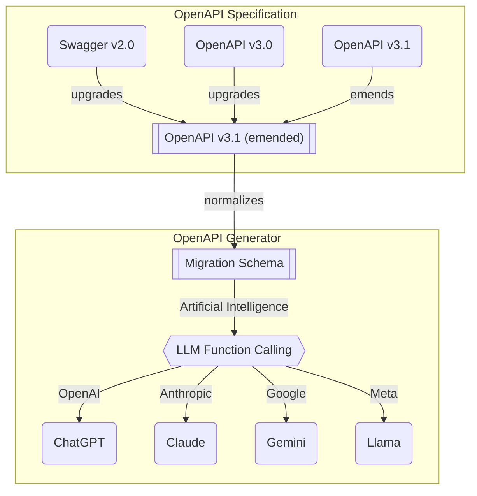
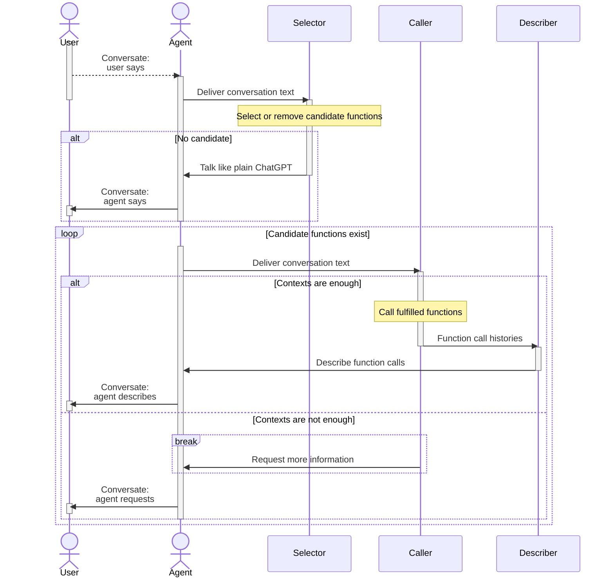

## LLM Function Calling
`@agentica` is an **Agentic AI** framework, specialized in **LLM Function Calling**. 

And the LLM function calling means that, LLM (Large Language Model) selects proper function, and fills arguments by analyzing conversation contexts with user. There is a similar concept called structured output, which means that LLM automatically transforms the output conversation into a structured data format as JSON.

`@agentica` is framework concentrating on such LLM function calling feature, and doing everything with it. Just by listing up candidate functions to `@agentica`, you can accomplish the Agentic AI. In here chapter, we will learn how `@agentica` accomplishes the idealistic LLM function calling with theoretical stories.

- https://platform.openai.com/docs/guides/function-calling
- https://platform.openai.com/docs/guides/structured-outputs


## OpenAPI Specification


Conversion of OpenAPI Specification to LLM Function Calling Scema.

LLM function calling needs JSON schema based function schema. However, service vendors of LLM (Large Language Model) are not using the same specified JSON schema. "OpenAI GPT" and "Anthropic Claude" are using different JSON schema speicification of LLM function calling, and Google Gemini is also different with them either.

What's even more horrible is that Swagger/OpenAPI documents also use a different kind of JSON schema specification than the LLM function calling schema, and the specifications vary greatly between versions of Swagger/OpenAPI. 

To resolve this problem, `@agentica` is utilizing [`@samchon/openapi`](https://github.com/samchon/openapi). When Swagger/OpenAPI document comes, it converts to an OpenAPI v3.1 emended specification. And then convert it to the specific LLM function calling schema of the service vendor bypassing the migration schema. For reference, migration schema is another middleware schema that converting OpenAPI operation schema to function like schema.

Also, when converting Swagger/OpenAPI document to LLM function calling schemas, [`@samchon/openapi`](https://github.com/samchon/openapi) embeds runtime validator of parameters for the [#Validation Feedback](#validation-feedback) strategy.


## Validation Feedback
```typescript filename="validation-feedback-concept.ts" showLineNumbers copy
import { FunctionCall } from "pseudo";
import { ILlmFunction, IValidation } from "typia";

export const correctFunctionCall = (p: {
  call: FunctionCall;
  functions: Array<ILlmFunction<"chatgpt">>;
  retry: (reason: string, errors?: IValidation.IError[]) => Promise<unknown>;
}): Promise<unknown> => {
  // FIND FUNCTION
  const func: ILlmFunction<"chatgpt"> | undefined =
    p.functions.find((f) => f.name === p.call.name);
  if (func === undefined) {
    // never happened in my experience
    return p.retry(
      "Unable to find the matched function name. Try it again.",
    );
  }

  // VALIDATE
  const result: IValidation<unknown> = func.validate(p.call.arguments);
  if (result.success === false) {
    // 1st trial: 30% (gpt-4o-mini in shopping mall chatbot)
    // 2nd trial with validation feedback: 99%
    // 3nd trial with validation feedback again: never have failed
    return p.retry(
      "Type errors are detected. Correct it through validation errors",
      {
        errors: result.errors,
      },
    );
  }
  return result.data;
}
```

Is LLM Function Calling perfect? No, absolutely not.

LLM (Large Language Model) service vendor like OpenAI takes a lot of type level mistakes when composing the arguments of function calling or structured output. Even though target schema is super simple like `Array<string>` type, LLM often fills it just by a `string` typed value.

In my experience, OpenAI `gpt-4o-mini` (`8b` parameters) is taking about 30% of type level mistakes when filling the arguments of function calling to Shopping Mall service. To overcome the imperfection of such LLM function calling, `@agentia` is using validation feedback strategy.

The key concept of validation feedback strategy is, let LLM function calling to construct invalid typed arguments first, and informing detailed type errors to the LLM, so that induce LLM to emend the wrong typed arguments at the next turn.

And `@agentica` has adopted [`typia.validate<T>()`](https://typia.io/docs/validators/validate) and [`typia.llm.application<Class, Model>()`](https://typia.io/docs/llm/application/#application) functions. They construct validation logic by analyzing TypeScript source codes and types in the compilation level, so that detailed and accurate than any other validators like below.

Such validation feedback strategy and combination with `typia` runtime validator, `@agentica` has achieved the most ideal LLM function calling. By such strategy, 70% success rate of the 1st function calling trial has been increased to 95% success rate of the 2nd function calling trial. And reached to near by 100% at the 3rd trial.

Components               | `typia` | `TypeBox` | `ajv` | `io-ts` | `zod` | `C.V.`
-------------------------|--------|-----------|-------|---------|-------|------------------
**Easy to use**          | ✅ | ❌ | ❌ | ❌ | ❌ | ❌ 
[Object (simple)](https://github.com/samchon/typia/blob/master/test/src/structures/ObjectSimple.ts)          | ✔ | ✔ | ✔ | ✔ | ✔ | ✔
[Object (hierarchical)](https://github.com/samchon/typia/blob/master/test/src/structures/ObjectHierarchical.ts)    | ✔ | ✔ | ✔ | ✔ | ✔ | ✔
[Object (recursive)](https://github.com/samchon/typia/blob/master/test/src/structures/ObjectRecursive.ts)       | ✔ | ❌ | ✔ | ✔ | ✔ | ✔ | ✔
[Object (union, implicit)](https://github.com/samchon/typia/blob/master/test/src/structures/ObjectUnionImplicit.ts) | ✅ | ❌ | ❌ | ❌ | ❌ | ❌
[Object (union, explicit)](https://github.com/samchon/typia/blob/master/test/src/structures/ObjectUnionExplicit.ts) | ✔ | ✔ | ✔ | ✔ | ✔ | ❌
[Object (additional tags)](https://github.com/samchon/typia/#comment-tags)        | ✔ | ✔ | ✔ | ✔ | ✔ | ✔
[Object (template literal types)](https://github.com/samchon/typia/blob/master/test/src/structures/TemplateUnion.ts) | ✔ | ✔ | ✔ | ❌ | ❌ | ❌
[Object (dynamic properties)](https://github.com/samchon/typia/blob/master/test/src/structures/DynamicTemplate.ts) | ✔ | ✔ | ✔ | ❌ | ❌ | ❌
[Array (rest tuple)](https://github.com/samchon/typia/blob/master/test/src/structures/TupleRestAtomic.ts) | ✅ | ❌ | ❌ | ❌ | ❌ | ❌
[Array (hierarchical)](https://github.com/samchon/typia/blob/master/test/src/structures/ArrayHierarchical.ts)     | ✔ | ✔ | ✔ | ✔ | ✔ | ✔
[Array (recursive)](https://github.com/samchon/typia/blob/master/test/src/structures/ArrayRecursive.ts)        | ✔ | ✔ | ✔ | ✔ | ✔ | ❌
[Array (recursive, union)](https://github.com/samchon/typia/blob/master/test/src/structures/ArrayRecursiveUnionExplicit.ts) | ✔ | ✔ | ❌ | ✔ | ✔ | ❌
[Array (R+U, implicit)](https://github.com/samchon/typia/blob/master/test/src/structures/ArrayRecursiveUnionImplicit.ts)    | ✅ | ❌ | ❌ | ❌ | ❌ | ❌
[Array (repeated)](https://github.com/samchon/typia/blob/master/test/src/structures/ArrayRepeatedNullable.ts)    | ✅ | ❌ | ❌ | ❌ | ❌ | ❌
[Array (repeated, union)](https://github.com/samchon/typia/blob/master/test/src/structures/ArrayRepeatedUnionWithTuple.ts)    | ✅ | ❌ | ❌ | ❌ | ❌ | ❌
[**Ultimate Union Type**](https://github.com/samchon/typia/blob/master/test/src/structures/UltimateUnion.ts)  | ✅ | ❌ | ❌ | ❌ | ❌ | ❌

> `C.V.` means `class-validator`

Additionally, this validation feedback strategy is useful for some LLM providers do not supporting restriction properties of JSON schema like OpenAI ([`IChatGptSchema`](https://github.com/samchon/openapi/blob/master/src/structures/IChatGptSchema.ts)) and Gemini ([`IGeminiSchema`](https://github.com/samchon/openapi/blob/master/src/structures/IGeminiSchema.ts)). For example, OpenAI and Gemini do not support `format` property of JSON schema, so that cannot understand the `UUID` like type. Even though `typia.llm.application<App, Model>()` function is writing the restriction information to the `description` property of JSON schema, but LLM provider does not reflect it perfectly.

Also, some LLM providers which have not specified the JSON schema version like Claude ([`IClaudeSchema`](https://github.com/samchon/openapi/blob/master/src/structures/IClaudeSchema.ts)) and Llama ([`ILlamaSchema`](https://github.com/samchon/openapi/blob/master/src/structures/ILlamaSchema.ts)), they tend to fail a lot of function calling about the restriction properties. In fact, Llama does not support function calling formally, so you have to detour it by prompt template, and its success rate is lower than others.

In that case, if you give validation feedback from `ILlmFunction.validate()` function to the LLM agent, the LLM agent will be able to understand the restriction information exactly and fill the arguments properly.

  - Restriction properties of JSON schema
    - `string`: `minLength`, `maxLength`, `pattern`, `format`, `contentMediaType`
    - `number`: `minimum`, `maximum`, `exclusiveMinimum`, `exclusiveMaximum`, `multipleOf`
    - `array`: `minItems`, `maxItems`, `uniqueItems`, `items`


## Orchestration Strategy


When user says, `@agentica` delivers the conversation text to the `selector` agent, and let the `selector` agent to find (or cancel) candidate functions from the context. If the `selector` agent could not find any candidate function to call and there is not any candidate function previously selected either, the `selector` agent will work just like a plain ChatGPT.

And `@agentica` enters to a loop statement until the candidate functions to be empty. In the loop statement, `caller` agent tries to LLM function calling by analyzing the user's conversation text. If context is enough to compose arguments of candidate functions, the `caller` agent actually calls the target functions, and let `decriber` agent to explain the function calling results. Otherwise the context is not enough to compose arguments, `caller` agent requests more information to user.

Such LLM (Large Language Model) function calling strategy separating `selector`, `caller`, and `describer` is the key logic of `@agentica`.