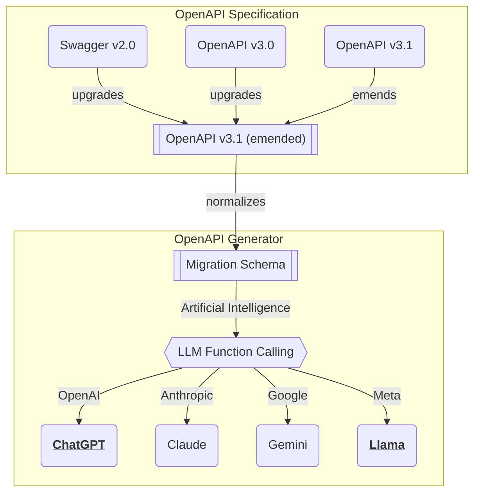

import { Tabs } from "nextra/components";

## Facade Controller
<Tabs items={[
  <code>Agentica</code>,
  <code>IAgenticaProps</code>,
  <code>IAgenticaVendor</code>,
  <code>IAgenticaController</code>,
]}>
  <Tabs.Tab>
```typescript filename="@agentica/core/Agentica" showLineNumbers
/**
 * Nestia A.I. chatbot agent.
 *
 * `Agentica` is a facade class for the super A.I. chatbot agent
 * which performs the {@link conversate user's conversation function}
 * with LLM (Large Language Model) function calling and manages the
 * {@link getPromptHistories prompt histories}.
 *
 * To understand and compose the `Agentica` class exactly, reference
 * below types concentrating on the documentation comments please.
 * Especially, you have to be careful about the {@link IAgenticaProps}
 * type which is used in the {@link constructor} function.
 *
 * - Constructors
 *   - {@link IAgenticaProps}
 *   - {@link IAgenticaVendor}
 *   - {@link IAgenticaController}
 *   - {@link IAgenticaConfig}
 *   - {@link IAgenticaSystemPrompt}
 * - Accessors
 *   - {@link AgenticaOperation}
 *   - {@link AgenticaPrompt}
 *   - {@link AgenticaEvent}
 *   - {@link AgenticaTokenUsage}
 *
 * @author Samchon
 */
export class Agentica<Model extends ILlmSchema.Model> {
  /**
   * Initializer constructor.
   *
   * @param props Properties to construct the agent
   */
  public constructor(private readonly props: IAgenticaProps<Model>);

  /**
   * Conversate with the A.I. chatbot.
   *
   * User talks to the A.I. chatbot with the content.
   *
   * When the user's conversation implies the A.I. chatbot to execute a
   * function calling, the returned chat prompts will contain the
   * function calling information like {@link AgenticaPrompt.Execute}.
   *
   * @param content The content to talk
   * @returns List of newly created chat prompts
   */
  public async conversate(content: string): Promise<AgenticaPrompt<Model>[]>;

  /**
   * Add an event listener.
   *
   * Add an event listener to be called whenever the event is emitted.
   *
   * @param type Type of event
   * @param listener Callback function to be called whenever the event is emitted
   */
  public on<Type extends AgenticaEvent.Type>(
    type: Type,
    listener: (
      event: AgenticaEvent.Mapper<Model>[Type],
    ) => void | Promise<void>,
  ): this;

  /**
   * Erase an event listener.
   *
   * Erase an event listener to stop calling the callback function.
   *
   * @param type Type of event
   * @param listener Callback function to erase
   */
  public off<Type extends AgenticaEvent.Type>(
    type: Type,
    listener: (
      event: AgenticaEvent.Mapper<Model>[Type],
    ) => void | Promise<void>,
  ): this;

  /**
   * Get the chatbot's prompt histories.
   *
   * Get list of chat prompts that the chatbot has been conversated.
   *
   * @returns List of chat prompts
   */
  public getPromptHistories(): AgenticaPrompt<Model>[];

  /**
   * Get token usage of the A.I. chatbot.
   *
   * Entire token usage of the A.I. chatbot during the conversating
   * with the user by {@link conversate} method callings.
   *
   * @returns Cost of the A.I. chatbot
   */
  public getTokenUsage(): AgenticaTokenUsage;
}
```
  </Tabs.Tab>
  <Tabs.Tab>
```typescript filename="@agentica/core/IAgenticaProps" showLineNumbers
/**
 * Properties of the Nestia Agent.
 *
 * `IAgenticaProps` is an interface that defines the properties
 * of the {@link Agentica.constructor}. In the `IAgenticaProps`,
 * there're everything to prepare to create a Super A.I. chatbot
 * performing the LLM (Large Language Model) function calling.
 *
 * At first, you have to specify the LLM service {@link vendor} like
 * OpenAI with its API key and client API. And then, you have to define
 * the {@link controllers} serving the functions to call. The controllers
 * are separated by two protocols; HTTP API and TypeScript class. At last,
 * you can {@link config configure} the agent by setting the locale, timezone,
 * and some of system prompts.
 *
 * Additionally, if you want to start from the previous A.I. chatbot
 * session, you can accomplish it by assigning the previous prompt
 * histories to the {@link histories} property.
 *
 * @author Samchon
 */
export interface IAgenticaProps<Model extends ILlmSchema.Model> {
  /**
   * LLM schema model.
   */
  model: Model;

  /**
   * LLM service vendor.
   */
  vendor: IAgenticaVendor;

  /**
   * Controllers serving functions to call.
   */
  controllers: IAgenticaController<Model>[];

  /**
   * Configuration of agent.
   *
   * Configuration of A.I. chatbot agent including the user's locale,
   * timezone, and some of system prompts. Also, you can affect to the
   * LLM function selecting/calling logic by configuring additional
   * properties.
   *
   * If you don't configure this property, these values would be default.
   *
   * - `locale`: your system's locale and timezone
   * - `timezone`: your system's timezone
   * - `systemPrompt`: default prompts written in markdown
   *   - https://github.com/wrtnlabs/agentica/tree/main/packages/core/prompts
   */
  config?: IAgenticaConfig<Model>;

  /**
   * Prompt histories.
   *
   * If you're starting the conversation from an existing session,
   * assign the previouis prompt histories to this property.
   */
  histories?: IAgenticaPromptJson[];
}
```
  </Tabs.Tab>
  <Tabs.Tab>
```typescript filename="@agentica/core/IAgenticaVendor" showLineNumbers
/**
 * LLM service vendor for Nestia Chat.
 *
 * `IAgenticaVendor` is a type represents an LLM
 * (Large Language Model) vendor of the {@link Agentica}.
 *
 * Currently, {@link Agentica} supports OpenAI SDK. However, it does
 * not mean that you can use only OpenAI's GPT model in the
 * {@link Agentica}. The OpenAI SDK is just a connection tool to the
 * LLM vendor's API, and you can use other LLM vendors by configuring
 * its `baseURL` and API key.
 *
 * Therefore, if you want to use another LLM vendor like Claude or
 * Gemini, please configure the `baseURL` to the {@link api}, and
 * set {@link IAgenticaController}'s schema model as "cluade" or
 * "gemini".
 *
 * @author Samchon
 */
export interface IAgenticaVendor {
  /**
   * OpenAI API instance.
   */
  api: OpenAI;

  /**
   * Chat model to be used.
   *
   * `({}) & string` means to support third party hosting cloud(eg. openRouter, aws)
   */
  model: OpenAI.ChatModel | ({} & string);

  /**
   * Options for the request.
   */
  options?: OpenAI.RequestOptions | undefined;
}
```
  </Tabs.Tab>
  <Tabs.Tab>
```typescript filename="@agentica/core/IAgenticaController" showLineNumbers
/**
 * Controller of the Nestia Agent.
 *
 * `IAgenticaController` is a type represents a controller of the
 * {@link Agentica}, which serves a set of functions to be called
 * by A.I. chatbot from LLM function calling.
 *
 * Also, `IAgenticaController` is an union type which can specify
 * a subtype by checking the {@link protocol} property.
 *
 * - HTTP server: {@link IAgenticaController..IHttp}
 * - TypeScript class: {@link IAgenticaController.IClass}
 *
 * @author Samchon
 */
export type IAgenticaController<Model extends ILlmSchema.Model> =
  | IAgenticaController.IHttp<Model>
  | IAgenticaController.IClass<Model>;
export namespace IAgenticaController {
  /**
   * HTTP controller.
   *
   * You can make it by {@link validateHttpLlmApplication} function with
   * the Swagger or OpenAPI document.
   */
  export interface IHttp<Model extends ILlmSchema.Model>
    extends IBase<"http", IHttpLlmApplication<Model>> {
    /**
     * Connection to the server.
     *
     * Connection to the API server including the URL and headers.
     */
    connection: IHttpConnection;

    /**
     * Executor of the API function.
     *
     * @param props Properties of the API function call
     * @returns HTTP response of the API function call
     */
    execute?: (props: {
      /**
       * Connection to the server.
       */
      connection: IHttpConnection;

      /**
       * Application schema.
       */
      application: IHttpLlmApplication<Model>;

      /**
       * Function schema.
       */
      function: IHttpLlmFunction<Model>;

      /**
       * Arguments of the function calling.
       *
       * It is an object of key-value pairs of the API function's parameters.
       * The property keys are composed by below rules:
       *
       * - parameter names
       * - query parameter as an object type if exists
       * - body parameter if exists
       */
      arguments: object;
    }) => Promise<IHttpResponse>;
  }

  /**
   * TypeScript class controller.
   *
   * You can make it by `typia.llm.application<App, Model>()` function.
   *
   * - https://typia.io/docs/llm/application
   */
  export interface IClass<Model extends ILlmSchema.Model>
    extends IBase<"class", ILlmApplication<Model>> {
    /**
     * Executor of the class function.
     *
     * Executor of the class function, by target class instance
     * or callback function with given schema and arguments
     * information.
     */
    execute:
      | object
      | ((props: {
          /**
           * Target application schema.
           */
          application: ILlmApplication<Model>;

          /**
           * Target function schema.
           */
          function: ILlmFunction<Model>;

          /**
           * Arguments of the function calling.
           */
          arguments: object;
        }) => Promise<unknown>);
  }

  interface IBase<Protocol, Application> {
    /**
     * Protocol discrminator.
     */
    protocol: Protocol;

    /**
     * Name of the controller.
     */
    name: string;

    /**
     * Application schema of function calling.
     */
    application: Application;
  }
}
```
  </Tabs.Tab>
</Tabs>

You can start chatbot by creating `Agentica` instance, and calling its function `Agentica.conversate()`. When creating the `Agentica` instance, you have to specify the LLM (Large Language Model) service vendor, and lists of controller to serving for function calling.

In the `Agentica.conversate()` function, [#Multi Agent Orchestration](/docs/concepts/function-calling/#orchestration-strategy) to the internal sub agents would be processed including function callings and executions. When the orchestration has been completed, the `Agentica.conversate()` function will return the list of newly created prompts.

If you want to archive the conversation state of current agent, store the returned prompots to your database serializing them from `AgenticaPrompt` type to JSON format's `IAgenticaPromptJson` type. And then restore the conversation state by assigning the prompt histories to the `IAgenticaProps.histories` property when creating a new `Agentica` instance.

By the way, within framework of the UX (User Experience) it is not a good choice to waiting for completion of the `Agentica.conversate()` function and giving prompt results to the user at once. Delivering the events to the user step by step with streaming is more recommended. Enroll event listeners by calling `Agentica.on()` function, and deliver it to the user.

```typescript filename="src/main.ts" showLineNumbers
import { Agentica, AgenticaEvent, AgenticaPrompt } from "@agentica/core";
import OpenAI from "@agentica/openai";
import { v4 } from "uuid";

const id: string = v4();
const agent: Agentica<"chatgpt"> = new Agentica({
  model: "chatgpt",
  vendor: {
    api: new OpenAI({
      apiKey: "********",
    }),
    model: "gpt-4o-mini",
  },
  controllers: [...],
});
agent.on("text", async (event) => {
  // streaming the text pieces
  for (const piece of event.stream)
    console.log(piece);
});
agent.on("select", async (event) => {
  console.log("select", event.reason, event.operation.function.name)
});
agent.on("describe", async (event) => {
  console.log(
    "describe", 
    event.executes.map((x) => x.operation.function.name),
    await event.join(), // full text joining instead of streaming
  );
});

const prompts: AgenticaPrompt[] = await agent.conversate(
  "I wanna buy Mackbook Pro."
);
await archivePrompts(id, prompts.map((p) => p.toJSON()))
```


## Vendor
<Tabs 
  items={[
    <code>IAgenticaProps</code>,
    <code>IAgenticaVendor</code>,
  ]}
  defaultIndex={1}>
  <Tabs.Tab>
```typescript filename="@agentica/core/IAgenticaProps" showLineNumbers
/**
 * Properties of the Nestia Agent.
 *
 * `IAgenticaProps` is an interface that defines the properties
 * of the {@link Agentica.constructor}. In the `IAgenticaProps`,
 * there're everything to prepare to create a Super A.I. chatbot
 * performing the LLM (Large Language Model) function calling.
 *
 * At first, you have to specify the LLM service {@link vendor} like
 * OpenAI with its API key and client API. And then, you have to define
 * the {@link controllers} serving the functions to call. The controllers
 * are separated by two protocols; HTTP API and TypeScript class. At last,
 * you can {@link config configure} the agent by setting the locale, timezone,
 * and some of system prompts.
 *
 * Additionally, if you want to start from the previous A.I. chatbot
 * session, you can accomplish it by assigning the previous prompt
 * histories to the {@link histories} property.
 *
 * @author Samchon
 */
export interface IAgenticaProps<Model extends ILlmSchema.Model> {
  /**
   * LLM schema model.
   */
  model: Model;

  /**
   * LLM service vendor.
   */
  vendor: IAgenticaVendor;

  /**
   * Controllers serving functions to call.
   */
  controllers: IAgenticaController<Model>[];

  /**
   * Configuration of agent.
   *
   * Configuration of A.I. chatbot agent including the user's locale,
   * timezone, and some of system prompts. Also, you can affect to the
   * LLM function selecting/calling logic by configuring additional
   * properties.
   *
   * If you don't configure this property, these values would be default.
   *
   * - `locale`: your system's locale and timezone
   * - `timezone`: your system's timezone
   * - `systemPrompt`: default prompts written in markdown
   *   - https://github.com/wrtnlabs/agentica/tree/main/packages/core/prompts
   */
  config?: IAgenticaConfig<Model>;

  /**
   * Prompt histories.
   *
   * If you're starting the conversation from an existing session,
   * assign the previouis prompt histories to this property.
   */
  histories?: IAgenticaPromptJson[];
}
```
  </Tabs.Tab>
  <Tabs.Tab>
```typescript filename="@agentica/core/IAgenticaVendor" showLineNumbers
/**
 * LLM service vendor for Nestia Chat.
 *
 * `IAgenticaVendor` is a type represents an LLM
 * (Large Language Model) vendor of the {@link Agentica}.
 *
 * Currently, {@link Agentica} supports OpenAI SDK. However, it does
 * not mean that you can use only OpenAI's GPT model in the
 * {@link Agentica}. The OpenAI SDK is just a connection tool to the
 * LLM vendor's API, and you can use other LLM vendors by configuring
 * its `baseURL` and API key.
 *
 * Therefore, if you want to use another LLM vendor like Claude or
 * Gemini, please configure the `baseURL` to the {@link api}, and
 * set {@link IAgenticaController}'s schema model as "cluade" or
 * "gemini".
 *
 * @author Samchon
 */
export interface IAgenticaVendor {
  /**
   * OpenAI API instance.
   */
  api: OpenAI;

  /**
   * Chat model to be used.
   *
   * `({}) & string` means to support third party hosting cloud(eg. openRouter, aws)
   */
  model: OpenAI.ChatModel | ({} & string);

  /**
   * Options for the request.
   */
  options?: OpenAI.RequestOptions | undefined;
}
```
  </Tabs.Tab>
</Tabs>

When creating `Agentica` instance, you have to specify the LLM service vendor.

`Agentica` is utilizing OpenAI SDK (`npm i openai`) for LLM (Large Language Model) service interaction. However, it does not mean that you can use only OpenAI's GPT models in the `Agentica`. The OpenAI SDK is just a connection tool to the LLM vendor's API, and as the most of modern LLMs are following the OpenAI's API design, you can use other LLM vendors like Claude, Gemini or Llama too.

In that case, configure `IAgenticaVendor.api.baseURL` and `IAgenticaVendor.model` properties to the LLM vendor's API endpoint and model name. For example, if you want to use Meta Llama instead of OpenAI GPT, you can do it like below. Instead, as LLM schema models are different between vendors, you have to change the `IAgenticaProps.model` property to the vendor's model name "llama".

<Tabs
  items={['OpenAI GPT', 'Meta Llama', 'LLM schema models']} 
  defaultIndex={1}>
  <Tabs.Tab>
```typescript filename="src/main.chatgpt.ts" showLineNumbers {12-18, 24}
import { 
  Agentica,
  IAgenticaController,
  IAgenticaProps,
  IAgenticaVendor
} from "@agentica/core";
import OpenAI from "openai";

import { BbsArticleService } from "./services/BbsArticleService";

const agent: Agentica<"chatgpt"> = new Agentica({
  model: "chatgpt",
  vendor: {
    model: "gpt-4o-mini",
    api: new OpenAI({
      apiKey: "********",
    }),
  } satisfies IAgenticaVendor,
  controllers: [
    {
      protocol: "http",
      name: "class",
      application: typia.llm.application<BbsArticleService, "chatgpt">(),
      execute: new BbsArticleService(),
    } satisfies IAgenticaController<"chatgpt">,
  ]
} satisfies IAgenticaProps<"chatgpt">);
await agent.conversate("I wanna buy MacBook Pro");
```
  </Tabs.Tab>
  <Tabs.Tab>
```typescript filename="src/main.llama.ts" showLineNumbers {12-19, 23}
import { 
  Agentica,
  IAgenticaController,
  IAgenticaProps,
  IAgenticaVendor
} from "@agentica/core";
import OpenAI from "openai";

import { BbsArticleService } from "./services/BbsArticleService";

const agent: Agentica<"llama"> = new Agentica({
  model: "llama",
  vendor: {
    model: "llama3.3-70b",
    api: new OpenAI({
      apiKey: "********",
      baseURL: "https://api.llama-api.com",
    }),
  } satisfies IAgenticaVendor,
  controllers: [
    {
      protocol: "http",
      name: "class",
      application: typia.llm.application<BbsArticleService, "llama">(),
      execute: new BbsArticleService(),
    } satisfies IAgenticaController<"llama">,
  ]
} satisfies IAgenticaProps<"llama">);
await agent.conversate("I wanna buy MacBook Pro");
```
  </Tabs.Tab>
  <Tabs.Tab>

  </Tabs.Tab>
</Tabs>


## Function Controller
<Tabs items={[
  <code>IAgenticaProps</code>,
  <code>IAgenticaController</code>,
]}>
  <Tabs.Tab>
```typescript filename="@agentica/core/IAgenticaProps" showLineNumbers
/**
 * Properties of the Nestia Agent.
 *
 * `IAgenticaProps` is an interface that defines the properties
 * of the {@link Agentica.constructor}. In the `IAgenticaProps`,
 * there're everything to prepare to create a Super A.I. chatbot
 * performing the LLM (Large Language Model) function calling.
 *
 * At first, you have to specify the LLM service {@link vendor} like
 * OpenAI with its API key and client API. And then, you have to define
 * the {@link controllers} serving the functions to call. The controllers
 * are separated by two protocols; HTTP API and TypeScript class. At last,
 * you can {@link config configure} the agent by setting the locale, timezone,
 * and some of system prompts.
 *
 * Additionally, if you want to start from the previous A.I. chatbot
 * session, you can accomplish it by assigning the previous prompt
 * histories to the {@link histories} property.
 *
 * @author Samchon
 */
export interface IAgenticaProps<Model extends ILlmSchema.Model> {
  /**
   * LLM schema model.
   */
  model: Model;

  /**
   * LLM service vendor.
   */
  vendor: IAgenticaVendor;

  /**
   * Controllers serving functions to call.
   */
  controllers: IAgenticaController<Model>[];

  /**
   * Configuration of agent.
   *
   * Configuration of A.I. chatbot agent including the user's locale,
   * timezone, and some of system prompts. Also, you can affect to the
   * LLM function selecting/calling logic by configuring additional
   * properties.
   *
   * If you don't configure this property, these values would be default.
   *
   * - `locale`: your system's locale and timezone
   * - `timezone`: your system's timezone
   * - `systemPrompt`: default prompts written in markdown
   *   - https://github.com/wrtnlabs/agentica/tree/main/packages/core/prompts
   */
  config?: IAgenticaConfig<Model>;

  /**
   * Prompt histories.
   *
   * If you're starting the conversation from an existing session,
   * assign the previouis prompt histories to this property.
   */
  histories?: IAgenticaPromptJson[];
}
```
  </Tabs.Tab>
  <Tabs.Tab>
```typescript filename="@agentica/core/IAgenticaController" showLineNumbers
/**
 * Controller of the Nestia Agent.
 *
 * `IAgenticaController` is a type represents a controller of the
 * {@link Agentica}, which serves a set of functions to be called
 * by A.I. chatbot from LLM function calling.
 *
 * Also, `IAgenticaController` is an union type which can specify
 * a subtype by checking the {@link protocol} property.
 *
 * - HTTP server: {@link IAgenticaController..IHttp}
 * - TypeScript class: {@link IAgenticaController.IClass}
 *
 * @author Samchon
 */
export type IAgenticaController<Model extends ILlmSchema.Model> =
  | IAgenticaController.IHttp<Model>
  | IAgenticaController.IClass<Model>;
export namespace IAgenticaController {
  /**
   * HTTP controller.
   *
   * You can make it by {@link validateHttpLlmApplication} function with
   * the Swagger or OpenAPI document.
   */
  export interface IHttp<Model extends ILlmSchema.Model>
    extends IBase<"http", IHttpLlmApplication<Model>> {
    /**
     * Connection to the server.
     *
     * Connection to the API server including the URL and headers.
     */
    connection: IHttpConnection;

    /**
     * Executor of the API function.
     *
     * @param props Properties of the API function call
     * @returns HTTP response of the API function call
     */
    execute?: (props: {
      /**
       * Connection to the server.
       */
      connection: IHttpConnection;

      /**
       * Application schema.
       */
      application: IHttpLlmApplication<Model>;

      /**
       * Function schema.
       */
      function: IHttpLlmFunction<Model>;

      /**
       * Arguments of the function calling.
       *
       * It is an object of key-value pairs of the API function's parameters.
       * The property keys are composed by below rules:
       *
       * - parameter names
       * - query parameter as an object type if exists
       * - body parameter if exists
       */
      arguments: object;
    }) => Promise<IHttpResponse>;
  }

  /**
   * TypeScript class controller.
   *
   * You can make it by `typia.llm.application<App, Model>()` function.
   *
   * - https://typia.io/docs/llm/application
   */
  export interface IClass<Model extends ILlmSchema.Model>
    extends IBase<"class", ILlmApplication<Model>> {
    /**
     * Executor of the class function.
     *
     * Executor of the class function, by target class instance
     * or callback function with given schema and arguments
     * information.
     */
    execute:
      | object
      | ((props: {
          /**
           * Target application schema.
           */
          application: ILlmApplication<Model>;

          /**
           * Target function schema.
           */
          function: ILlmFunction<Model>;

          /**
           * Arguments of the function calling.
           */
          arguments: object;
        }) => Promise<unknown>);
  }

  interface IBase<Protocol, Application> {
    /**
     * Protocol discrminator.
     */
    protocol: Protocol;

    /**
     * Name of the controller.
     */
    name: string;

    /**
     * Application schema of function calling.
     */
    application: Application;
  }
}
```
  </Tabs.Tab>
</Tabs>

In `@agentica/core`, there is a concept of controller, a set LLM function calling schemas (application schema) and execute functions for actual function calling. And `@agentica/core` supports two protocol types of controllers; HTTP server and TypeScript class.

When you're using HTTP server controller, create LLM application schema from `assertHttpLlmApplication()` or `validateHttpLlmApplication()` function. These functions will validate whether the target Swagger/OpenAPI document is correct or not. And then, configure connection information to the HTTP server with destination URL and headers. 

Otherwise you want to serve the function calling from a TypeScript class, create LLM application schema from `typia.llm.application<Class, Model>()` function. And provide the class instance for the actual function calling.

For reference, `IAgenticaController.name` must be unique, because it is used to identify the controller in the agent. Also, if number of your controller functions are too many, it would better to configure `executor.selector` as vector selector of plugin. If you don't do it, too much LLM token costs would be consumed.

```typescript filename="src/main.ts" showLineNumbers {13-51}
import { Agentica, assertHttpLlmApplication } from "@agentica/core";
import { AgenticaPgVectorSelector } from "@agentica/pg-vector-selector";
import { OpenApi, HttpLlm } from "@samchon/openapi";
import typia from "typia";

const main = async (): Promise<void> => {
  const agent = new Agentica({
    model: "chatgpt",
    vendor: {
      api: new OpenAI({ apiKey: "*****" }),
      model: "gpt-4o-mini",
    },
    controllers: [
      {
        protocol: "http",
        name: "shopping",
        application: assertHttpLlmApplication({
          model: "chatgpt",
          document: await fetch(
            "https://shopping-be.wrtn.ai/editor/swagger.json",
          ).then((r) => r.json()),
        }),
        connection: {
          host: "https://shopping-be.wrtn.ai",
          headers: {
            Authorization: "Bearer *****",
          },
        },
      },
      {
        protocol: "class",
        name: "counselor",
        application: 
          typia.llm.application<ShoppingCounselor, "chatgpt">(),
        execute: new ShoppingCounselor(),
      },
      {
        protocol: "class",
        name: "policy",
        application: 
          typia.llm.application<ShoppingPolicy, "chatgpt">(),
        execute: new ShoppingPolicy(),
      },
      {
        protocol: "class",
        name: "rag",
        application: 
          typia.llm.application<ShoppingSearchRag, "chatgpt">(),
        execute: new ShoppingSearchRag(),
      },
    ],
    config: {
      executor: {
        select: AgenticaPgVectorSelector.boot<"chatgpt">(
          'https://your-connector-hive-server.com'
        ),
      },
    },
  });
  await agent.conversate("I wanna buy MacBook Pro");
};
main().catch(console.error);
```


## Converasation
<Tabs items={[
  <code>Agentica</code>,
  <code>AgenticaPrompt</code>,
  <code>AgenticaEvent</code>,
]}>
  <Tabs.Tab>
```typescript filename="@agentica/core/Agentica" showLineNumbers
/**
 * Nestia A.I. chatbot agent.
 *
 * `Agentica` is a facade class for the super A.I. chatbot agent
 * which performs the {@link conversate user's conversation function}
 * with LLM (Large Language Model) function calling and manages the
 * {@link getPromptHistories prompt histories}.
 *
 * To understand and compose the `Agentica` class exactly, reference
 * below types concentrating on the documentation comments please.
 * Especially, you have to be careful about the {@link IAgenticaProps}
 * type which is used in the {@link constructor} function.
 *
 * - Constructors
 *   - {@link IAgenticaProps}
 *   - {@link IAgenticaVendor}
 *   - {@link IAgenticaController}
 *   - {@link IAgenticaConfig}
 *   - {@link IAgenticaSystemPrompt}
 * - Accessors
 *   - {@link AgenticaOperation}
 *   - {@link AgenticaPrompt}
 *   - {@link AgenticaEvent}
 *   - {@link AgenticaTokenUsage}
 *
 * @author Samchon
 */
export class Agentica<Model extends ILlmSchema.Model> {
  /**
   * Initializer constructor.
   *
   * @param props Properties to construct the agent
   */
  public constructor(private readonly props: IAgenticaProps<Model>);

  /**
   * Conversate with the A.I. chatbot.
   *
   * User talks to the A.I. chatbot with the content.
   *
   * When the user's conversation implies the A.I. chatbot to execute a
   * function calling, the returned chat prompts will contain the
   * function calling information like {@link AgenticaPrompt.Execute}.
   *
   * @param content The content to talk
   * @returns List of newly created chat prompts
   */
  public async conversate(content: string): Promise<AgenticaPrompt<Model>[]>;

  /**
   * Add an event listener.
   *
   * Add an event listener to be called whenever the event is emitted.
   *
   * @param type Type of event
   * @param listener Callback function to be called whenever the event is emitted
   */
  public on<Type extends AgenticaEvent.Type>(
    type: Type,
    listener: (
      event: AgenticaEvent.Mapper<Model>[Type],
    ) => void | Promise<void>,
  ): this;

  /**
   * Erase an event listener.
   *
   * Erase an event listener to stop calling the callback function.
   *
   * @param type Type of event
   * @param listener Callback function to erase
   */
  public off<Type extends AgenticaEvent.Type>(
    type: Type,
    listener: (
      event: AgenticaEvent.Mapper<Model>[Type],
    ) => void | Promise<void>,
  ): this;

  /**
   * Get the chatbot's prompt histories.
   *
   * Get list of chat prompts that the chatbot has been conversated.
   *
   * @returns List of chat prompts
   */
  public getPromptHistories(): AgenticaPrompt<Model>[];

  /**
   * Get token usage of the A.I. chatbot.
   *
   * Entire token usage of the A.I. chatbot during the conversating
   * with the user by {@link conversate} method callings.
   *
   * @returns Cost of the A.I. chatbot
   */
  public getTokenUsage(): AgenticaTokenUsage;
}
```
  </Tabs.Tab>
  <Tabs.Tab>
```typescript filename="@agentica/core/AgenticaPrompt" showLineNumbers
export type AgenticaPrompt =
  | AgenticaPrompt.Text
  | AgenticaPrompt.Select
  | AgenticaPrompt.Cancel
  | AgenticaPrompt.Execute
  | AgenticaPrompt.Describe;
export namespace AgenticaPrompt {
  export interface Select extends Base<"select"> {
    id: string;
    selections: AgenticaOperationSelection[];
    toJSON(): IAgenticaPromptJson.ISelect;
  }
  export interface Cancel extends Base<"cancel"> {
    id: string;
    selections: IAgenticaOperationSelection[];
    toJSON(): IAgenticaPromptJson.ICancel;
  }
  export interface Execute extends Base<"execute"> {
    id: string;
    operation: AgenticaOperation;
    arguments: Record<string, any>;
    value: any;
    toJSON(): IAgenticaPromptJson.IExecute;
  }
  export interface Describe extends Base<"describe"> {
    executes: Execute[];
    text: string;
    toJSON(): IAgenticaPromptJson.IDescribe;
  }
  export interface Text extends Base<"text"> {
    role: "assistant" | "user";
    text: string;
  }
  interface Base<Type extends string> {
    type: Type;
  }
}
```
  </Tabs.Tab>
  <Tabs.Tab>
```typescript filename="@agentica/core/AgenticaEvent" showLineNumbers
export type AgenticaEvent = 
  | AgenticaEvent.Initialize
  | AgenticaEvent.Select
  | AgenticaEvent.Call
  | AgenticaEvent.Execute
  | AgenticaEvent.Describe;
export namespace AgenticaEvent {
  export interface Initialize extends Base<"initialize"> {}
  export interface Select<Model extends ILlmSchema.Model> 
    extends Base<"select"> {
    selection: AgenticaOperationSelection<Model>;
  }
  export interface Call<Model extends ILlmSchema.Model> 
    extends Base<"call"> {
    id: string;
    operation: AgenticaOperation<Model>;
    arguments: Record<string, any>;
  }
  export interface Execute<Model extends ILlmSchema.Model> 
    extends Base<"execute"> {
    id: string;
    operation: AgenticaOperation<Model>;
    arguments: Record<string, any>;
    value: any;
  }
  export interface Describe<Model extends ILlmSchema.Model> 
    extends Base<"describe"> {
    executes: AgenticaExecutePrompt<Model>[];
  }
  export interface Text extends Base<"text"> {
    role: "user" | "assistant"
    text: string;
  }
  interface Base<Type extends string> {
    type: Type;
  }
}
```
  </Tabs.Tab>
</Tabs>

When you call `Agentica.conversate()` function, the agent will start the [#Multi Agent Orchestration](/docs/concepts/function-calling/#orchestration-strategy) to the internal sub agents including function calling and executions. After the orchestration process, `Agentica.conversate()` function will return the list of newly created prompts in the orchestration process; `AgenticaPrompt`.

If you want to archive the conversation state of current agent, store the returned prompts to your database with serialization to `IAgenticaPromptJson` format by calling `AgenticaPrompt.toJSON()` function. And then restore the conversation state by assigning the prompt histories to the `IAgenticaProps.histories` property creating a new `Agentica` instance.

By the way, waiting for the compleltion of internal agents' orchestration nand giving prompt results to the user at once is not a good choice in the UX (User Experience) perspective. In that case, it would better to deliver the events to the user step by step with streaming. Enroll event listeners by calling `Agentica.on()` function, and deliver it to the user.

```typescript filename="src/main.ts" showLineNumbers
import {
  Agentica,
  AgenticaPrompt,
  IAgenticaPromptJson,
} from "@agentica/core";
import { AgenticaPgVectorSelector } from "@agentica/pg-vector-selector";
import { OpenApi, HttpLlm } from "@samchon/openapi";
import typia from "typia";

// CONSTRUCTION
const agent = new Agentica({
  model: "chatgpt",
  vendor: {
    api: new OpenAI({ apiKey: "*****" }),
    model: "gpt-4o-mini",
  },
  controllers: [...],
  config: {
    executor: {
      select: AgenticaPgVectorSelector.boot<"chatgpt">(
        'https://your-connector-hive-server.com'
      ),
    },
  },
  histories: 
    (await loadPromptsFromDatabase()) satisfies IAgenticaPromptJson[],
});

// EVENT LISTENING
agent.on("text", async (event) => {
  console.log(`Conversation from ${event.role}: `);
  for (const str of event.stream)
    process.stdout.write(str);
  process.stdout.write("\n");
});
agent.on("describe", async (event) => {
  console.log("Descriptions of the function calling: ");
  for (const execute of event.executes)
    console.log(`  - ${execute.operation.function.name}`);
  console.log(await event.join());
});

// CONVERSATION + ARCHIVING
const prompts: AgenticaPrompt[] = await agent.conversate(
  "I wanna buy MacBook Pro",
);
await archiveToDatabase(prompts.map((p) => p.toJSON()));
```