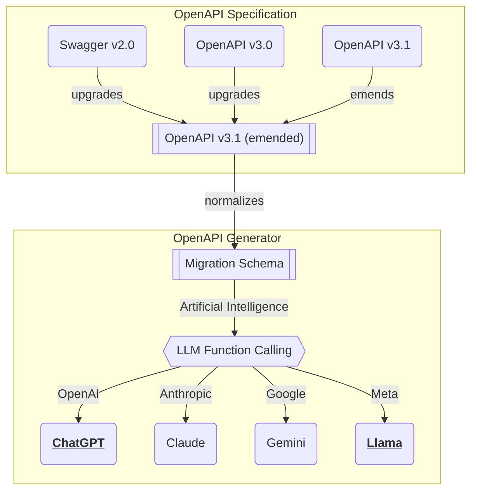

import { Tabs } from "nextra/components";

import AgenticaSnippet from "../../snippets/AgenticaSnippet.mdx";
import IAgenticaPropsSnippet from "../../snippets/IAgenticaPropsSnippet.mdx";
import IAgenticaConfigSnippet from "../../snippets/IAgenticaConfigSnippet.mdx";
import IAgenticaControllerSnippet from "../../snippets/IAgenticaControllerSnippet.mdx";
import IAgenticaVendorSnippet from "../../snippets/IAgenticaVendorSnippet.mdx";
import AgenticaPromptSnippet from "../../snippets/AgenticaPromptSnippet.mdx";
import AgenticaEventSnippet from "../../snippets/AgenticaEventSnippet.mdx";

## Facade Controller
<Tabs items={[
  <code>src/main.ts</code>,
  <code>Agentica</code>,
  <code>IAgenticaProps</code>,
  <code>IAgenticaVendor</code>,
  <code>IAgenticaController</code>,
]}>
  <Tabs.Tab>
```typescript filename="src/main.ts" showLineNumbers {36-38}
import { Agentica, AgenticaEvent, AgenticaPrompt } from "@agentica/core";
import OpenAI from "@agentica/openai";
import { v4 } from "uuid";

const id: string = v4();
export const main = async (id: string): Promise<void> => {
  // CONSTRUCTION
  const agent: Agentica<"chatgpt"> = new Agentica({
    model: "chatgpt",
    vendor: {
      api: new OpenAI({
        apiKey: "********",
      }),
      model: "gpt-4o-mini",
    },
    controllers: [...],
  });

  // EVENT HANDLING
  agent.on("text", async (event) => {
    for (const piece of event.stream)
      console.log(piece);
  });
  agent.on("select", async (event) => {
    console.log("select", event.reason, event.operation.function.name)
  });
  agent.on("describe", async (event) => {
    console.log(
      "describe", 
      event.executes.map((x) => x.operation.function.name),
      await event.join(), // full text joining instead of streaming
    );
  });

  // CONVERSATION & ARCHIVING
  const prompts: AgenticaPrompt[] = await agent.conversate(
    "I wanna buy Mackbook Pro."
  );
  await archivePrompts(id, prompts);
};
```
  </Tabs.Tab>
  <Tabs.Tab>
    <AgenticaSnippet />
  </Tabs.Tab>
  <Tabs.Tab>
    <IAgenticaPropsSnippet />
  </Tabs.Tab>
  <Tabs.Tab>
    <IAgenticaConfigSnippet />
  </Tabs.Tab>
  <Tabs.Tab>
    <IAgenticaControllerSnippet />
  </Tabs.Tab>
</Tabs>

You can start chatbot by creating `Agentica` instance, and calling its function `Agentica.conversate()`. When creating the `Agentica` instance, you have to specify the LLM (Large Language Model) service vendor, and lists of controller to serving for function calling.

In the `Agentica.conversate()` function, [#Multi Agent Orchestration](/docs/concepts/function-calling/#orchestration-strategy) to the internal sub agents would be processed including function callings and executions. When the orchestration has been completed, the `Agentica.conversate()` function will return the list of newly created prompts.

If you want to archive the conversation state of current agent, store the returned prompots to your database serializing them from `AgenticaPrompt` type to JSON format's `IAgenticaPromptJson` type. And then restore the conversation state by assigning the prompt histories to the `IAgenticaProps.histories` property when creating a new `Agentica` instance.

By the way, within framework of the UX (User Experience) it is not a good choice to waiting for completion of the `Agentica.conversate()` function and giving prompt results to the user at once. Delivering the events to the user step by step with streaming is more recommended. Enroll event listeners by calling `Agentica.on()` function, and deliver it to the user.


## API Vendor
<Tabs 
  items={[
    <code>src/main.chatgpt.ts</code>,
    <code>src/main.llama.ts</code>,
    <code>IAgenticaProps</code>,
    <code>IAgenticaVendor</code>,
  ]}
  defaultIndex={1}>
  <Tabs.Tab>
```typescript filename="src/main.chatgpt.ts" showLineNumbers {12-18, 23}
import { 
  Agentica,
  IAgenticaController,
  IAgenticaProps,
  IAgenticaVendor
} from "@agentica/core";
import OpenAI from "openai";

import { BbsArticleService } from "./services/BbsArticleService";

const agent: Agentica<"chatgpt"> = new Agentica({
  model: "chatgpt",
  vendor: {
    model: "gpt-4o-mini",
    api: new OpenAI({
      apiKey: "********",
    }),
  } satisfies IAgenticaVendor,
  controllers: [
    {
      protocol: "http",
      name: "class",
      application: typia.llm.application<BbsArticleService, "chatgpt">(),
      execute: new BbsArticleService(),
    } satisfies IAgenticaController<"chatgpt">,
  ]
} satisfies IAgenticaProps<"chatgpt">);
await agent.conversate("I wanna buy MacBook Pro");
```
  </Tabs.Tab>
  <Tabs.Tab>
```typescript filename="src/main.llama.ts" showLineNumbers {12-19, 24}
import { 
  Agentica,
  IAgenticaController,
  IAgenticaProps,
  IAgenticaVendor
} from "@agentica/core";
import OpenAI from "openai";

import { BbsArticleService } from "./services/BbsArticleService";

const agent: Agentica<"llama"> = new Agentica({
  model: "llama",
  vendor: {
    model: "llama3.3-70b",
    api: new OpenAI({
      apiKey: "********",
      baseURL: "https://api.llama-api.com",
    }),
  } satisfies IAgenticaVendor,
  controllers: [
    {
      protocol: "http",
      name: "class",
      application: typia.llm.application<BbsArticleService, "llama">(),
      execute: new BbsArticleService(),
    } satisfies IAgenticaController<"llama">,
  ]
} satisfies IAgenticaProps<"llama">);
await agent.conversate("I wanna buy MacBook Pro");
```
  </Tabs.Tab>
  <Tabs.Tab>
    <IAgenticaPropsSnippet />
  </Tabs.Tab>
  <Tabs.Tab>
    <IAgenticaVendorSnippet />
  </Tabs.Tab>
</Tabs>

When creating `Agentica` instance, you have to specify the LLM service vendor.

`Agentica` is utilizing OpenAI SDK (`npm i openai`) for LLM (Large Language Model) service interaction. However, it does not mean that you can use only OpenAI's GPT models in the `Agentica`. The OpenAI SDK is just a connection tool to the LLM vendor's API, and as the most of modern LLMs are following the OpenAI's API design, you can use other LLM vendors like Claude, Gemini or Llama too.

In that case, configure `IAgenticaVendor.api.baseURL` and `IAgenticaVendor.model` properties to the LLM vendor's API endpoint and model name. For example, if you want to use Meta Llama instead of OpenAI GPT, you can do it like below. Instead, as LLM schema models are different between vendors, you have to change the `IAgenticaProps.model` property to the vendor's model name "llama".



  - [`IChatGptSchema`](https://samchon.github.io/openapi/api/types/IChatGptSchema-1.html): OpenAI GPT
  - [`IClaudeSchema`](https://samchon.github.io/openapi/api/types/IClaudeSchema-1.html): Anthropic Claude
  - [`IGeminiSchema`](https://samchon.github.io/openapi/api/types/IGeminiSchema-1.html): Google Gemini
  - [`ILlamaSchema`](https://samchon.github.io/openapi/api/types/ILlamaSchema-1.html): Meta Llama
- Midldle layer schemas
  - [`ILlmSchemaV3`](https://samchon.github.io/openapi/api/types/ILlmSchemaV3-1.html): middle layer based on OpenAPI v3.0 specification
  - [`ILlmSchemaV3_1`](https://samchon.github.io/openapi/api/types/ILlmSchemaV3_1-1.html): middle layer based on OpenAPI v3.1 specification


## Function Controller
<Tabs items={[
  <code>src/main.ts</code>,
  <code>IAgenticaProps</code>,
  <code>IAgenticaController</code>,
]}>
  <Tabs.Tab>
```typescript filename="src/main.ts" showLineNumbers {13-51}
import { Agentica, assertHttpLlmApplication } from "@agentica/core";
import { AgenticaPgVectorSelector } from "@agentica/pg-vector-selector";
import { OpenApi, HttpLlm } from "@samchon/openapi";
import typia from "typia";

const main = async (): Promise<void> => {
  const agent = new Agentica({
    model: "chatgpt",
    vendor: {
      api: new OpenAI({ apiKey: "*****" }),
      model: "gpt-4o-mini",
    },
    controllers: [
      {
        protocol: "http",
        name: "shopping",
        application: assertHttpLlmApplication({
          model: "chatgpt",
          document: await fetch(
            "https://shopping-be.wrtn.ai/editor/swagger.json",
          ).then((r) => r.json()),
        }),
        connection: {
          host: "https://shopping-be.wrtn.ai",
          headers: {
            Authorization: "Bearer *****",
          },
        },
      },
      {
        protocol: "class",
        name: "counselor",
        application: 
          typia.llm.application<ShoppingCounselor, "chatgpt">(),
        execute: new ShoppingCounselor(),
      },
      {
        protocol: "class",
        name: "policy",
        application: 
          typia.llm.application<ShoppingPolicy, "chatgpt">(),
        execute: new ShoppingPolicy(),
      },
      {
        protocol: "class",
        name: "rag",
        application: 
          typia.llm.application<ShoppingSearchRag, "chatgpt">(),
        execute: new ShoppingSearchRag(),
      },
    ],
    config: {
      executor: {
        select: AgenticaPgVectorSelector.boot<"chatgpt">(
          'https://your-connector-hive-server.com'
        ),
      },
    },
  });
  await agent.conversate("I wanna buy MacBook Pro");
};
main().catch(console.error);
```
  </Tabs.Tab>
  <Tabs.Tab>
    <IAgenticaPropsSnippet />
  </Tabs.Tab>
  <Tabs.Tab>
    <IAgenticaControllerSnippet />
  </Tabs.Tab>
</Tabs>

In `@agentica/core`, there is a concept of controller, a set LLM function calling schemas (application schema) and execute functions for actual function calling. And `@agentica/core` supports two protocol types of controllers; HTTP server and TypeScript class.

When you're using HTTP server controller, create LLM application schema from `assertHttpLlmApplication()` or `validateHttpLlmApplication()` function. These functions will validate whether the target Swagger/OpenAPI document is correct or not. And then, configure connection information to the HTTP server with destination URL and headers. 

Otherwise you want to serve the function calling from a TypeScript class, create LLM application schema from `typia.llm.application<Class, Model>()` function. And provide the class instance for the actual function calling.

For reference, `IAgenticaController.name` must be unique, because it is used to identify the controller in the agent. Also, if number of your controller functions are too many, it would better to configure `executor.selector` as vector selector of plugin. If you don't do it, too much LLM token costs would be consumed.


## Converasation
<Tabs items={[
  <code>src/main.ts</code>,
  <code>Agentica</code>,
  <code>AgenticaPrompt</code>,
  <code>AgenticaEvent</code>,
]}>
  <Tabs.Tab>
```typescript filename="src/main.ts" showLineNumbers
import {
  Agentica,
  AgenticaPrompt,
  IAgenticaPromptJson,
} from "@agentica/core";
import { AgenticaPgVectorSelector } from "@agentica/pg-vector-selector";
import { OpenApi, HttpLlm } from "@samchon/openapi";
import typia from "typia";

// CONSTRUCTION
const agent = new Agentica({
  model: "chatgpt",
  vendor: {
    api: new OpenAI({ apiKey: "*****" }),
    model: "gpt-4o-mini",
  },
  controllers: [...],
  config: {
    executor: {
      select: AgenticaPgVectorSelector.boot<"chatgpt">(
        'https://your-connector-hive-server.com'
      ),
    },
  },
  histories: 
    (await loadPromptsFromDatabase()) satisfies IAgenticaPromptJson[],
});

// EVENT LISTENING
agent.on("text", async (event) => {
  console.log(`Conversation from ${event.role}: `);
  for (const str of event.stream)
    process.stdout.write(str);
  process.stdout.write("\n");
});
agent.on("describe", async (event) => {
  console.log("Descriptions of the function calling: ");
  for (const execute of event.executes)
    console.log(`  - ${execute.operation.function.name}`);
  console.log(await event.join());
});

// CONVERSATION + ARCHIVING
const prompts: AgenticaPrompt[] = await agent.conversate(
  "I wanna buy MacBook Pro",
);
await archiveToDatabase(prompts.map((p) => p.toJSON()));
```
  </Tabs.Tab>
  <Tabs.Tab>
    <AgenticaSnippet />
  </Tabs.Tab>
  <Tabs.Tab>
    <AgenticaPromptSnippet />
  </Tabs.Tab>
  <Tabs.Tab>
    <AgenticaEventSnippet />
  </Tabs.Tab>
</Tabs>

When you call `Agentica.conversate()` function, the agent will start the [#Multi Agent Orchestration](/docs/concepts/function-calling/#orchestration-strategy) to the internal sub agents including function calling and executions. After the orchestration process, `Agentica.conversate()` function will return the list of newly created prompts in the orchestration process; `AgenticaPrompt`.

If you want to archive the conversation state of current agent, store the returned prompts to your database with serialization to `IAgenticaPromptJson` format by calling `AgenticaPrompt.toJSON()` function. And then restore the conversation state by assigning the prompt histories to the `IAgenticaProps.histories` property creating a new `Agentica` instance.

By the way, waiting for the compleltion of internal agents' orchestration nand giving prompt results to the user at once is not a good choice in the UX (User Experience) perspective. In that case, it would better to deliver the events to the user step by step with streaming. Enroll event listeners by calling `Agentica.on()` function, and deliver it to the user.