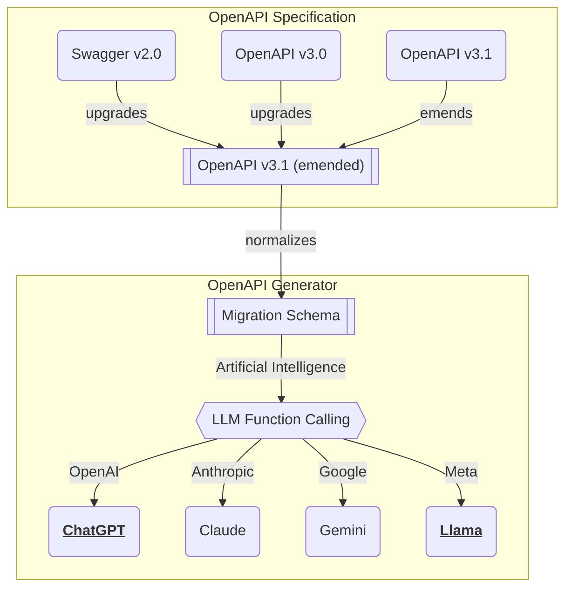

import { Tabs } from "nextra/components";

import RemoteSource from "../../../components/RemoteSource";

import MicroAgenticaSnippet from "../../snippets/MicroAgenticaSnippet.mdx";
import AgenticaHistorySnippet from "../../snippets/AgenticaHistorySnippet.mdx";
import AgenticaEventSnippet from "../../snippets/AgenticaEventSnippet.mdx";

## `MicroAgentica`
<Tabs items={[
  <code>src/main.ts</code>,
  <code>MicroAgentica</code>,
  <code>IMicroAgenticaProps</code>,
  <code>IMicroAgenticaConfig</code>,
  <code>IAgenticaController</code>,
]}>
  <Tabs.Tab>
```typescript filename="src/main.ts" showLineNumbers
import { MicroAgentica, MicroAgenticaHistory } from "@agentica/core";
import OpenAI from "openai";
import typia from "typia";
import { v4 } from "uuid";

export const main = async (id: string): Promise<void> => {
  // CONSTRUCTION
  const agent: MicroAgentica = new MicroAgentica({
    vendor: {
      api: new OpenAI({ apiKey: "********" }),
      model: "gpt-4o-mini",
    },
    controllers: [
      {
        protocol: "class",
        name: "bbs",
        application: typia.llm.application<BbsArticleService>(),
        execute: new BbsArticleService(),
      }
    ],
    histories: await getPrompts(id),
  });

  // EVENT HANDLING
  agent.on("text", async (event) => {
    for await (const piece of event.stream)
      console.log(piece);
  });
  agent.on("describe", async (event) => {
    console.log(
      "describe", 
      event.executes.map((x) => x.operation.function.name),
      await event.join(), // full text joining instead of streaming
    );
  });

  // CONVERSATION & ARCHIVING
  const prompts: MicroAgenticaHistory[] = await agent.conversate(
    "I wanna buy MacBook Pro."
  );
  await archiveHistories(id, prompts);
};
```
  </Tabs.Tab>
  <Tabs.Tab>
    <MicroAgenticaSnippet />
  </Tabs.Tab>
  <Tabs.Tab>
    <RemoteSource 
      url="https://raw.githubusercontent.com/wrtnlabs/agentica/refs/heads/main/packages/core/src/structures/IMicroAgenticaProps.ts"
      filename="@agentica/core/IMicroAgenticaProps"
      showLineNumbers />
  </Tabs.Tab>
  <Tabs.Tab>
    <RemoteSource 
      url="https://raw.githubusercontent.com/wrtnlabs/agentica/refs/heads/main/packages/core/src/structures/IMicroAgenticaConfig.ts"
      filename="@agentica/core/IMicroAgenticaConfig"
      showLineNumbers />
  </Tabs.Tab>
  <Tabs.Tab>
    <RemoteSource 
      url="https://raw.githubusercontent.com/wrtnlabs/agentica/refs/heads/main/packages/core/src/structures/IAgenticaController.ts"
      filename="@agentica/core/IAgenticaController"
      showLineNumbers />
  </Tabs.Tab>
</Tabs>

Micro AI chatbot.

`MicroAgentica` is a facade class of micro AI agent, which is a lightweight version of `Agentica` that is suitable for small-scale applications. Its [#Orchestration](/docs/concepts/function-calling/#orchestration-strategy) does not have `selector` agent, but has only `caller` and `describer` agents. `MicroAgentica` directly list up every functions to the `caller` agent.

If your number of functions is less than 8, `MicroAgentica` is recommended. As there's no [selector agent](/docs/concepts/function-calling/#orchestration-strategy), `MicroAgentica` is faster than `Agentica`. In contrary, if your number of functions is more than 8, `Agentica` is recommended. Note that, if number of functions is more than 8, AI agent tends to be confused and the function calling performance is lowered.


## API Vendor
<Tabs 
  items={[
    <code>src/main.chatgpt.ts</code>,
    <code>src/main.llama.ts</code>,
    <code>IMicroAgenticaProps</code>,
    <code>IAgenticaVendor</code>,
  ]}
  defaultIndex={1}>
  <Tabs.Tab>
```typescript filename="src/main.chatgpt.ts" showLineNumbers {12-18, 23}
import {
  IAgenticaController,
  IAgenticaVendor,
  IMicroAgenticaProps,
  MicroAgentica
} from "@agentica/core";
import OpenAI from "openai";
import typia from "typia";

import { BbsArticleService } from "./services/BbsArticleService";

const agent: MicroAgentica = new MicroAgentica({
  vendor: {
    model: "gpt-4o-mini",
    api: new OpenAI({
      apiKey: "********",
    }),
  } satisfies IAgenticaVendor,
  controllers: [
    {
      protocol: "class",
      name: "bbs",
      application: typia.llm.application<BbsArticleService>(),
      execute: new BbsArticleService(),
    } satisfies IAgenticaController,
  ]
} satisfies IMicroAgenticaProps);
await agent.conversate("I wanna buy MacBook Pro");
```
  </Tabs.Tab>
  <Tabs.Tab>
```typescript filename="src/main.llama.ts" showLineNumbers {12-19, 24}
import {
  IAgenticaController,
  IAgenticaVendor,
  IMicroAgenticaProps,
  MicroAgentica
} from "@agentica/core";
import OpenAI from "openai";
import typia from "typia";

import { BbsArticleService } from "./services/BbsArticleService";

const agent: MicroAgentica = new MicroAgentica({
  vendor: {
    model: "llama3.3-70b",
    api: new OpenAI({
      apiKey: "********",
      baseURL: "https://api.llama-api.com",
    }),
  } satisfies IAgenticaVendor,
  controllers: [
    {
      protocol: "class",
      name: "bbs",
      application: typia.llm.application<BbsArticleService>(),
      execute: new BbsArticleService(),
    } satisfies IAgenticaController,
  ]
} satisfies IMicroAgenticaProps);
await agent.conversate("I wanna buy MacBook Pro");
```
  </Tabs.Tab>
  <Tabs.Tab>
    <RemoteSource 
      url="https://raw.githubusercontent.com/wrtnlabs/agentica/refs/heads/main/packages/core/src/structures/IMicroAgenticaProps.ts"
      filename="@agentica/core/IMicroAgenticaProps"
      showLineNumbers />
  </Tabs.Tab>
  <Tabs.Tab>
    <RemoteSource 
      url="https://raw.githubusercontent.com/wrtnlabs/agentica/refs/heads/main/packages/core/src/structures/IAgenticaVendor.ts"
      filename="@agentica/core/IAgenticaVendor"
      showLineNumbers />
  </Tabs.Tab>
</Tabs>

When creating `MicroAgentica` instance, you have to specify the LLM service vendor.

`MicroAgentica` is utilizing OpenAI SDK (`npm i openai`) for LLM (Large Language Model) service interaction. However, it does not mean that you can use only OpenAI's GPT models in the `MicroAgentica`. The OpenAI SDK is just a connection tool to the LLM vendor's API, and as the most of modern LLMs are following the OpenAI's API design, you can use other LLM vendors like Claude, Gemini or Llama too.

In that case, configure `IAgenticaVendor.api.baseURL` and `IAgenticaVendor.model` properties to the LLM vendor's API endpoint and model name. For example, if you want to use Meta Llama instead of OpenAI GPT, you can do it like below.



  - [`IChatGptSchema`](/api/types/_samchon_openapi.IChatGptSchema-1.html): OpenAI GPT
  - [`IClaudeSchema`](/api/types/_samchon_openapi.IClaudeSchema-1.html): Anthropic Claude
  - [`IGeminiSchema`](/api/types/_samchon_openapi.IGeminiSchema-1.html): Google Gemini
  - [`ILlamaSchema`](/api/types/_samchon_openapi.ILlamaSchema-1.html): Meta Llama
- Middle layer schemas
  - [`ILlmSchemaV3`](/api/types/_samchon_openapi.ILlmSchemaV3-1.html): middle layer based on OpenAPI v3.0 specification
  - [`ILlmSchemaV3_1`](/api/types/_samchon_openapi.ILlmSchemaV3_1-1.html): middle layer based on OpenAPI v3.1 specification


## Events Handling
<Tabs items={[
  <code>src/main.ts</code>,
  <code>MicroAgenticaEvent</code>,
  <code>AgenticaEvent</code>,
]}>
  <Tabs.Tab>
```typescript filename="src/main.ts" showLineNumbers
import { MicroAgentica } from "@agentica/core";
import OpenAI from "openai";

const agent = new MicroAgentica({
  vendor: {
    api: new OpenAI({ apiKey: "********" }),
    model: "gpt-4o-mini",
  },
  controllers: [...],
});

agent.on("text", async (event) => {
  console.log("Text from", event.role);
  for await (const text of event.stream)
    process.stdout.write(text);
  process.stdout.write("\n");
});
agent.on("execute", async (event) => {
  console.log(
    "Function executed", 
    event.operation.name, 
    event.arguments, 
    event.value,
  );
});
agent.on("describe", async (event) => {
  console.log("Describe Function Calling");
  for (const execute of event.executes)
    console.log(`  - ${execute.operation.name}`);
  for await (const text of event.stream)
    process.stdout.write(text);
  process.stdout.write("\n");
}); 

await agent.conversate("I wanna buy Surface Pro");
```
  </Tabs.Tab>
  <Tabs.Tab>
    <RemoteSource 
      url="https://raw.githubusercontent.com/wrtnlabs/agentica/refs/heads/main/packages/core/src/events/MicroAgenticaEvent.ts"
      filename="@agentica/core/MicroAgenticaEvent"
      showLineNumbers />
  </Tabs.Tab>
  <Tabs.Tab>
    <AgenticaEventSnippet />
  </Tabs.Tab>
</Tabs>

As `MicroAgentica` does not have `selector` agent, its event types are also narrower than `Agentica`.


## Prompt Histories
<Tabs items={[
  <code>src/main.ts</code>,
  <code>MicroAgenticaHistory</code>,
  <code>AgenticaHistory</code>,
]}>
  <Tabs.Tab>
```typescript filename="src/main.ts" showLineNumbers {16, 21}
import {
  IMicroAgenticaHistoryJson,
  MicroAgentica,
  MicroAgenticaHistory,
} from "@agentica/core";
import OpenAI from "openai";

export const main = async (id: string): Promise<void> => {
  const agent = new MicroAgentica({
    vendor: {
      api: new OpenAI({ apiKey: "*****" }),
      model: "gpt-4o-mini",
    },
    controllers: [...],
    histories: (await getHistories(id)) satisfies IMicroAgenticaHistoryJson[],
  });
  const prompts: MicroAgenticaHistory[] = await agent.conversate(
    "I wanna buy MacBook Pro",
  );
  await archiveHistories(id, prompts.map((p) => p.toJSON()));
};
```
  </Tabs.Tab>
  <Tabs.Tab>
    <RemoteSource 
      url="https://raw.githubusercontent.com/wrtnlabs/agentica/refs/heads/main/packages/core/src/histories/MicroAgenticaHistory.ts"
      filename="@agentica/core/MicroAgenticaHistory"
      showLineNumbers />
  </Tabs.Tab>
  <Tabs.Tab>
    <AgenticaHistorySnippet />
  </Tabs.Tab>
</Tabs>

As `MicroAgentica` does not have `selector` agent, its prompt histories are also narrower than `Agentica`.


## Conversation
<Tabs items={[
  <code>src/main.ts</code>,
  <code>MicroAgentica</code>,
  <code>MicroAgenticaHistory</code>,
  <code>MicroAgenticaEvent</code>,
]}>
  <Tabs.Tab>
```typescript filename="src/main.ts" showLineNumbers
import {
  IMicroAgenticaHistoryJson,
  MicroAgentica,
  MicroAgenticaHistory,
} from "@agentica/core";
import typia from "typia";

export const main = async (id: string): Promise<void> => {
  const agent = new MicroAgentica({
    vendor: {
      api: new OpenAI({ apiKey: "*****" }),
      model: "gpt-4o-mini",
    },
    controllers: [...],
    histories: (await getHistories(id)) satisfies IMicroAgenticaHistoryJson[],
  });
  const prompts: MicroAgenticaHistory[] = await agent.conversate(
    "I wanna buy MacBook Pro",
  );
  await archiveHistories(id, prompts.map((p) => p.toJSON()));
}
```
  </Tabs.Tab>
  <Tabs.Tab>
    <MicroAgenticaSnippet />
  </Tabs.Tab>
  <Tabs.Tab>
    <RemoteSource 
      url="https://raw.githubusercontent.com/wrtnlabs/agentica/refs/heads/main/packages/core/src/histories/MicroAgenticaHistory.ts"
      filename="@agentica/core/MicroAgenticaHistory"
      showLineNumbers />
  </Tabs.Tab>
  <Tabs.Tab>
    <RemoteSource 
      url="https://raw.githubusercontent.com/wrtnlabs/agentica/refs/heads/main/packages/core/src/events/MicroAgenticaEvent.ts"
      filename="@agentica/core/MicroAgenticaEvent"
      showLineNumbers />
  </Tabs.Tab>
</Tabs>

When you call `MicroAgentica.conversate()` function, the agent will start the [#Multi Agent Orchestration](/docs/concepts/function-calling/#orchestration-strategy) to the internal sub agents including function calling and executions (except `selector` agent). After the orchestration process, `MicroAgentica.conversate()` function will return the list of newly created prompts in the orchestration process; `MicroAgenticaHistory`.

If you want to archive the conversation state of current agent, store the returned prompts to your database with serialization to `IMicroAgenticaHistoryJson` format by calling `MicroAgenticaHistory.toJSON()` function. And then restore the conversation state by assigning the prompt histories to the `IMicroAgenticaProps.histories` property creating a new `Agentica` instance.

By the way, waiting for the completion of internal agents' orchestration and giving prompt results to the user at once is not a good choice in the UX (User Experience) perspective. In that case, it would better to deliver the events to the user step by step with streaming. Enroll event listeners by calling `MicroAgentica.on()` function, and deliver it to the user.