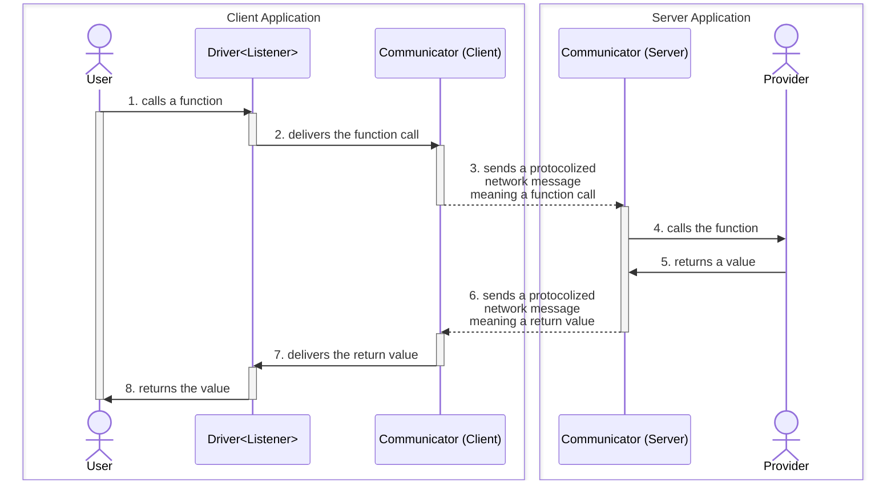

import { Tabs } from 'nextra/components'

## `@agentica/rpc`
RPC module of Agentica for WebSocket Communication.

[`@agentica/core`](/docs/core) is the simplest Agentic AI library specialized in **LLM Function Calling**, and `@agentica/rpc` is an RPC (Remote Procedure Call) wrapper module of it. If you combine the RPC wrapper module with [`TGrid`](https://tgrid.com), you can develop the WebSocket AI Chatbot.

And if you are considering to develop AI chatbot application development, WebSocket protocol is essentially required. Chatting application is basically a two-way communication. AI chatbot is also a two-way chat between an user and an assistant, based on events. Therefore, it cannot be a one-way communication HTTP Restful API, and a two-way protocol such as WebSocket is required.

However, don't be afraid of WebSocket application development. Below is the example codes of WebSocket application development utilizing `@agentica/rpc` in both client and server side. Look at the example codes, and feel how easy and type-safe it is.

<Tabs items={[
  "Client Application",
  "NodeJS Server",
  "NestJS Server",
]}>
  <Tabs.Tab>
```typescript filename="client/src/main.ts" showLineNumbers copy
import { IAgenticaRpcListener, IAgenticaRpcService } from "@agentica/rpc";
import { Driver, WebSocketConnector } from "tgrid";

const connector: WebSocketConnector<
  null,
  IAgenticaRpcListener<"chatgpt">,
  IAgenticaRpcService<"chatgpt">
> = new WebSocketConnector(null, {
  text: async (evt) => {
    console.log(evt.role, evt.text);
  },
  describe: async (evt) => {
    console.log("describer", evt.text);
  },
});
await connector.connect("ws://localhost:3001");

const driver: Driver<IAgenticaRpcService<"chatgpt">> = 
  connector.getDriver();
await driver.conversate("Hello, what you can do?");
```
  </Tabs.Tab>
  <Tabs.Tab>
```typescript filename="nodejs/src/main.ts" showLineNumbers copy
import { Agentica } from "@agentica/core";
import {
  AgenticaRpcService,
  IAgenticaRpcListener,
  IAgenticaRpcService,
} from "@agentica/rpc";
import { WebSocketServer } from "tgrid";

const server: WebSocketServer<
  null,
  IAgenticaRpcService<"chatgpt">,
  IAgenticaRpcListener<"chatgpt">
> = new WebSocketServer();
await server.open(3_001, async (acceptor) => {
  const agent: Agentica<"chatgpt"> = new Agentica({ ... });
  const service: AgenticaRpcService<"chatgpt"> = 
    new AgenticaRpcService({
      agent,
      listener: acceptor.getDriver(),
    });
  await acceptor.accept(service);
});
```
  </Tabs.Tab>
  <Tabs.Tab>
```typescript filename="nestjs/src/chat.controller.ts" showLineNumbers copy
import { AgenticaRpcService, IAgenticaRpcListener } from "@agentica/rpc";
import { WebSocketRoute } from "@nestia/core";
import { Controller } from "@nestjs/common";
import { WebSocketAcceptor } from "tgrid";

@Controller("chat")
export class ChatController {
  @WebSocketRoute()
  public async start(
    // @WebSocketRoute.Param("id") id: string,
    @WebSocketRoute.Acceptor()
    acceptor: WebSocketAcceptor<
      null, // header
      AgenticaRpcService<"chatgpt">,
      IAgenticaRpcListener<"chatgpt">
    >,
  ): Promise<void> {
    const agent: Agentica<"chatgpt"> = new Agentica({ ... });
    const service: AgenticaRpcService<"chatgpt"> = 
      new AgenticaRpcService({
        agent,
        listener: acceptor.getDriver(),
      });
    await acceptor.accept(service);
  }
}
```
  </Tabs.Tab>
</Tabs>


## Setup
### NodeJS Server
```bash filename="Terminal" copy
npm install @agentica/core @samchon/openapi typia
npm install @agentica/rpc tgrid
npx typia setup
```

### NestJS Server
```bash filename="Terminal" copy
npm install @agentica/core @samchon/openapi
npm install @nestjs/common @nestjs/core @nestjs/platform-express
npm install @agentica/rpc tgrid

npm install -D nestia
npx nestia setup
```

### Client Application
```bash filename="Terminal" copy
npm install @agentica/rpc tgrid
```


## Remote Procedure Call


WebSocket protocol with RPC paradigm for AI chatbot.

`@agentica/rpc` supports WebSocket protocol that is utilizing [`TGrid`](https://tgrid.com) and its RPC (Remote Procedure Call) paradigm for easy and type safe development. In the RPC paradigm, client application can call a function of `IAgenticaRpcService` remotely as if it were its own object.

Internally, the RPC has composed with three elements; [`Communicator`](https://tgrid.com/docs/features/components/#communicator), [`Provider`](https://tgrid.com/docs/features/components/#provider) and [`Driver`](https://tgrid.com/docs/features/components/#driver). The first `Communicator` takes a responsibility of (WebSocket) network communication. The next `Provider` means an object providing to the remote system for RPC, and `Driver` is a proxy instance realizing the RPC to the remote provided `Provider` instance.

For example, below client application code is calling `IAgenticaRpcService.conversate()` function remotely through the `Driver<IAgenticaRpcService>` typed instance. In that case, `IAgenticaRpcService` is the `Provider` instance from server to client. And `WebSocketConnector` is the communicator taking responsibility of WebSocket communication.

<Tabs items={[
  "Client Application",
  "Server Application",
  <code>IAgenticaRpcService</code>,
  <code>IAgenticaRpcListener</code>,
]}>
  <Tabs.Tab>
```typescript filename="client/src/main.ts" showLineNumbers
import { IAgenticaRpcListener, IAgenticaRpcService } from "@agentica/rpc";
import { Driver, WebSocketConnector } from "tgrid";

interface IAuthorizationHeader {
  Authorization: string;
}

const connector: WebSocketConnector<
  IAuthorizationHeader,
  IAgenticaRpcListener<"chatgpt">,
  IAgenticaRpcService<"chatgpt">
> = new WebSocketConnector(
  {
    Authorization: "Bearer ********",
  }, 
  {
    text: async (evt) => {
      console.log(evt.role, evt.text);
    },
    describe: async (evt) => {
      console.log("describer", evt.text);
    },
  },
);
await connector.connect("ws://localhost:3001");

const driver: Driver<IAgenticaRpcService<"chatgpt">> = 
  connector.getDriver();
await driver.conversate("Hello, what you can do?");
```
  </Tabs.Tab>
  <Tabs.Tab>
```typescript filename="server/src/main.ts" showLineNumbers
import { Agentica } from "@agentica/core";
import {
  AgenticaRpcService,
  IAgenticaRpcListener,
  IAgenticaRpcService
} from "@agentica/rpc";
import { Driver, WebSocketServer } from "tgrid";

import { authorizeToken } from "./internal/authorizeToken";

const server: WebSocketServer<
  IAuthorizationHeader,
  IAgenticaRpcService<"chatgpt">,
  IAgenticaRpcListener
> = new WebSocketServer();
await server.open(3_001, async (acceptor) => {
  try {
    await authorizeToken(acceptor.header);
  } catch (error) {
    await acceptor.reject(1008, (error as Error).message);
    return;
  }
  const agent: Agentica<"chatgpt"> = new Agentica({ ... });
  const listener: Driver<IAgenticaRpcListener> = acceptor.getDriver();
  const service: AgenticaRpcService<"chatgpt"> = 
    new AgenticaRpcService({
      agent,
      listener,
    });
  await acceptor.accept(service);
});

interface IAuthorizationHeader {
  Authorization: string;
}
```
  </Tabs.Tab>
  <Tabs.Tab>
```typescript filename="@agentica/rpc/IAgenticaRpcService.ts" showLineNumbers
/**
 * RPC interface of AI agent service.
 *
 * `IAgenticaRpcService` is an interface defining an AI agent service
 * provided from the server to client through the RPC (Remote Procedure Call)
 * paradigm in the websocket protocol.
 *
 * The client will call the {@link conversate} function remotely, and the
 * server responses to the client by calling the client's
 * {@link IAgenticaRpcListener} functions remotely too.
 *
 * @author Samchon
 */
export interface IAgenticaRpcService<Model extends ILlmSchema.Model> {
  /**
   * Conversate with the AI agent.
   *
   * User talks to the AI agent with the content.
   *
   * When AI agent responds some actions like conversating or executing
   * LLM (Large Language Model) function calling, the functions defined in the
   * {@link IAgenticaRpcListener} would be called through the RPC
   * (Remote Procedure Call) paradigm.
   *
   * @param content The content to talk
   * @returns Returned when the conversation process is completely done
   */
  conversate(content: string): Promise<void>;

  /**
   * Get controllers.
   *
   * Get controllers, collection of functions that would be
   * called by the AI chatbot.
   */
  getControllers(): Promise<Primitive<IAgenticaController<Model>[]>>;
}
```
  </Tabs.Tab>
  <Tabs.Tab>
```typescript filename="@agentica/rpc/IAgenticaRpcListener.ts" showLineNumbers
/**
 * RPC interface of AI agent listener.
 *
 * `IAgenticaRpcListener` is an interface defining an AI agent listener
 * provided from the client to server through the RPC (Remote Procedure Call)
 * paradigm in the websocket protocol.
 *
 * It has defined the event listener functions of {@link IAgenticaEvent}
 * types. If you skip some event typed functions' implementations,
 * the skipped event would be ignored.
 *
 * Also, the event like listener functions of `IAgenticaRpcListener` type
 * are remotely called when a client calls the
 * {@link IAgenticaRpcService.conversate} function remotely, so that the
 * server responses to the client by the event listener functions.
 *
 * You can connect to the WebSocket server of the AI agent like below:
 *
 * ```typescript
 * import { IAgenticaRpcListener, IAgenticaRpcService } from "@agentica/core";
 * import { Driver, WebSocketConnector } from "tgrid";
 *
 * const connector: WebSocketConnector<
 *   null,
 *   IAgenticaRpcListener,
 *   IAgenticaRpcService
 * > = new WebSocketConnector(null, {
 *   text: async (evt) => {
 *     console.log(evt.role, evt.text);
 *   },
 *   describe: async (evt) => {
 *     console.log("describer", evt.text);
 *   },
 * });
 * await connector.connect("ws://localhost:3001");
 *
 * const driver: Driver<IAgenticaRpcService> = connector.getDriver();
 * await driver.conversate("Hello, what you can do?");
 * ```
 *
 * @author Samchon
 */
export interface IAgenticaRpcListener<Model extends ILlmSchema.Model> {
  /**
   * Describe the function executions' results.
   *
   * Inform description message of the function execution's results from
   * the AI agent server to client.
   *
   * @param evt Event of a description of function execution results
   */
  describe(evt: Primitive<IAgenticaEvent.IDescribe<Model>>): Promise<void>;

  /**
   * Text conversation message.
   *
   * @param evt Event of a text conversation message
   */
  text(evt: IAgenticaEvent.IText): Promise<void>;

  /**
   * Initialize the AI agent.
   *
   * Informs an initialization of controller functions from
   * the AI agent server to client.
   *
   * @param evt Event of initialization
   */
  initialize?(evt: IAgenticaEvent.IInitialize): Promise<void>;

  /**
   * Select a function to call.
   *
   * Informs a selected function to call from the AI agent server to client.
   *
   * @param evt Event of selecting a function to call
   */
  select?(evt: Primitive<IAgenticaEvent.ISelect<Model>>): Promise<void>;

  /**
   * Cancel a function to call.
   *
   * Informs a canceling function to call from the AI agent server to client.
   *
   * @param evt Event of canceling a function to call
   */
  cancel?(evt: Primitive<IAgenticaEvent.ICancel<Model>>): Promise<void>;

  /**
   * Call a function.
   *
   * Informs a function calling from the AI agent server to client.
   *
   * This event comes before the function execution, so that if you return
   * a different value from the original {@link IAgenticaEvent.ICall.arguments},
   * you can modify the arguments of the function calling.
   *
   * Otherwise you do not return anything (`undefined`) or `null` value, the
   * arguments of the function calling would not be modified. Also, if you are
   * not interested in the function calling event, you can skit its
   * implementation.
   *
   * @param evt Event of a function calling
   * @return New arguments if you want to modify, otherwise null or undefined
   */
  call?(
    evt: Primitive<IAgenticaEvent.ICall<Model>>,
  ): Promise<object | null | undefined>;

  /**
   * Executition of a function.
   *
   * Informs a function execution from the AI agent server to client.
   *
   * @param evt Event of a function execution
   */
  execute?(evt: IAgenticaEvent.IExecute<Model>): Promise<void>;
}
```
  </Tabs.Tab>
</Tabs>

### Header
Header value delivered from client to server after the connection.

In [`TGrid`](https://tgrid.com)'s RPC (Remote Procedure Call) paradigm, header means a value that is delivered after the connection from a client to the server. And header is used in most cases to authenticate the connecting client.

In the above example project, `IAuthorizationHeader` is the header type, and is used by server to determine whether to accept the client's connection or not. If the client's header is not valid, the server would reject the connection.

### Provider
Functions provided from remote system.

Provider is an object instance containing some functions provided for the remote system for RPC (Remote Procedure Call). In many cases, the provide becomes a class instance containing some methods to be called, but it is okay that composing the provider by just an interface type.

Also, the opposite remote system will call provider's functions by the [`Driver<Remote>`](#driver) instance. In the above example, client application is providing `IAgenticaRpcListener` to the server, and server is providing `AgenticaRpcService` (`IAgenticaRpcService`) to the client.

### Driver
Driver of RPC (Remote Procedure Call).

`Driver` is a proxy instance designed to call functions of the remote system. It has a generic argument `Remote` which means the type of remote system's [Provider](#provider), and you can remotely call the functions of the [Provider](#provider) asynchronously through the `Drive<Remote>` instance.

When you call some function of remote [Provider](#provider) by the `Driver<Listener>` instance, it hooks the function call expression, and delivers the function name and arguments (parameter values) to the remote system through the [Communicator](#communicator). If the remote system succeeded to reply the result of the function call, [Communicator](#communicator) resolves the promise of the function call expression with the result, so that makes `Driver<Remote>` working.

In the above example, client application is calling `IAgenticaRpcService.conversate()` function remotely through the `Driver<IAgenticaRpcService>` typed instance. In that case, `IAgenticaRpcService` is the [Provider](#provider) instance from server to client.