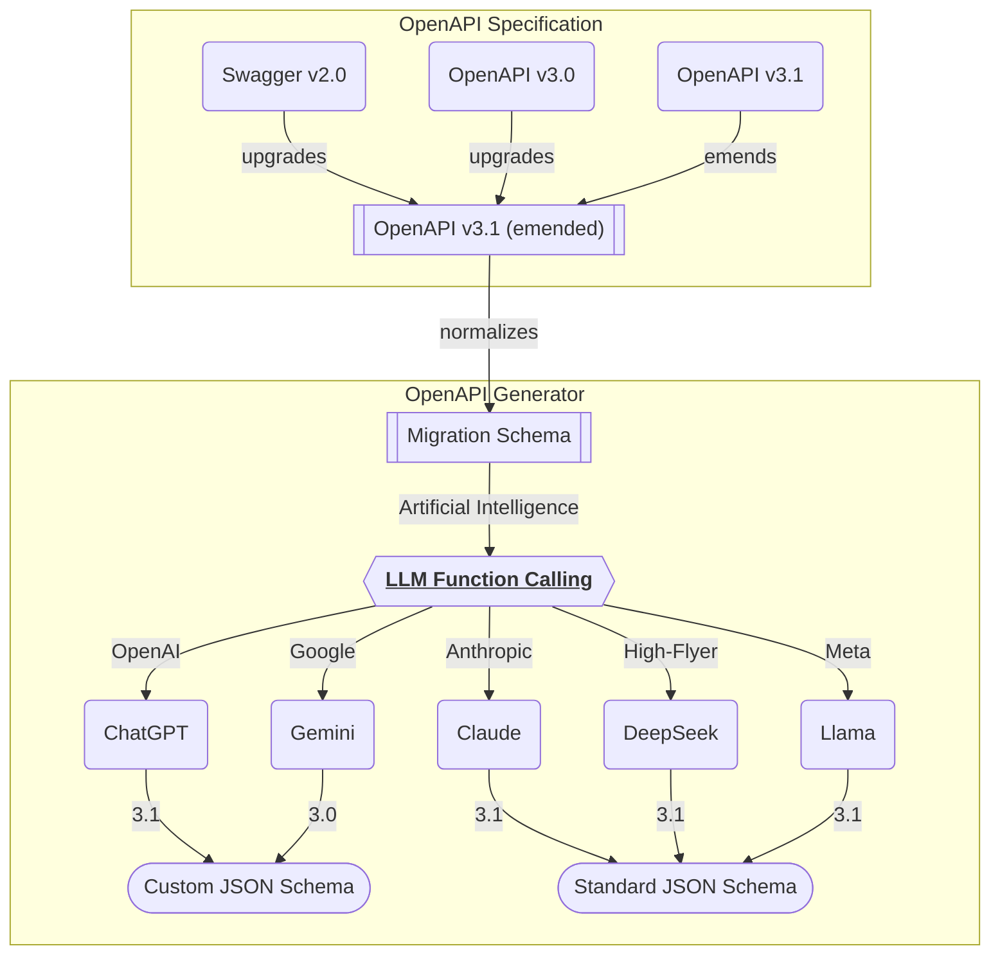

```mermaid
flowchart
  subgraph "OpenAPI Specification"
    v20("Swagger v2.0") --upgrades--> emended[["OpenAPI v3.1 (emended)"]]
    v30("OpenAPI v3.0") --upgrades--> emended
    v31("OpenAPI v3.1") --emends--> emended
  end
  subgraph "OpenAPI Generator"
    emended --normalizes--> migration[["Migration Schema"]]
    migration --"Artificial Intelligence"--> lfc{{"<b><u>LLM Function Calling</u></b>"}}
    lfc --"OpenAI"--> chatgpt("ChatGPT")
    lfc --"Google"--> gemini("Gemini")
    lfc --"Anthropic"--> claude("Claude")
    lfc --"High-Flyer"--> deepseek("DeepSeek")
    lfc --"Meta"--> llama("Llama")
    chatgpt --"3.1"--> custom(["Custom JSON Schema"])
    gemini --"3.0"--> custom(["Custom JSON Schema"])
    claude --"3.1"--> standard(["Standard JSON Schema"])
    deepseek --"3.1"--> standard
    llama --"3.1"--> standard
  end
```